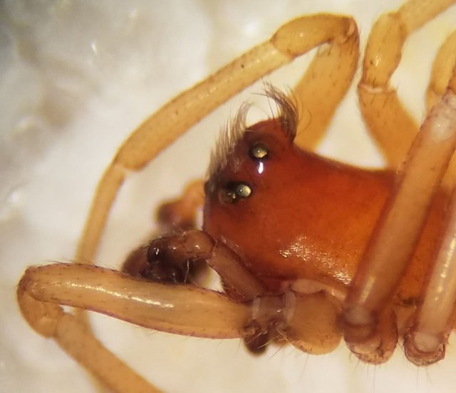
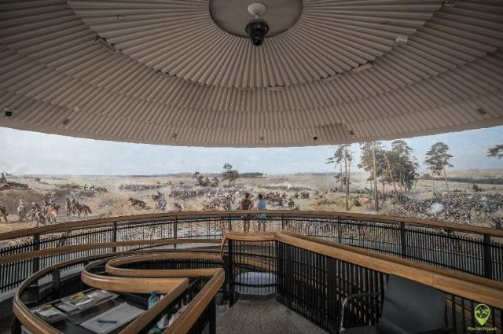
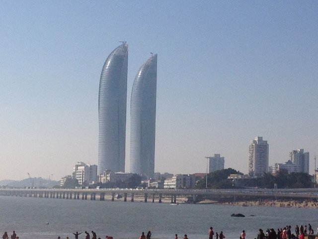
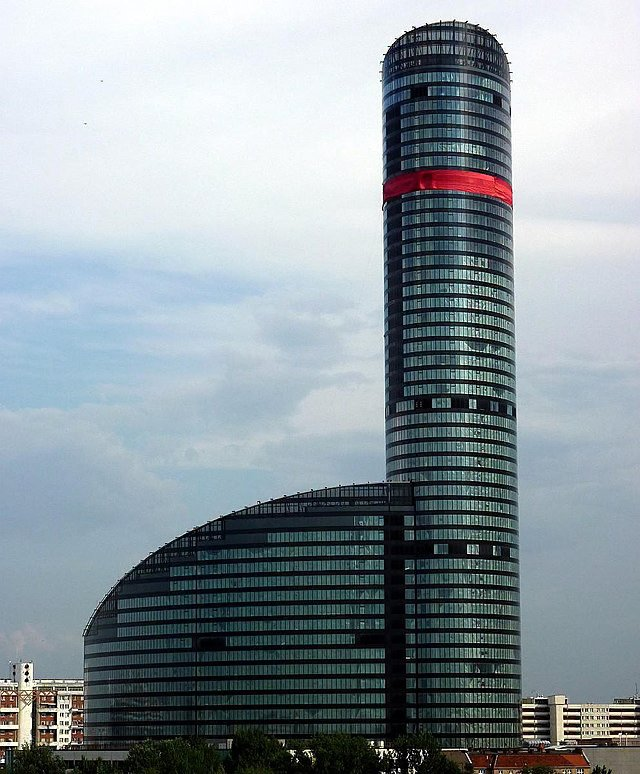

# Il grande salvataggio dei nani di Breslavia (pl_02)
> [!note] Educators & Designers: help improving this quest!
> **Comments and feedback**: [discuss in the Forum](https://antura.discourse.group/t/pl-02-the-great-wroclaw-dwarf-rescue/33/1)  
> **Improve script translations**: [comment the Google Sheet](https://docs.google.com/spreadsheets/d/1FPFOy8CHor5ArSg57xMuPAG7WM27-ecDOiU-OmtHgjw/edit?gid=1721014062#gid=1721014062)  
> **Improve Cards translations**: [comment the Google Sheet](https://docs.google.com/spreadsheets/d/1M3uOeqkbE4uyDs5us5vO-nAFT8Aq0LGBxjjT_CSScWw/edit?gid=415931977#gid=415931977)  
> **Improve the script**: [propose an edit here](https://github.com/vgwb/Antura/blob/main/Assets/_discover/_quests/PL_02%20Wroclaw%20Dwarves/PL_02%20Wroclaw%20Dwarves%20-%20Yarn%20Script.yarn)  

- Version: 1.00
- Status: NeedsReview
- Location: Poland - Breslavia

- Difficulty: Normal
- Duration (min): 20
- Description: Esplora la splendida città di Breslavia e scopri le sue famose statue di nani nascoste vicino ai monumenti.

## Design Notes
## Game Design Notes

**Mission**  
The player must explore a stylized map of Wrocław to find 10 unique dwarf statues. The quest involves simple exploration and collection, with key educational facts delivered through interactions with major landmarks like the Old Town Hall and the Cathedral. A small quiz-like interaction at the Cathedral must be completed to collect one of the dwarves. The ultimate goal is to gather all the dwarves to unlock the Sky Tower elevator.

**Characters:**  
**The Dwarf Expert (Guide):** A friendly guide who explains the mission and the magical nature of the dwarves.  
**Special Dwarves:** The "Bishop Dwarf" who asks questions, and the "Keymaster Dwarf" who guards the elevator.  

### Knowledge Content

**Facts about Wrocław:**

- It is the third (3) biggest city in Poland.
- The dwarf is the official symbol of the city.

**Landmark Recognition:** To identify and learn about the Old Town Hall, the Cathedral, and the Sky Tower.

**Basic Definitions:** To understand that a Town Hall is where the city's leaders work and a Cathedral is a large, important church where people pray.

### Flow

**Mission**: We start on the campus of the Leonardo School. The player meets the "Dwarf Expert."

**Dwarf Expert:** "Oh no, it's terrible! Your friend Antura is stuck on the observation deck of the Sky Tower! The mischievous Wrocław dwarves locked the elevator. They love games! The only way to get them to open it is to find 10 of their friends who are hiding around the city. Will you help me find them?"

**The Hunt - Part 1 (Old Town)**
The player must find  several dwarves in fun, interactive ways (e.g., clicking on a bench to make a dwarf pop out from behind it).
In the first part we hide 7 dwarfes

**Dwarfs stories**
For each we play [Activity Jigsaw puzzle]

**Dwarf 0 - The origin of Dwarfs**
They became the symbol of Wrocław and first appeared in that context in 2003, although they were used as a resistance movement in the 1980s against the communist regime. 

"Wrocław is the city of dwarfs. You can find them everywhere: on sidewalks, in squares, and in the Wrocław Market Square. They are a big group of little city residents, like the Coach, Sleepyhead, Kind One, Firefighters, Forget-Me-Not, and many more."

**Dwarf 1: The Old Town Hall**  
The player approaches the beautiful Town Hall building. A pop-up appears: A "Councilor Dwarf" is found on the steps.

EN: "This is the magnificent Old Town Hall. It's a very old and important building where the city's leaders work."

**Dwarf 2 - The Cathedral & Quiz**  
The player reaches the Cathedral. A special "Bishop Dwarf" statue blocks the path to a collectible dwarf behind it. 
[Activity Puzzle with a dwarf]

**Dwarf 3 - ZOO Fact Integration**  
The player finds an "Animal Lover Dwarf" sitting next to a large, colorful poster that reads: "Visit the Wrocław ZOO - The Biggest in Poland!" (it’ll be Quest PL 04)

**Dwarf 4 - Centennial Hall**  
EN: The Centennial Hall is a huge building that looks like a big tent with a roof. It’s very tall. Inside, you can see different shows, listen to concerts, or watch sports games. 

**Dwarf 5 - The Wrocław Multimedia Fountain**
one of the largest operating fountains in Europe, is a multimedia musical fountain, that offers nightly displays of Multimedia Shows that use different coloured lights.

EN: The Wrocław multimedia fountain is a place where water dances to music and colorful lights. Every summer show is a beautiful story told with water and light.

**Dwarf 6 - Panorama Racławicka**
a museum in Wrocław that displays the painting by Wojciech Kossak and Jan Styka, showing the events of a battle of Raclawice. Its dimentions are 1500x11400 cm.

EN: The Racławice Panorama is a giant painting that shows a big battle. It’s so big that it goes all around you, and when you stand in the middle, you feel like you’re part of the story.

**Dwarf 7 - Olga Tokarczuk**
polish writer who was awarded with the Nobel Prize in Literature. She is living in Wrocław.
EN: In Wrocław lives Olga Tokarczuk. She is the most famous Polish writer. The characters in her books often live in Lower Silesia, the region where Wrocław is the main city.

**The Hunt - Part 2 (Sky Tower): **
After finding the first 7 dwarves,  we can enter the Sky Tower to find the final **3** hidden in the modern plaza around its base.

Unlocking the Tower:
With the Dwarf Counter showing 10/10, the player approaches the elevator doors of the Sky Tower, which are blocked by a "Keymaster Dwarf" with a giant key.

## Topics
### Wroclaw Dwarves {#wroclaw_dwarves}
[Open topic page](../../topics/index.md#wroclaw_dwarves)  

- Importance: Medium  
- Country: Poland  
- Target age: Ages6to10

#### Core Card - Nani di Breslavia
Piccole statue sparse per la città che amano fare scherzi.

{ width="200" }
- Type: Concept
- Subjects: Culture, Community, History

#### Connection (RelatedTo) - Nano amante degli animali
Una statua di un nano che ama lo zoo e gli animali.

{ width="200" }
- Type: Object
- Subjects: Culture, Animal, Education

#### Connection (RelatedTo) - Vescovo nano
Una statua nana che pone una domanda in chiesa.

{ width="200" }
- Type: Object
- Subjects: Culture, History

#### Connection (RelatedTo) - Esperto di nani
Una guida amichevole che sa tutto sui nani.

{ width="200" }
- Type: Person
- Subjects: Education, Culture

#### Connection (RelatedTo) - Maestro delle Chiavi Nano
Una statua nana sorveglia l'ascensore con una grande chiave.

{ width="200" }
- Type: Object
- Subjects: Culture

#### Connection (RelatedTo) - Nano polacco (gnomi di Breslavia)
Piccole statue di nani si nascondono in giro per Breslavia. Trovarle è un divertente gioco cittadino.

{ width="200" }
- Type: Concept
- Subjects: Community, Culture
- Year: 1700

#### Connection (RelatedTo) - Statua del nano di Breslavia
Una piccola statua cittadina; i nani sono il simbolo di Breslavia.

{ width="200" }
- Type: Object
- Subjects: Culture, Community, History

#### Connection (LocatedIn) - Breslavia
Una città in Polonia con fiumi, ponti e storia.

{ width="200" }
- Type: Place
- Subjects: Geography, History, Culture

## Additional Cards
#### Sala del Centenario
La Centennial Hall è un enorme edificio che sembra una grande tenda con un tetto. È molto alto. Al suo interno si possono vedere diversi spettacoli, ascoltare concerti o guardare partite sportive.

{ width="200" }
- Type: Place
- Subjects: Culture, Recreation

#### Olga Tokarczuk
Un famoso scrittore polacco che vive a Breslavia.

{ width="200" }
- Type: Person
- Subjects: Literature, Culture

#### Panorama Racławicka
Un dipinto gigante tutto intorno a te che racconta una battaglia storica.

{ width="200" }
- Type: Place
- Subjects: History, Art, Culture

#### Sky Tower Plaza
Una piazza moderna dove le persone si incontrano vicino alla torre.

{ width="200" }
- Type: Place
- Subjects: Geography, Community, Recreation

#### Municipio
Il luogo in cui i leader della città lavorano e si incontrano.

{ width="200" }
- Type: Concept
- Subjects: Civics, Community, History

#### fiume Vistola
Il fiume più lungo della Polonia; sfocia nel Mar Baltico.

{ width="200" }
- Type: Place
- Subjects: Geography, Environment

#### Breslavia: Cattedrale
Una chiesa grande e importante, dove la gente prega. È possibile salire sulla torre per ammirare il panorama.

{ width="200" }
- Type: Place
- Subjects: History, Culture

#### Piazza del mercato di Breslavia
La piazza principale della Città Vecchia, piena di vita.

{ width="200" }
- Type: Place
- Subjects: Geography, Culture, Community, History

#### Fontana multimediale di Breslavia
Acqua che danza con musica e luci colorate.

{ width="200" }
- Type: Place
- Subjects: Culture, Technology, Recreation

#### Vecchio Municipio (Breslavia)
Uno splendido edificio gotico nella piazza principale. Ha un famoso orologio.

{ width="200" }
- Type: Place
- Subjects: Geography, Environment

#### Breslavia: Sky Tower
Uno degli edifici più alti della Polonia. Ospita negozi e un punto panoramico.

{ width="200" }
- Type: Place
- Subjects: Geography, Community, Culture

#### Scuola Primaria Leonardo da Vinci
È un luogo accogliente dove i bambini imparano, creano ed esplorano guidati dalla curiosità, dall'arte e dalla scienza.

{ width="200" }
- Type: None
- Subjects: Education

#### Mappa di Wroklaw
Una semplice mappa di Breslavia che mostra il fiume Odra con le sue isole e numerosi ponti

{ width="200" }
- Type: None
- Subjects: Geography

## Quest Script

[See the full script here](./pl_02-script.md)

## Words
## Activities
- [JigsawPuzzle](../../activities/index.md#JigsawPuzzle)
- [JigsawPuzzle](../../activities/index.md#JigsawPuzzle)

## Tasks
- [Collect] FIND_DWARVES
## Credits
- [Jan Stasienko](mailto:jan.stasienko@dsw.edu.pl) (Poland) (content)
- Lorenzo Castrovilli (Italy) (design)
- [Stefano Cecere](https://stefanocecere.com) (Italy) (development)
- Valeria Passarella (Italy) (design)
- Vieri Toti (Italy) (design)
