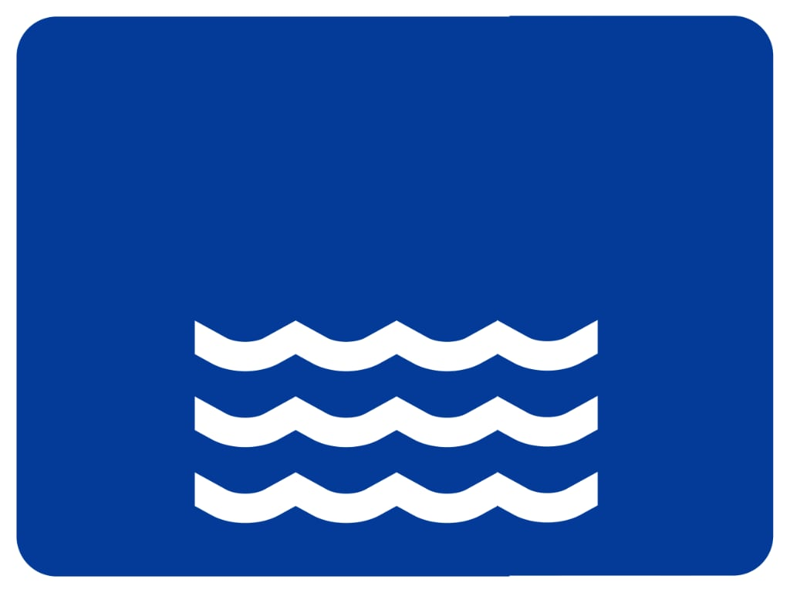

# Fiume Odra (pl_03)
> [!note] Educators & Designers: help improving this quest!
> **Comments and feedback**: [discuss in the Forum](https://antura.discourse.group/t/pl-03-a-voyage-on-the-odra-river/34/1)  
> **Improve script translations**: [comment the Google Sheet](https://docs.google.com/spreadsheets/d/1FPFOy8CHor5ArSg57xMuPAG7WM27-ecDOiU-OmtHgjw/edit?gid=106202032#gid=106202032)  
> **Improve Cards translations**: [comment the Google Sheet](https://docs.google.com/spreadsheets/d/1M3uOeqkbE4uyDs5us5vO-nAFT8Aq0LGBxjjT_CSScWw/edit?gid=415931977#gid=415931977)  
> **Improve the script**: [propose an edit here](https://github.com/vgwb/Antura/blob/main/Assets/_discover/_quests/PL_03%20Wroclaw%20River/PL_03%20Wroclaw%20River%20-%20Yarn%20Script.yarn)  

- Version: 1.00
- Status: Production
- Location: Poland - Breslavia

- Difficulty: Normal
- Duration (min): 20
- Description: Scoprite il famoso fiume Odra a Breslavia e i diversi tipi di ponti e imbarcazioni che rendono questo fiume un'arteria trafficata della città.

## Design Notes
## Game Design Notes

Discover the famous Odra River in Wrocław and the different types of bridges and boats that make this river a bustling artery of the city.

### Flow

Antura messed up the the pages of a tourist guide.
She ask to find the 5 pages.
When we bring them back she finds the best cards to be missing... she was along the Odra river... can we help her?

Now we can go along all the river and get the 7 chests containing the photo. 
each with someone protecting it who tells something about the place and asks a question / activitiy to open the chest

these are the 7 cards:

- odra_river_map
- tumski_bridge
- redzinski_bridge
- train_bridge
- houseboat
- boat_people
- barge

When we have collected the 7 Cards we go back to the tourist for happy end
Talking with NPC we can know these things:

### Knowledge Content
**River Geography:**

- The Odra is the second biggest river in Poland (after the Wisła).
- The Odra flows into the Baltic Sea.
- Learn to recognize a standard European sign indicating a river

**Urban Geography (Wrocław):**

- Wrocław has over 100 bridges.
- Bridges have different functions: for cars, pedestrians (footbridges), and trains.
- Rivers are used by different boats: for tourists, for living (houseboats), and for transporting goods (barges).

### Resources
**Rędziński Bridge**: Rędziński Bridge is the longest cable-stayed bridge in Poland, stretching across the Oder. It plays an important role in the city’s ring road system. Its modern design makes it a landmark of contemporary Wrocław.

**Tumski Bridge**: Tumski Bridge is famous for love padlocks and connects Ostrów Tumski with the city center. It’s a romantic spot for couples. In the evenings, it’s lit with gas lanterns.

**Cargo Barage**: A cargo barge is a flat-bottomed boat used to transport goods along rivers. These barges are still seen on the Oder today. They are essential for inland water transport.

**Kayaks**: Kayaks are popular for exploring Wrocław’s waterways and getting close to nature. Many people rent them for relaxing weekend trips. Paddling offers a peaceful view of the city from the water.

**Tourist Boats**: A tourist boat cruises the Oder River, offering scenic views of the city’s landmarks. It’s a great way to learn about Wrocław’s history. Guided tours are available in several languages.

## Topics
### Wroclaw {#wroclaw}
[Open topic page](../../topics/index.md#wroclaw)  

- Importance: Medium  
- Country: Poland  
- Target age: Ages6to10

#### Core Card - Breslavia
Una città in Polonia con fiumi, ponti e storia.

{ width="200" }
- Type: Place
- Subjects: Geography, History, Culture

#### Connection (RelatedTo) - Mappa di Wroklaw
Una semplice mappa di Breslavia che mostra il fiume Odra con le sue isole e numerosi ponti

{ width="200" }
- Type: None
- Subjects: Geography

#### Connection (RelatedTo) - Ponti di Breslavia
A Breslavia ci sono molti ponti che attraversano il fiume Odra.

{ width="200" }
- Type: Concept
- Subjects: Geography, Transportation, Community

#### Connection (RelatedTo) - Rivière Odra
Un grande fiume nella Polonia occidentale. Aiuta le navi a viaggiare e commerciare.

{ width="200" }
- Type: Place
- Subjects: Geography, Environment

#### Connection (RelatedTo) - fiume Vistola (Wisła)
Il fiume più lungo della Polonia si chiama Wisła o Vistola. Scorre attraverso Cracovia e Varsavia.

{ width="200" }
- Type: Place
- Subjects: Geography, Environment

### Odra river {#odra_river}
[Open topic page](../../topics/index.md#odra_river)  

- Importance: Medium  
- Country: Poland  
- Target age: Ages6to10

#### Core Card - Rivière Odra
Un grande fiume nella Polonia occidentale. Aiuta le navi a viaggiare e commerciare.

{ width="200" }
- Type: Place
- Subjects: Geography, Environment

#### Connection (RelatedTo) - Mappa del fiume Odra
Una semplice mappa che mostra il fiume Odra in Polonia e il modo in cui scorre verso il Mar Baltico

{ width="200" }
- Type: None
- Subjects: Geography

#### Connection (RelatedTo) - fiume Vistola (Wisła)
Il fiume più lungo della Polonia si chiama Wisła o Vistola. Scorre attraverso Cracovia e Varsavia.

{ width="200" }
- Type: Place
- Subjects: Geography, Environment

#### Connection (RelatedTo) - Ponti di Breslavia
A Breslavia ci sono molti ponti che attraversano il fiume Odra.

{ width="200" }
- Type: Concept
- Subjects: Geography, Transportation, Community

#### Connection (RelatedTo) - Passerella
Un ponte su cui le persone possono camminare. Niente auto.

{ width="200" }
- Type: Object
- Subjects: Transportation, Community

#### Connection (RelatedTo) - Ponte Tumski
Un famoso ponte con lucchetti dell'amore e lanterne a gas.

{ width="200" }
- Type: Place
- Subjects: Culture, Geography, Community

#### Connection (RelatedTo) - Ponte Rędziński
Il ponte strallato più lungo della Polonia.

{ width="200" }
- Type: Place
- Subjects: Geography, Transportation, Technology

#### Connection (RelatedTo) - Ponte stradale
Un ponte per auto e autobus.

{ width="200" }
- Type: Object
- Subjects: Transportation

#### Connection (RelatedTo) - Ponte per auto
Una strada che attraversa l'acqua, consentendo alle auto di attraversare fiumi e laghi.

{ width="200" }
- Type: Place
- Subjects: Geography, Environment

#### Connection (RelatedTo) - Ponte ferroviario
Un ponte con binari per i treni.

{ width="200" }
- Type: Object
- Subjects: Transportation, Technology

#### Connection (RelatedTo) - Chiatta
Una lunga imbarcazione piatta che trasporta merci sui fiumi.

{ width="200" }
- Type: Object
- Subjects: Transportation, Geography

#### Connection (RelatedTo) - Casa galleggiante
Una barca fatta per vivere.

{ width="200" }
- Type: Object
- Subjects: Transportation, Community

#### Connection (RelatedTo) - Barca per le persone
Un'imbarcazione che trasporta le persone da un luogo all'altro attraverso l'acqua.

{ width="200" }
- Type: Place
- Subjects: Geography, Environment

#### Connection (RelatedTo) - Kayak
Una piccola barca su cui si pagaia.

{ width="200" }
- Type: Object
- Subjects: Recreation, Sport

#### Connection (RelatedTo) - river_sign
{ width="200" }
- Type: None

## Additional Cards
#### Barca
Un veicolo che si muove sull'acqua.

{ width="200" }
- Type: Object
- Subjects: Transportation

#### Ponte
Una struttura che consente alle persone o ai veicoli di attraversare l'acqua.

{ width="200" }
- Type: Concept
- Subjects: Technology, Transportation

## Quest Script

[See the full script here](./pl_03-script.md)

## Words
## Activities
- [CleanCanvas](../../activities/index.md#CleanCanvas)
- [CleanCanvas](../../activities/index.md#CleanCanvas)
- [JigsawPuzzle](../../activities/index.md#JigsawPuzzle)
- [JigsawPuzzle](../../activities/index.md#JigsawPuzzle)
- [Match](../../activities/index.md#Match)
- [Memory](../../activities/index.md#Memory)
- [Memory](../../activities/index.md#Memory)

## Tasks
- [Collect] collect_cards
- [Collect] find_photos
- [Interact] go_back
## Credits
- [Jan Stasienko](mailto:jan.stasienko@dsw.edu.pl) (Poland) (content)
- Lorenzo Castrovilli (Italy) (design)
- [Stefano Cecere](https://stefanocecere.com) (Italy) (development)
- Valeria Passarella (Italy) (design)
- Vieri Toti (Italy) (design)
