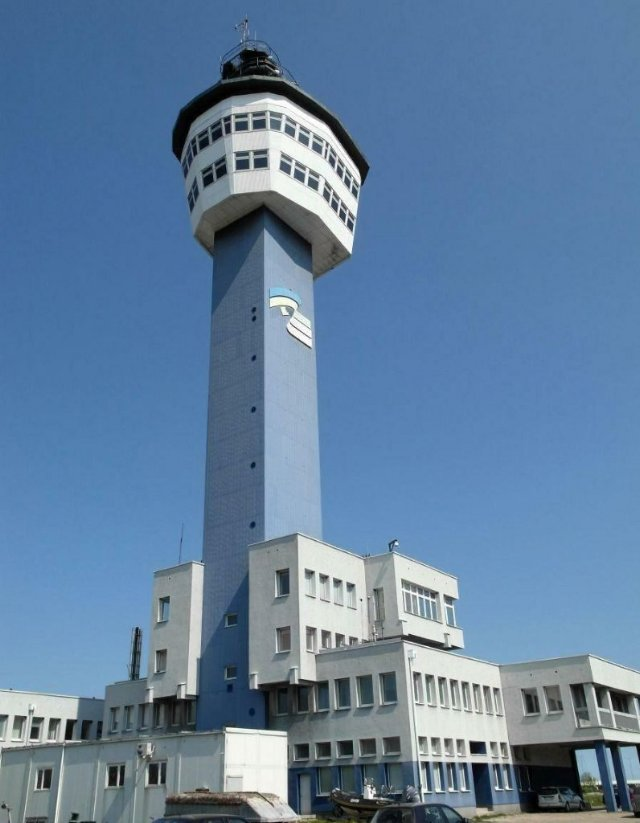
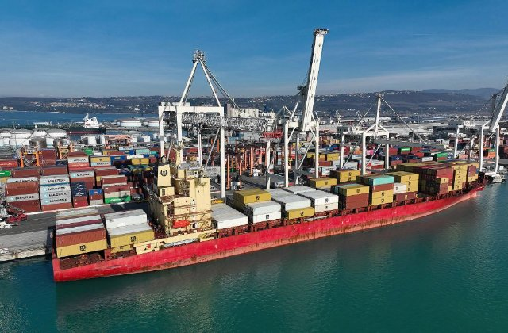

# La collana d'ambra di Danzica (pl_05)
> [!note] Educators & Designers: help improving this quest!
> **Comments and feedback**: [discuss in the Forum](https://antura.discourse.group/t/pl-05-the-amber-necklace-of-gdansk/36/1)  
> **Improve script translations**: [comment the Google Sheet](https://docs.google.com/spreadsheets/d/1FPFOy8CHor5ArSg57xMuPAG7WM27-ecDOiU-OmtHgjw/edit?gid=224592228#gid=224592228)  
> **Improve Cards translations**: [comment the Google Sheet](https://docs.google.com/spreadsheets/d/1M3uOeqkbE4uyDs5us5vO-nAFT8Aq0LGBxjjT_CSScWw/edit?gid=415931977#gid=415931977)  
> **Improve the script**: [propose an edit here](https://github.com/vgwb/Antura/blob/main/Assets/_discover/_quests/PL_05%20Baltic%20Sea/PL_05%20Baltic%20Sea%20-%20Yarn%20Script.yarn)  

- Version: 1.00
- Status: Development
- Location: Poland - Danzica

- Difficulty: Normal
- Duration (min): 10
- Description: Proteggi la fauna selvatica locale in questa avventura nel Mar Baltico

## Design Notes
## Game Design Notes

**Mission**  
The player must gather materials from a Baltic beach by playing a "beachcombing" mini-game. They will then use these materials in a simple crafting interface to create a necklace. This offering is used to solve the main problem of relighting the lighthouse. 

**GamePlay**: Seek, Crafting, Mini-Games, Journey

**Characters**  
The Fisherman: A friendly character who provides information about his job, the local geography, and wildlife.
Neptune: The statue at Neptune's Fountain, who comes to life to accept the offering.

### Knowledge Content
Baltic Sea Characteristics:

- The Baltic coast has beautiful sandy beaches.
- It is a world-famous source of amber.
- Wild seals live in and around the Baltic Sea.

**Vocabulary:**  
Learn words related to the sea: fisherman, cutter, fishing net, shell, fish, seal, beach, sand.

**History & Culture:**  

- Learn about the historic Gdańsk Lighthouse and its role.
- Get a brief introduction to the legend of the Amber Room.

### Flow
The quest begins in Gdańsk near the Lighthouse, which is turned off. A message explains: "Antura has played a prank and turned off the lighthouse! The legend says only an offering to Neptune, king of the sea, can relight it. He desires a necklace made from the treasures of the Baltic: 5 pieces of amber and 5 beautiful seashells."

**The Beach: **
The player heads to the sandy beach.
Mini-Game Shells: To find the items, the player plays a "beachcombing" game, dragging a rake tool across the sand to uncover the hidden amber and shells.
5 sand piles 1 for each piece of shell

**Meet the Fisherman:** 
meets a fisherman mending his fishing net next to his cutter.
Mini-Game Amber 5 special piles 1 for each piece of amber
Fisherman: "Witaj! I am a fisherman. 
I use this cutter to go out on the Baltic Sea 
and this net to catch fish.

**The Crafting:**
Once all 10 items are collected, a simple crafting UI appears. The player drags the amber and shells onto a string in a pattern to create the necklace. (sequence activity)
Use Activity Order. 
The order of the piles can be around the fountain

**The Offering to Neptune:**
The player returns to Neptune's Fountain and places the finished necklace on the statue.
The statue of Neptune glows and speaks with a deep voice.
Neptune: "A fine offering! This beautiful amber reminds me of the lost Amber Room! (A pop-up explains the Amber Room mystery). You have shown respect for the sea. I will grant your wish!"
With a flash of light from Neptune's trident, the Lighthouse beam turns on in the distance.

**Conclusion - The Final Lesson:**
The player wins the race, reaching the seals just in time to block Antura, who then scampers away. The fisherman walks over.
Fisherman: "Well done! These are wild seals. 
We must always keep our distance to keep them safe and happy in their natural home.
Look there is Antura! Go there
Walk to antura (pay attention to seals -1)
Antura: The quest is complete.

**Final Assessment**
Question: 4 questions on pictures (2 answers each)
(An image of amber) -> Amber
(An image of a fish) -> Fish
(An image of a seal) -> Seal
(An image of a beach) -> Beach

### Resources
**Gdańsk Nowy Port Lighthouse:** historic 19th century structure, built in 1894, that used to guide ships into Gdansk’s harbor and was among the first lighthouses on the Baltic Sea coast to use electric light. It’s currently open to visitors as a museum and offers a panoramic view of the Baltic Sea and port area.

**Baltic Sea – shore in Gdańsk** (photo of Brzeźno Beach): it is known for sandy beaches, brisk sea breeze, and scenic coast. It’s a popular spot for both locals and tourists, especially during summer.
  
**Amber**: also known as Baltic Gold, is fossilized tree resin that can be found along the shores of the Baltic Sea. It can often contain ancient inclusions like insects or plant matter. It is prized for its warm hues and used to be traded along the famous Amber Road connecting northern Europe to the Mediterranean.

**The Amber Room:** world famous chamber decorated in amber panels, originally created in the 18th century by German and Gdansk-based artisans. A replica now resides in Catherine Palace near St. Petersburg, but its mysterious wartime disappearance links it forever to Gdansk’s amber trade.

**Żuraw**: medieval port crane and one of Gdansk’s most iconic landmarks. Built in the 15th century, it served both as a loading crane and a city gate along the Motława River.

Neptun’s fountain: historic fountain in Gdansk located in Gdansk’s Long Market and in front of the Main Town Hall, symbolizes the city’s connection to the sea. The statue of the sea god has stood there since the 17th century and is a popular meeting point for visitors.

Town Hall: the Main Town Hall is an example of Gothic – Renaissance architecture with a soaring tower and richly decorated interiors. It now houses the city’s historical museum and offers panoramic views from the tower.

## Additional Cards
#### Ambra
Resina fossile lucida di albero chiamata "oro baltico".

{ width="200" }
- Type: Object
- Subjects: History, Culture, Science

#### Camera d'Ambra
Una famosa stanza fatta di ambra con una storia misteriosa.

{ width="200" }
- Type: Concept
- Subjects: History, Culture

#### Mar Baltico
Un grande mare nel nord Europa, dove si incontrano Polonia, Germania e altri paesi. Ha spiagge bellissime ed è famoso per i tesori d'ambra!

{ width="200" }
- Rationale: The Baltic Sea teaches kids about marine geography and Poland's coastal access
- Type: Place
- Subjects: Geography, Environment

#### Costa del Mar Baltico
La costa sabbiosa lungo il Mar Baltico.

{ width="200" }
- Type: Place
- Subjects: Geography, Environment

#### Taglierina
Una piccola barca da pesca usata in mare.

{ width="200" }
- Type: Object
- Subjects: Transportation, Technology

#### Ecosistema
Gli esseri viventi e la loro casa nella natura, che lavorano insieme.

{ width="200" }
- Type: Concept
- Subjects: Environment, Science

#### Pescatore
Persona che pesca in mare.

{ width="200" }
- Type: Person
- Subjects: Community, Geography

#### Rete da pesca
Una rete usata per catturare i pesci.

{ width="200" }
- Type: Object
- Subjects: Technology, Community

#### Danzica
Città portuale in Polonia sul Mar Baltico.

{ width="200" }
- Type: Place
- Subjects: Geography, History, Culture

#### Faro di Danzica
Un faro storico che aiuta le navi a trovare il porto.

{ width="200" }
- Type: Place
- Subjects: History, Geography, Transportation

#### Municipio principale
Un alto municipio con torre e museo.

{ width="200" }
- Type: Place
- Subjects: History, Culture

#### Fiume Motława
Il fiume che attraversa Danzica fino al mare.

{ width="200" }
- Type: Place
- Subjects: Geography

#### Navigazione
Orientarsi in mare utilizzando luci, mappe e strumenti.

{ width="200" }
- Type: Concept
- Subjects: Technology, Geography

#### Collana
Una collana di perline o conchiglie da indossare intorno al collo.

{ width="200" }
- Type: Object
- Subjects: Art, Culture

#### Fontana di Nettuno
Una famosa fontana di Danzica con la statua del dio del mare.

{ width="200" }
- Type: Place
- Subjects: History, Culture, Community

#### Porta
Un luogo dove le navi caricano e scaricano.

{ width="200" }
- Type: Place
- Subjects: Transportation, Community, Geography

#### Gabbiano
Un uccello marino che vive vicino alla costa.

{ width="200" }
- Type: Object
- Subjects: Animal, Environment

#### Foca
Un animale marino selvatico che riposa sulle spiagge.

{ width="200" }
- Type: Object
- Subjects: Animal, Environment, Safety

#### Conchiglia
Un guscio duro di un animale marino, ottimo per i lavoretti.

{ width="200" }
- Type: Object
- Subjects: Animal, Environment, Art

#### Nave
Una grande imbarcazione che trasporta persone o merci.

{ width="200" }
- Type: Object
- Subjects: Transportation

#### Onde
Acqua in movimento sul mare.

{ width="200" }
- Type: Concept
- Subjects: Environment, Science

#### Żuraw Crane
Una vecchia gru portuale e una porta della città sul fiume.

{ width="200" }
- Type: Place
- Subjects: History, Technology, Geography

## Quest Script

[See the full script here](./pl_05-script.md)

## Words
## Activities
- (none)

## Tasks
- (none)
## Credits
- [Jan Stasienko](mailto:jan.stasienko@dsw.edu.pl) (Poland) (content)
- Lorenzo Castrovilli (Italy) (design)
- [Stefano Cecere](https://stefanocecere.com) (Italy) (development)
- Valeria Passarella (Italy) (design)
- Vieri Toti (Italy) (design)
