# Copernico e il sistema solare (pl_07)
> [!note] Educators & Designers: help improving this quest!
> **Comments and feedback**: [discuss in the Forum](https://antura.discourse.group/t/pl-07-copernicus-and-the-solar-system/38/1)  
> **Improve script translations**: [comment the Google Sheet](https://docs.google.com/spreadsheets/d/1FPFOy8CHor5ArSg57xMuPAG7WM27-ecDOiU-OmtHgjw/edit?gid=783699917#gid=783699917)  
> **Improve Cards translations**: [comment the Google Sheet](https://docs.google.com/spreadsheets/d/1M3uOeqkbE4uyDs5us5vO-nAFT8Aq0LGBxjjT_CSScWw/edit?gid=415931977#gid=415931977)  
> **Improve the script**: [propose an edit here](https://github.com/vgwb/Antura/blob/main/Assets/_discover/_quests/PL_07%20Solar%20System/PL_07%20Solar%20System%20-%20Yarn%20Script.yarn)  

- Version: 1.00
- Status: Development
- Location: Poland - Torun

- Difficulty: Normal
- Duration (min): 10
- Description: Scopri chi era Niccolò Copernico e gli 8 pianeti del sistema solare

## Game Design Notes

**Mission**  
Discover the 8 planets of the Solar System, collect their treasures, and put them in order to rescue Antura from Copernicus's model room.  
And did you know Copernicus was from Poland?

### Core Subject
The 8 planets of the Solar System and their order from the Sun, Nicolaus Copernicus and his heliocentric discovery.

### Collect Mechanic
Each planet has objects to collect equal to its position number from the Sun.  
Finding and counting them reinforces both the planet facts and the order.

| # | Planet | Activity | Object |
|---|--------|---------|--------|
| 1 | Mercury | Collect 1 | sun-heated rock |
| 2 | Venus | Collect 2 | hot clouds |
| 3 | Earth | Collect 3 | water drops |
| 4 | Mars | Collect 4 | red dust grains |
| 5 | Jupiter | Collect 5 | storm bolts |
| 6 | Saturn | Collect 6 | ring fragments |
| 7 | Uranus | Collect 7 | ice crystals |
| 8 | Neptune | memory game | other planets |

### Characters
- **Nicolaus Copernicus** (SENIOR_M): The main guide. Tells a short story about each planet.
- **Guide** (GUIDE_F): Introduces the quest, helps rescue Antura at the end.
- **Old Sailor** (SENIOR_M): Has sailed the farthest seas and knows about the deep, dark ocean of space.

### Knowledge Content

**Planets:**
- Mercury — closest to the Sun, no air, covered in craters
- Venus — hottest planet, wrapped in thick hot clouds
- Earth — our home, covered in water and life
- Mars — the Red Planet, dusty surface, tallest volcano in the Solar System
- Jupiter — the biggest planet, giant storm called the Great Red Spot
- Saturn — famous rings made of ice and rock
- Uranus — icy blue-green giant that spins on its side
- Neptune — farthest planet, deep blue, extreme winds, has a giant moon called Triton

**History:**
- Copernicus proved the Sun (not Earth) is at the center of the Solar System — the **heliocentric model**
- He was born in **Torun**, Poland

**Vocabulary:**  
planet, solar system, sun, orbit, Mercury, Venus, Earth, Mars, Jupiter, Saturn, Uranus, Neptune, rings, crater, volcano, storm, ocean, cloud, ice, wind, moon

---

### Flow

1. **Arrival in Torun** — The guide welcomes the player outside Copernicus's house. Antura has sneaked into the model room.
2. **Meet Copernicus** — He introduces himself and asks for help: the Solar System model is broken and the planets are scattered.
3. **Order Activity** — The player arranges the 8 planets from the Sun (ORDER activity). Copernicus explains the heliocentric model.
4. **Planet Hunt (×7)** — For planets 1–7 (Mercury → Uranus), in order from the Sun:
   - Copernicus tells a short story about that planet
   - The player collects N objects via a CLEANCANVAS activity (N = planet position)
   - The planet is placed into the model
5. **Neptune Bonus** — An old sailor (boatswain) appears at the edge of the model and introduces Neptune, the farthest planet. The activity is a MEMORY game matching Neptune facts (simpler, as a reward beat before the finale).
6. **Model Complete** — All 8 planets placed. The model lights up.
7. **Rescue Antura** — Copernicus opens the model room. Antura was hiding behind Neptune!
8. **Copernicus Farewell** — He thanks the player and recalls his key discovery.
9. **Final Quiz** — 3 questions: 
- What's at the center?
- Which planet is closest?
- Which planet has rings?

---

### Activities
- `order planets_order` — arrange 7 planets in order from the Sun
- `cleancanvas collect_mercury_1` — find 1 sun-heated rock
- `cleancanvas collect_venus_2` — find 2 hot clouds
- `cleancanvas collect_earth_3` — find 3 water drops
- `cleancanvas collect_mars_4` — find 4 red dust grains
- `cleancanvas collect_jupiter_5` — find 5 storm bolts
- `cleancanvas collect_saturn_6` — find 6 ring fragments
- `cleancanvas collect_uranus_7` — find 7 ice crystals
- `memory neptune_facts` — match Neptune facts (deep blue, farthest, Triton moon, strong winds) — simpler activity, introduced by the boatswain
- `quiz copernicus_basics` — 3 final questions

---

### Resources

**Nicolaus Copernicus (1473-1543):** Born in Torun, Poland. Proposed the heliocentric model of the Solar System — that the Sun, not the Earth, is at the center. His work *De revolutionibus orbium coelestium* (1543) transformed our understanding of the cosmos.

**Copernicus House (Torun):** His birthplace is now a museum dedicated to his life and scientific achievements.

**Mercury:** Smallest planet and closest to the Sun. No atmosphere. Surface is covered with impact craters. Temperatures swing from -180 C at night to 430 C by day.

**Venus:** Second planet from the Sun. The hottest planet (460 C average), hotter than Mercury, due to its dense CO2 atmosphere trapping heat. Often called Earth's "twin" in size.

**Earth:** Third planet and the only one known to support life. 71% of its surface is water. Has one natural satellite: the Moon.

**Mars:** Fourth planet. Red color comes from iron oxide (rust) on its surface. Home to Olympus Mons, the tallest volcano in the Solar System (22 km high). Has two tiny moons.

**Jupiter:** Fifth planet and the largest in the Solar System. The Great Red Spot is a storm larger than Earth that has raged for centuries. Has at least 95 known moons.

**Saturn:** Sixth planet. Its spectacular ring system is made of billions of ice and rock particles. Saturn is so light it would float on water.

**Uranus:** Seventh planet. An "ice giant" made mostly of water, methane, and ammonia ices. Rotates on its side (98 degree axial tilt), making it unique in the Solar System.

**Neptune:** Eighth and farthest planet. A deep blue ice giant with the strongest winds in the Solar System (up to 2,100 km/h). Its largest moon, Triton, orbits backwards and is slowly spiralling inward. Named after the Roman god of the sea.

## Quest Script
[See the full script here](./pl_07-script.md)

## Topics
### Solar System {#solar_system}
[Open topic page](../../topics/index.md#solar_system)  

- Importance: High  
- Country: International  
- Target age: Ages6to10  
- Subjects: Science

#### Core Card - Sistema solare
Il Sole e gli otto pianeti che gli ruotano attorno.

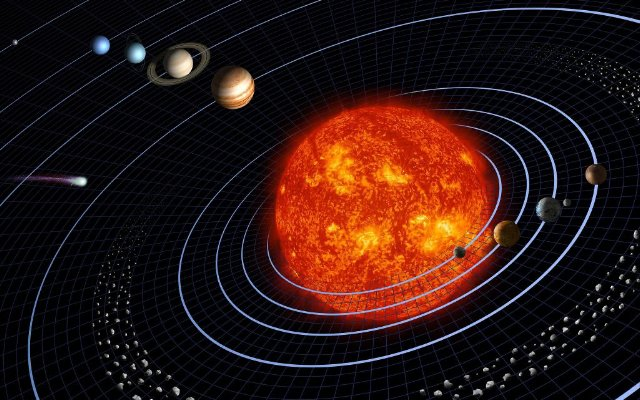{ width="200" }
- Type: Concept
- Subjects: Space, Science

#### Connection (RelatedTo) - Mercurio
Il pianeta più vicino al Sole; piccolo e molto veloce.

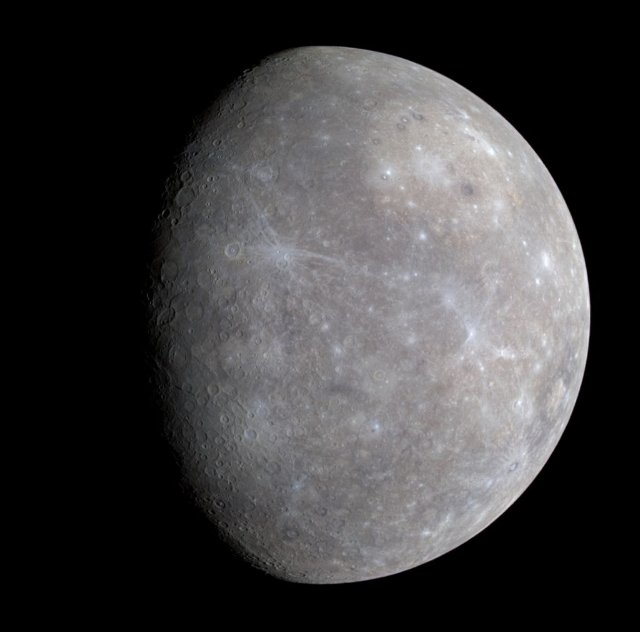{ width="200" }
- Type: Object
- Subjects: Space, Science

#### Connection (RelatedTo) - Marte
Il pianeta rosso con polvere e grandi vulcani.

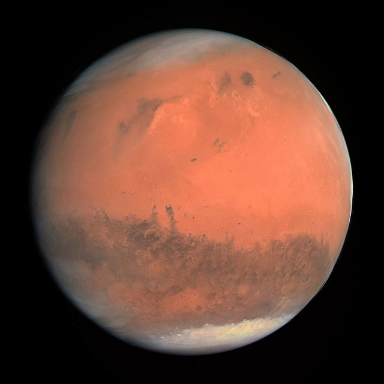{ width="200" }
- Type: Object
- Subjects: Space, Science

#### Connection (RelatedTo) - Giove
Il pianeta più grande, famoso per la Grande Macchia Rossa.

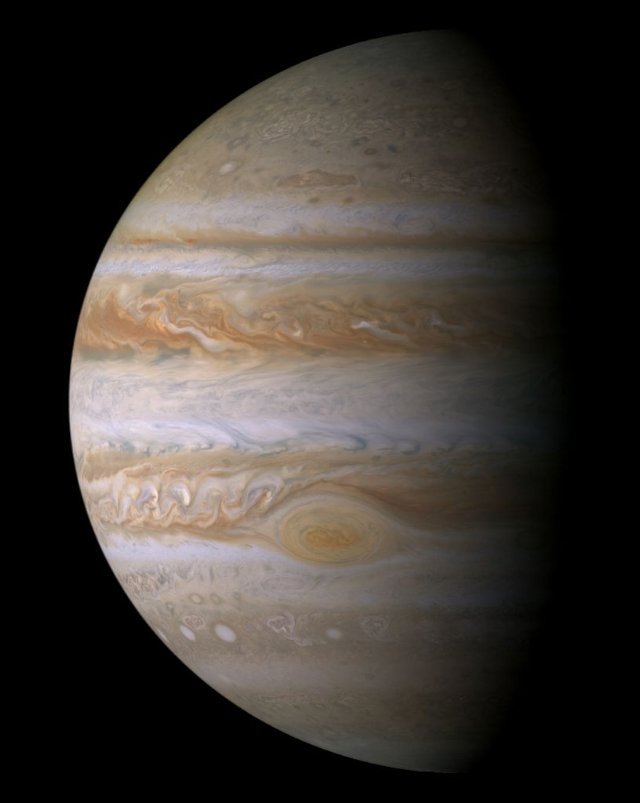{ width="200" }
- Type: Object
- Subjects: Space, Science

#### Connection (RelatedTo) - Nettuno
Il dio del mare delle vecchie storie.

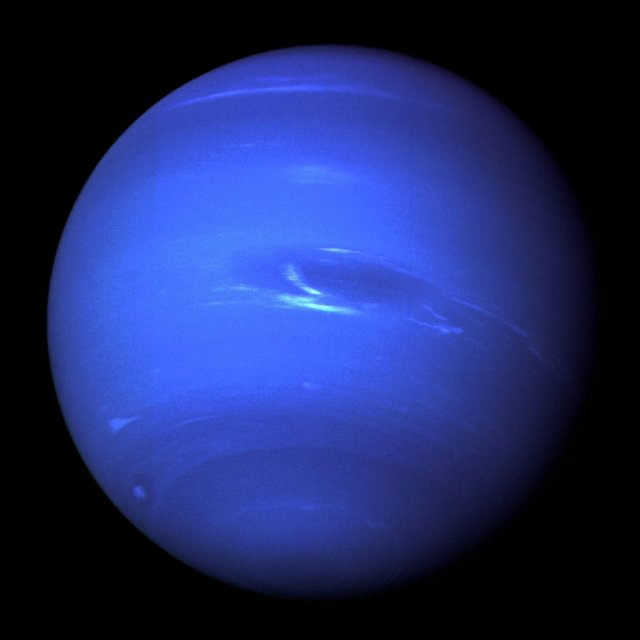{ width="200" }
- Type: Concept
- Subjects: Culture, History

#### Connection (RelatedTo) - Venere
Un pianeta molto caldo ricoperto da spesse nubi.

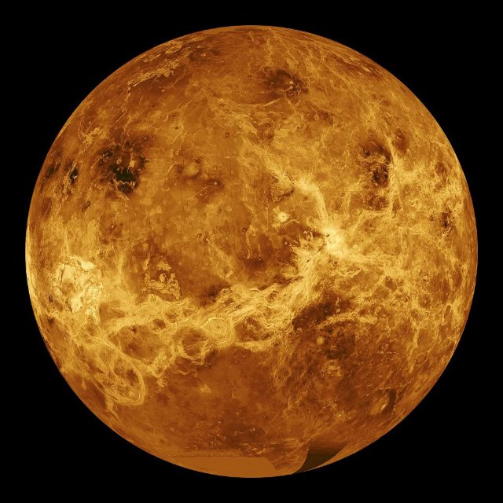{ width="200" }
- Type: Object
- Subjects: Space, Science

#### Connection (RelatedTo) - Modello eliocentrico
L'idea che il Sole sia al centro e che i pianeti gli girino attorno.

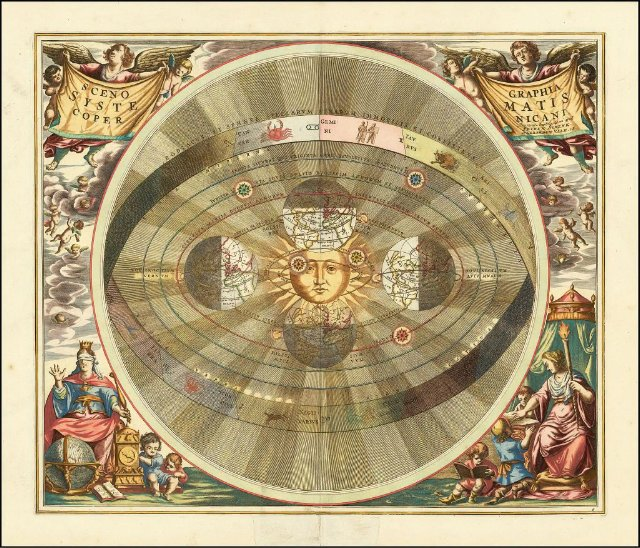{ width="200" }
- Type: Concept
- Subjects: Science, Space, History

#### Connection (RelatedTo) - Astronomia
La scienza che studia il Sole, la Luna, le stelle e i pianeti.

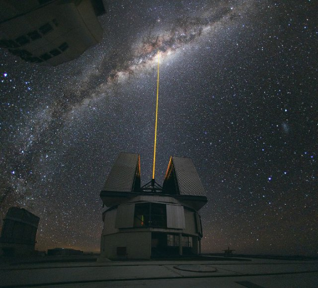{ width="200" }
- Type: Concept
- Subjects: Science, Space

#### Connection (RelatedTo) - Saturno
Un pianeta gigante con anelli luminosi e numerose lune.

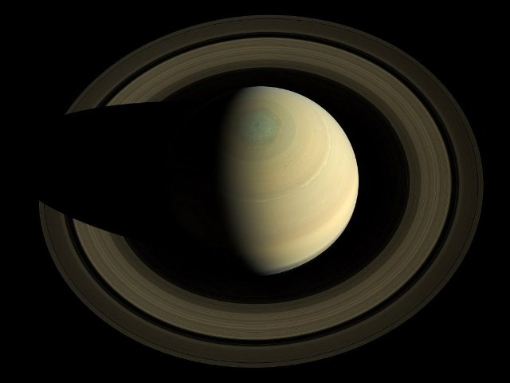{ width="200" }
- Type: Object
- Subjects: Space, Science

#### Connection (RelatedTo) - Planetario
Un luogo dove è possibile osservare il cielo e le stelle restando al chiuso.

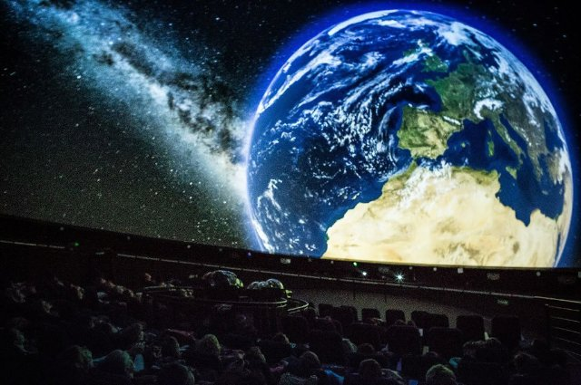{ width="200" }
- Type: Place
- Subjects: Education, Science, Space

#### Connection (RelatedTo) - Terra
Il nostro pianeta natale con terra, aria e acqua.

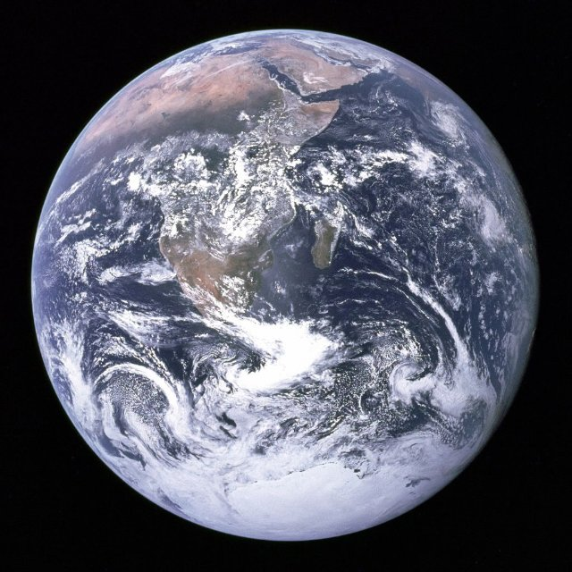{ width="200" }
- Type: Object
- Subjects: Space, Science, Geography, Environment

#### Connection (RelatedTo) - Urano
Un pianeta blu-verde che ruota su un lato.

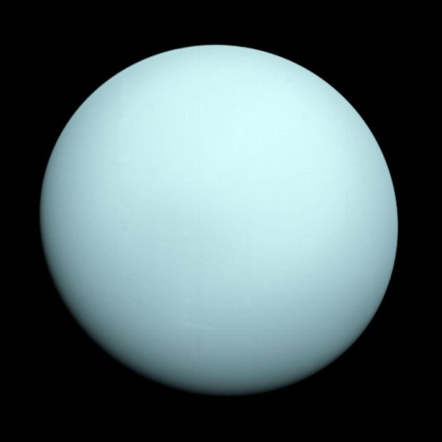{ width="200" }
- Type: Object
- Subjects: Space, Science

### Telescope {#telescope}
[Open topic page](../../topics/index.md#telescope)  

- Importance: Medium  
- Country: International  
- Target age: Ages6to10  
- Subjects: Science

#### Core Card - Telescopio
Uno strumento che ci aiuta a vedere cose lontane nel cielo.

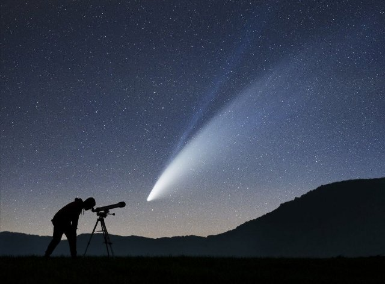{ width="200" }
- Type: Object
- Subjects: Science, Technology, Space

#### Connection (RelatedTo) - Niccolò Copernico
Un brillante scienziato polacco ha scoperto che è la Terra a girare intorno al Sole, non il contrario! Questo ha cambiato il nostro modo di concepire lo spazio.

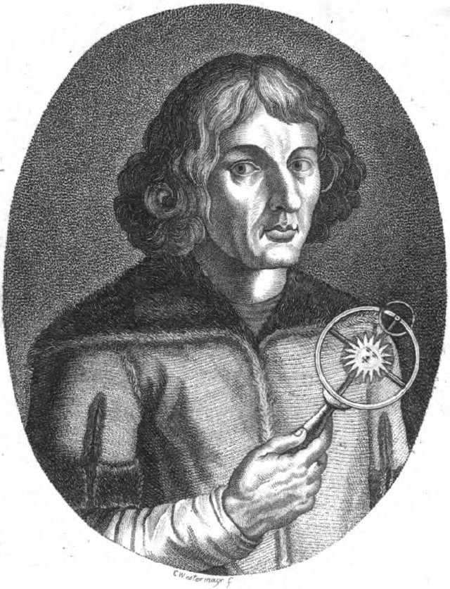{ width="200" }
- Rationale: Copernicus teaches kids about scientific discovery and Polish contributions to astronomy
- Type: Person
- Subjects: Science, History, Space
- Year: 1473

#### Connection (RelatedTo) - Oculare
La piccola lente attraverso cui si guarda in un telescopio.

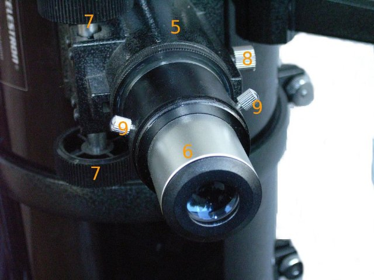{ width="200" }
- Type: Object
- Subjects: Science, Technology

#### Connection (RelatedTo) - Lente
Un pezzo di vetro o plastica trasparente che piega la luce.

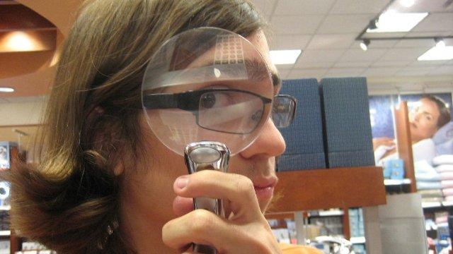{ width="200" }
- Type: Object
- Subjects: Science, Technology

#### Connection (RelatedTo) - Planetario
Un luogo dove è possibile osservare il cielo e le stelle restando al chiuso.

{ width="200" }
- Type: Place
- Subjects: Education, Science, Space

## Additional Cards
#### Casa di Niccolò Copernico
Ora è un museo dove è possibile scoprire di più sulla sua vita e sui suoi successi scientifici.

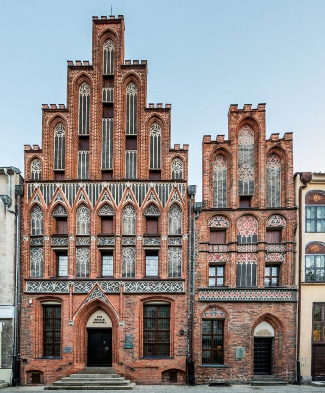{ width="200" }
- Type: Place
- Subjects: Culture, Science

#### Toruń
Città della Polonia dove nacque Niccolò Copernico.

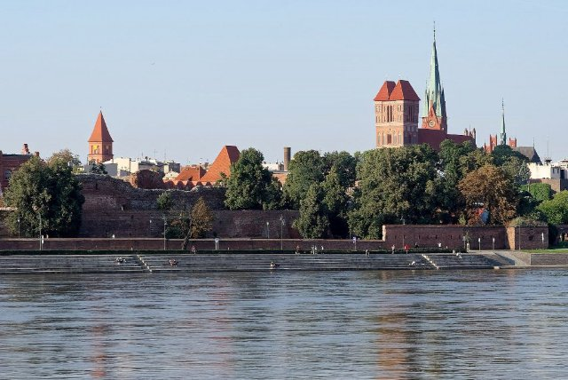{ width="200" }
- Type: Place
- Subjects: Geography, History, Culture

## Words
## Activities
- (none)

## Tasks
- (none)
## Credits
- [Jan Stasienko](mailto:jan.stasienko@dsw.edu.pl) (Poland) (content)
- [Stefano Cecere](https://stefanocecere.com) (Italy) (development)
