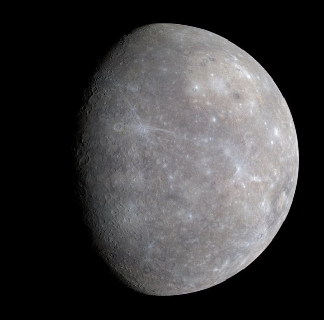
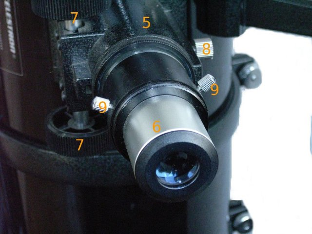

# Copernico e il sistema solare (pl_07)
> [!note] Educators & Designers: help improving this quest!
> **Comments and feedback**: [discuss in the Forum](https://antura.discourse.group/t/pl-07-copernicus-and-the-solar-system/38/1)  
> **Improve script translations**: [comment the Google Sheet](https://docs.google.com/spreadsheets/d/1FPFOy8CHor5ArSg57xMuPAG7WM27-ecDOiU-OmtHgjw/edit?gid=783699917#gid=783699917)  
> **Improve Cards translations**: [comment the Google Sheet](https://docs.google.com/spreadsheets/d/1M3uOeqkbE4uyDs5us5vO-nAFT8Aq0LGBxjjT_CSScWw/edit?gid=415931977#gid=415931977)  
> **Improve the script**: [propose an edit here](https://github.com/vgwb/Antura/blob/main/Assets/_discover/_quests/PL_07%20Solar%20System/PL_07%20Solar%20System%20-%20Yarn%20Script.yarn)  

- Version: 1.00
- Status: Development
- Location: Poland - Torun

- Difficulty: Normal
- Duration (min): 10
- Description: Scopri chi era Niccolò Copernico e gli 8 pianeti del sistema solare

## Design Notes
## Game Design Notes
**Mission**  
discover who Nicolaus Copernicus was and how he revolutionised science.
And did you know he was from poland?

### Knowledge
Nicolaus Copernicus and the life of a scientist in the renaissance  

- How does the telescope work?
- The 8 planets of the solar system and their names and order

### Flow
You arrive in Toruń, meeting the guide who welcomes you. He says that apparently Antura got stuck in Nicolaus Copernicus’ house and we need to help him. To do that, you first talk with Nicolaus Kopernik outside of his house – he introduces himself and says that he will help you if you help him first. He says that there is a map of a solar system that needs fixing.  
He asks you to put the planets in the correct order (ACTIVITY ORDER).  
When you do, he explains how people used to think that Earth was in the center of it and how he created the model of the Solar System that has the Sun in the center. You go with him inside of the house looking for Antura. You follow his trail and pass a telescope.  
Copernicus explains what that is and mentions what a planetarium is as well. Eventually you find Antura and take him out of there. Copernicus says he’s glad everything is okay and tells you about himself, who he is, what he’s known for.

## Topics
### Solar System {#solar_system}
[Open topic page](../../topics/index.md#solar_system)  

- Importance: High  
- Country: International  
- Target age: Ages6to10  
- Subjects: Science

#### Core Card - Sistema solare
Il Sole e gli otto pianeti che gli ruotano attorno.

{ width="200" }
- Type: Concept
- Subjects: Space, Science

#### Connection (RelatedTo) - Mercurio
Il pianeta più vicino al Sole; piccolo e molto veloce.

{ width="200" }
- Type: Object
- Subjects: Space, Science

#### Connection (RelatedTo) - Marte
Il pianeta rosso con polvere e grandi vulcani.

{ width="200" }
- Type: Object
- Subjects: Space, Science

#### Connection (RelatedTo) - Giove
Il pianeta più grande, famoso per la Grande Macchia Rossa.

{ width="200" }
- Type: Object
- Subjects: Space, Science

#### Connection (RelatedTo) - Nettuno
Il dio del mare delle vecchie storie.

{ width="200" }
- Type: Concept
- Subjects: Culture, History

#### Connection (RelatedTo) - Venere
Un pianeta molto caldo ricoperto da spesse nubi.

{ width="200" }
- Type: Object
- Subjects: Space, Science

#### Connection (RelatedTo) - Modello eliocentrico
L'idea che il Sole sia al centro e che i pianeti gli girino attorno.

{ width="200" }
- Type: Concept
- Subjects: Science, Space, History

#### Connection (RelatedTo) - Astronomia
La scienza che studia il Sole, la Luna, le stelle e i pianeti.

{ width="200" }
- Type: Concept
- Subjects: Science, Space

#### Connection (RelatedTo) - Saturno
Un pianeta gigante con anelli luminosi e numerose lune.

{ width="200" }
- Type: Object
- Subjects: Space, Science

#### Connection (RelatedTo) - Planetario
Un luogo dove è possibile osservare il cielo e le stelle restando al chiuso.

{ width="200" }
- Type: Place
- Subjects: Education, Science, Space

#### Connection (RelatedTo) - Terra
Il nostro pianeta natale con terra, aria e acqua.

{ width="200" }
- Type: Object
- Subjects: Space, Science, Geography, Environment

#### Connection (RelatedTo) - Urano
Un pianeta blu-verde che ruota su un lato.

{ width="200" }
- Type: Object
- Subjects: Space, Science

### Telescope {#telescope}
[Open topic page](../../topics/index.md#telescope)  

- Importance: Medium  
- Country: International  
- Target age: Ages6to10  
- Subjects: Science

#### Core Card - Telescopio
Uno strumento che ci aiuta a vedere cose lontane nel cielo.

{ width="200" }
- Type: Object
- Subjects: Science, Technology, Space

#### Connection (RelatedTo) - Niccolò Copernico
Un brillante scienziato polacco ha scoperto che è la Terra a girare intorno al Sole, non il contrario! Questo ha cambiato il nostro modo di concepire lo spazio.

{ width="200" }
- Rationale: Copernicus teaches kids about scientific discovery and Polish contributions to astronomy
- Type: Person
- Subjects: Science, History, Space
- Year: 1473

#### Connection (RelatedTo) - Oculare
La piccola lente attraverso cui si guarda in un telescopio.

{ width="200" }
- Type: Object
- Subjects: Science, Technology

#### Connection (RelatedTo) - Lente
Un pezzo di vetro o plastica trasparente che piega la luce.

{ width="200" }
- Type: Object
- Subjects: Science, Technology

#### Connection (RelatedTo) - Planetario
Un luogo dove è possibile osservare il cielo e le stelle restando al chiuso.

{ width="200" }
- Type: Place
- Subjects: Education, Science, Space

## Additional Cards
#### Casa di Niccolò Copernico
Ora è un museo dove è possibile scoprire di più sulla sua vita e sui suoi successi scientifici.

{ width="200" }
- Type: Place
- Subjects: Culture, Science

#### Toruń
Città della Polonia dove nacque Niccolò Copernico.

{ width="200" }
- Type: Place
- Subjects: Geography, History, Culture

## Quest Script

[See the full script here](./pl_07-script.md)

## Words
## Activities
- (none)

## Tasks
- (none)
## Credits
- [Jan Stasienko](mailto:jan.stasienko@dsw.edu.pl) (Poland) (content)
- [Stefano Cecere](https://stefanocecere.com) (Italy) (development)
