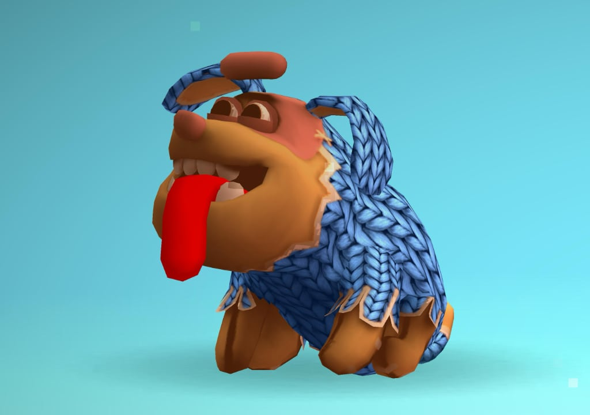
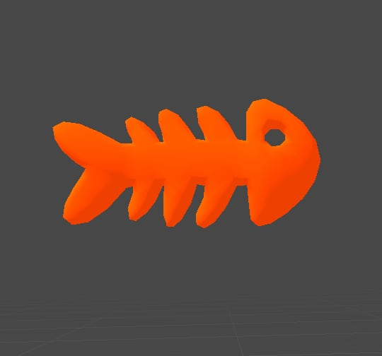
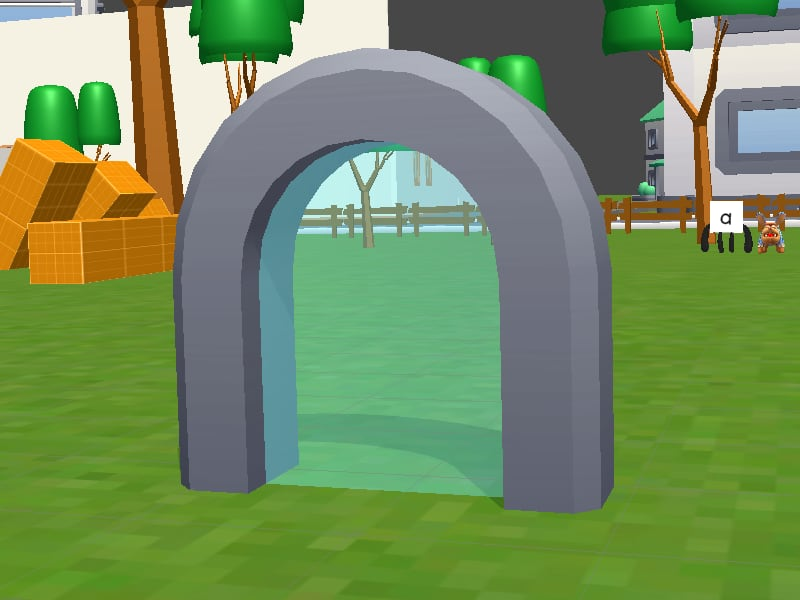
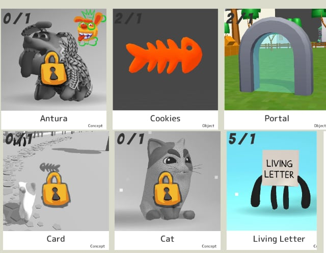
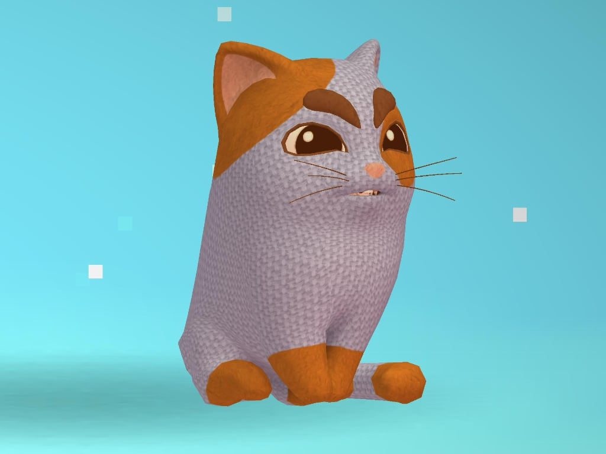
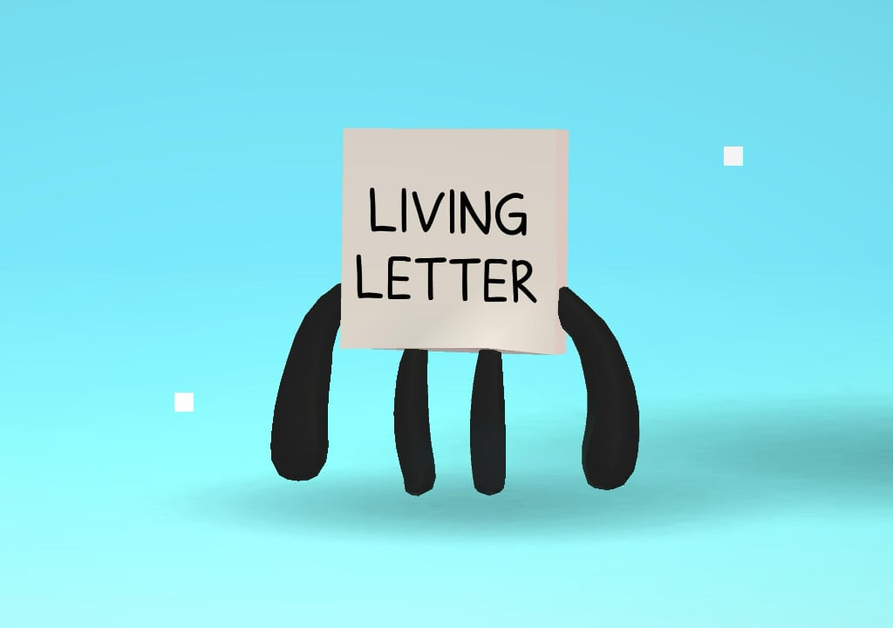
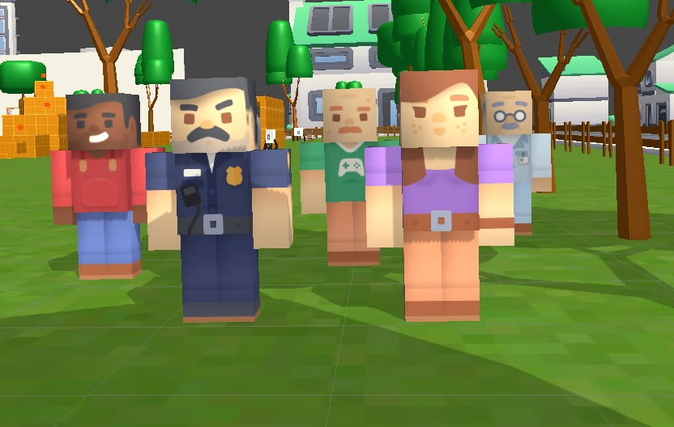

# Tutorial (tutorial)
> [!note] Educators & Designers: help improving this quest!
> **Comments and feedback**: [discuss in the Forum](https://antura.discourse.group/t/quest-tutorial/41)  
> **Improve script translations**: [comment the Google Sheet](https://docs.google.com/spreadsheets/d/1FPFOy8CHor5ArSg57xMuPAG7WM27-ecDOiU-OmtHgjw/edit?gid=631129787#gid=631129787)  
> **Improve Cards translations**: [comment the Google Sheet](https://docs.google.com/spreadsheets/d/1M3uOeqkbE4uyDs5us5vO-nAFT8Aq0LGBxjjT_CSScWw/edit?gid=415931977#gid=415931977)  
> **Improve the script**: [propose an edit here](https://github.com/vgwb/Antura/blob/main/Assets/_discover/_quests/_TUTORIAL/Tutorial%20-%20Yarn%20Script.yarn)  

- Version: 1.00
- Status: Production
- Location: International

- Difficulty: Tutorial
- Duration (min): 10
- Description: Impariamo a giocare ad Antura Discover!

## Topics
### Antura's world {#antura-world}
[Open topic page](../../topics/index.md#antura-world)  

- Importance: Medium  
- Country: International  
- Target age: Ages6to10

#### Core Card - Antura
Il personaggio principale di questo videogioco

{ width="200" }
- Type: Concept

#### Connection (RelatedTo) - Biscotti
Fantastiche ricompense che puoi collezionare giocando! Usale per ottenere nuovi oggetti e sorprese.

{ width="200" }
- Type: Object

#### Connection (RelatedTo) - Portale
Una porta magica che ti porta in nuovi luoghi. Entra e scopri dove ti porta!

{ width="200" }
- Type: Object

#### Connection (RelatedTo) - Carte
Ogni carta ha qualcosa di speciale da imparare. Trovale tutte e leggile!

{ width="200" }
- Type: Concept

#### Connection (RelatedTo) - Gatto
La migliore amica e compagna di viaggio di Antura. Curiosa, intelligente e sempre pronta ad aiutare!

{ width="200" }
- Type: Concept

#### Connection (RelatedTo) - Lettera vivente
Una lettera amichevole che ama parlare e giocare! Parla con loro per imparare nuove parole

{ width="200" }
- Type: Concept

#### Connection (RelatedTo) - Blocchi
Queste persone divertenti vivono in questo mondo.
Parlate con loro... hanno storie da raccontare!

{ width="200" }
- Type: Concept

#### Connection (RelatedTo) - Portale
Una porta magica che ti porta in nuovi luoghi. Entra e scopri dove ti porta!

{ width="200" }
- Type: Object

#### Connection (RelatedTo) - Pericolo
Qualcosa che non dovresti fare! Fai attenzione e stai al sicuro.

{ width="200" }
- Type: Concept

## Quest Script

[See the full script here](./tutorial-script.md)

## Words
## Activities
- [CleanCanvas](../../activities/index.md#CleanCanvas)
- [JigsawPuzzle](../../activities/index.md#JigsawPuzzle)
- [Match](../../activities/index.md#Match)
- [Memory](../../activities/index.md#Memory)
- [MoneyCount](../../activities/index.md#MoneyCount)
- [Order](../../activities/index.md#Order)

## Tasks
- [Collect] talk_everybody
- [Interact] open_chest
## Credits
- Fabio Cecere (Italy) (design, development)
- [Stefano Cecere](https://stefanocecere.com) (Italy) (design, development)
