# Topics

Total found: **34**

> [!note] NOTE: connections type can be:
> **Created By** (agent (person/org) who made/discovered/commissioned)  
> **Located In**       (where it is/was)  
> **Is A**             (type/category relation (Baguette is a Bread))  
> **Part Of**         (whole/part relation (Crust is part of Baguette))  
> **Made Of**          (physical composition)  
> **Time Context**     (period/event/date)  
> **Cultural Context** (origin/tradition/symbolism)  
> **Causal**           (clear cause→effect)  
> **Purpose**          (used for…)  
> **Compare**          (compare/Kind similar/contrast/analogy)  
> **Related To**     (whatever else, last choice...)  

## International

### Elementary Math {#elementary-maths}
- Description: Numbers and shapes for everyday life: counting, adding and subtracting, simple fractions, measuring, telling time, and using money.  
- Importance: Medium  
- Subjects: Math  
- Target Age: Ages6to10
- Core card:
    - **[Eleementary Maths](../cards/index.md#elementary_maths)**
    Numbers and shapes for everyday life: counting, adding and subtracting, simple fractions, measuring, telling time, and using money.

- Connected cards:
    - **[Linea](../cards/index.md#fr_figure_line)** (PartOf)
    Un segno dritto che va da un punto all'altro. Le linee possono essere lunghe o corte.

    { width="200" }

    - **[Triangolo](../cards/index.md#fr_figure_triangle)** (PartOf)
    Una forma con tre lati dritti e tre angoli. I triangoli sembrano fette di pizza!

    { width="200" }

    - **[Bussola](../cards/index.md#math_compass)** (Purpose)
    Uno strumento che ti aiuta a disegnare cerchi perfetti. Ha due gambe come forbici.

    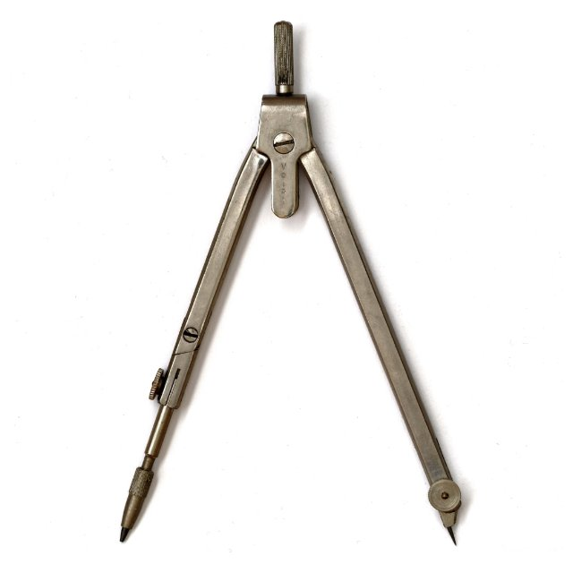{ width="200" }

    - **[Governate](../cards/index.md#math_ruler)** (Purpose)
    Uno strumento dritto usato per misurare la lunghezza degli oggetti. I righelli hanno numeri e linee.

    { width="200" }

    - **[Piazza](../cards/index.md#math_setsquare)** (Purpose)
    Strumento a forma di triangolo utilizzato per disegnare linee rette e angoli retti in matematica.

    { width="200" }

    - **[Cerchio](../cards/index.md#fr_figure_circle)** (PartOf)
    Una forma rotonda senza angoli. I cerchi sembrano ruote, palline e monete!

    { width="200" }

- Quests: [Il sistema scolastico (fr_02)](../quests/quest/fr_02.md)

Credits:
  - Valeria Passarella (Italy)
  - [Stefano Cecere](https://stefanocecere.com) (Italy)

---

### Fisherman {#fisherman}
- Importance: Medium  
- Target Age: Ages6to10
- Core card:
    - **[Pescatore](../cards/index.md#fisherman)**
    Persona che pesca in mare.

    { width="200" }

- Connected cards:
    - **[Porta](../cards/index.md#port)** (LocatedIn)
    Un luogo dove le navi caricano e scaricano.

    { width="200" }

    - **[Onde](../cards/index.md#waves)** (RelatedTo)
    Acqua in movimento sul mare.

    { width="200" }

    - **[Navigazione](../cards/index.md#navigation)** (RelatedTo)
    Orientarsi in mare utilizzando luci, mappe e strumenti.

    { width="200" }

    - **[Rete da pesca](../cards/index.md#fishing_net)** (Purpose)
    Una rete usata per catturare i pesci.

    { width="200" }

    - **[Nave](../cards/index.md#ship)** (RelatedTo)
    Una grande imbarcazione che trasporta persone o merci.

    { width="200" }

---

### Flags of Europe {#flags_euroe}
- Importance: Medium  
- Target Age: Ages6to10
- Core card:
    - **[Mappa dell'Europa](../cards/index.md#concept_europe_map)**
    Una mappa che mostra tutti i paesi d'Europa. Puoi vedere dove si trovano Francia, Polonia, Germania e altri paesi.

    { width="200" }

- Connected cards:
    - **[Bandiera della Germania](../cards/index.md#flag_germany)** (CulturalContext)
    La bandiera della Germania ha tre strisce orizzontali: nera, rossa e gialla. La Germania è famosa per le automobili, i castelli e le fiabe!

    { width="200" }

    - **[Bandiera dell'Italia](../cards/index.md#flag_italy)** (CulturalContext)
    La bandiera italiana ha tre strisce verticali: verde, bianco e rosso. I colori ricordano il basilico, la mozzarella e i pomodori sulla pizza!

    { width="200" }

    - **[Bandiera del Lussemburgo](../cards/index.md#flag_luxembourg)** (CulturalContext)
    La bandiera del Lussemburgo è a strisce orizzontali rosse, bianche e azzurre. Il Lussemburgo è un paese molto piccolo in cui si parlano tre lingue!

    { width="200" }

    - **[Bandiera di Monaco](../cards/index.md#flag_monaco)** (CulturalContext)
    La bandiera di Monaco è a strisce orizzontali rosse e bianche. Monaco è piccola ma famosa per le sue auto di lusso e i palazzi reali sul mare!

    { width="200" }

    - **[Bandiera del Belgio](../cards/index.md#flag_belgium)** (CulturalContext)
    La bandiera del Belgio ha tre strisce verticali: nera, gialla e rossa. Il Belgio è famoso per il cioccolato e i waffle!

    { width="200" }

    - **[Bandiera della Spagna](../cards/index.md#flag_spain)** (CulturalContext)
    La bandiera spagnola ha strisce orizzontali rosse e gialle. I colori sono quelli del sole e dei peperoni! La Spagna ha inventato il flamenco.

    { width="200" }

    - **[Bandiera della Svizzera](../cards/index.md#flag_switzerland)** (CulturalContext)
    La bandiera svizzera è rossa con una croce bianca al centro. Sembra un kit di pronto soccorso! La Svizzera è famosa per le montagne e il formaggio.

    { width="200" }

    - **[Bandiera della Francia](../cards/index.md#flag_france)** (CulturalContext)
    La bandiera francese ha tre strisce verticali: blu, bianco e rosso. Questi colori rappresentano libertà, uguaglianza e fratellanza!

    { width="200" }

    - **[Flag of Czech Republic](../cards/index.md#flag_czech_republic)** (CulturalContext)
    The flag has white and red stripes with a blue triangle. The Czech Republic is famous for beautiful Prague castle and crystal glass.

    { width="200" }

    - **[Bandiera della Slovacchia](../cards/index.md#flag_slovakia)** (CulturalContext)
    Una bandiera con i colori bianco, blu e rosso. Rappresenta la Slovacchia.

    { width="200" }

    - **[Bandiera dell'Ucraina](../cards/index.md#flag_ukraine)** (CulturalContext)
    Una bandiera con i colori blu e giallo, come il cielo e il sole. Rappresenta il paese dell'Ucraina.

    { width="200" }

- Quests: [I vicini della Francia (fr_00)](../quests/quest/fr_00.md), [I vicini della Polonia (pl_00)](../quests/quest/pl_00.md)

---

### mountain activities {#mountain_activities}
- Importance: Medium  
- Target Age: Ages6to10
- Core card:
    - **[Montagna](../cards/index.md#mountain)**
    I pilastri della terra

    { width="200" }

- Connected cards:
    - **[Guida alpina](../cards/index.md#mountain_guide)** (RelatedTo)
    Una persona che aiuta le persone ad arrampicarsi in sicurezza.

    { width="200" }

    - **[Escursionismo](../cards/index.md#hiking)** (RelatedTo)
    Camminare sui sentieri immersi nella natura.

    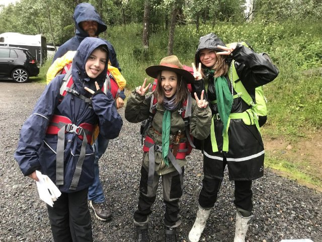{ width="200" }

    - **[Arrampicata](../cards/index.md#climbing)** (RelatedTo)
    Salire su rocce o ghiaccio con attrezzatura speciale.

    { width="200" }

    - **[Sciare](../cards/index.md#skiing)** (RelatedTo)
    Scivolare sulla neve con gli sci.

    { width="200" }

- Quests: [Monte Bianco e montagne (fr_08)](../quests/quest/fr_08.md)

---

### mountain tools {#mountain_tools}
- Description: what we need to stay ssafe in the mountain  
- Importance: Medium  
- Target Age: Ages6to10
- Core card:
    - **[Montagna](../cards/index.md#mountain)**
    I pilastri della terra

    { width="200" }

- Connected cards:
    - **[Guanti](../cards/index.md#gloves)** (RelatedTo)
    Coperture calde per le tue mani.

    { width="200" }

    - **[Cappello](../cards/index.md#hat)** (RelatedTo)
    Un berretto caldo per la testa.

    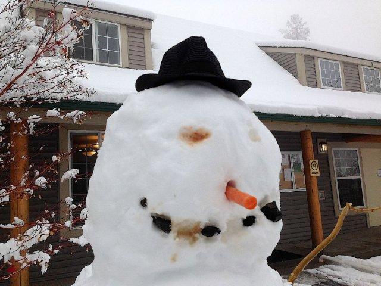{ width="200" }

    - **[Zaino](../cards/index.md#backpack)** (RelatedTo)
    Una borsa che porti sulla schiena.

    { width="200" }

    - **[Corda](../cards/index.md#rope)** (RelatedTo)
    Una linea robusta utilizzata per la sicurezza durante l'arrampicata.

    { width="200" }

    - **[Ramponi](../cards/index.md#crampons)** (RelatedTo)
    Impugnature metalliche appuntite da fissare agli scarponi per usare il ghiaccio.

    { width="200" }

    - **[Sciarpa](../cards/index.md#scarf)** (RelatedTo)
    Un panno caldo da indossare intorno al collo.

    { width="200" }

    - **[Occhiali da sole](../cards/index.md#sunglasses)** (RelatedTo)
    Occhiali che proteggono gli occhi dalla luce intensa.

    { width="200" }

- Quests: [Monte Bianco e montagne (fr_08)](../quests/quest/fr_08.md)

---

### Musical Notes {#musical_notes}
- Importance: Medium  
- Target Age: Ages6to10
- Core card:
    - **[Spartito musicale](../cards/index.md#musical_score)**
    Le note scritte e le parole di una canzone.

    { width="200" }

- Connected cards:
    - **[Pianoforte](../cards/index.md#piano)** (RelatedTo)
    Strumento a tastiera utilizzato per suonare melodie e accordi.

    { width="200" }

    - **[La](../cards/index.md#note_la)** (RelatedTo)
    Una nota musicale.

    { width="200" }

    - **[Fa](../cards/index.md#note_fa)** (RelatedTo)
    Una nota musicale.

    { width="200" }

    - **[Sì](../cards/index.md#note_si)** (RelatedTo)
    Una nota musicale.

    { width="200" }

    - **[Sol](../cards/index.md#note_sol)** (RelatedTo)
    Una nota musicale.

    { width="200" }

    - **[Nota Do](../cards/index.md#note_do)** (RelatedTo)
    Una nota musicale.

    { width="200" }

    - **[Mi](../cards/index.md#note_mi)** (RelatedTo)
    Una nota musicale.

    { width="200" }

    - **[Rif](../cards/index.md#note_re)** (RelatedTo)
    Una nota musicale.

    { width="200" }

- Quests: [La Marsigliese (fr_11)](../quests/quest/fr_11.md)

---

### Solar System {#solar_system}
- Importance: High  
- Subjects: Science  
- Target Age: Ages6to10
- Core card:
    - **[Sistema solare](../cards/index.md#solar_system)**
    Il Sole e gli otto pianeti che gli ruotano attorno.

    { width="200" }

- Connected cards:
    - **[Mercurio](../cards/index.md#mercury)** (RelatedTo)
    Il pianeta più vicino al Sole; piccolo e molto veloce.

    { width="200" }

    - **[Marte](../cards/index.md#mars)** (RelatedTo)
    Il pianeta rosso con polvere e grandi vulcani.

    { width="200" }

    - **[Giove](../cards/index.md#jupiter)** (RelatedTo)
    Il pianeta più grande, famoso per la Grande Macchia Rossa.

    { width="200" }

    - **[Nettuno](../cards/index.md#neptune)** (RelatedTo)
    Il dio del mare delle vecchie storie.

    { width="200" }

    - **[Venere](../cards/index.md#venus)** (RelatedTo)
    Un pianeta molto caldo ricoperto da spesse nubi.

    { width="200" }

    - **[Modello eliocentrico](../cards/index.md#heliocentric_model)** (RelatedTo)
    L'idea che il Sole sia al centro e che i pianeti gli girino attorno.

    { width="200" }

    - **[Astronomia](../cards/index.md#astronomy)** (RelatedTo)
    La scienza che studia il Sole, la Luna, le stelle e i pianeti.

    { width="200" }

    - **[Saturno](../cards/index.md#saturn)** (RelatedTo)
    Un pianeta gigante con anelli luminosi e numerose lune.

    { width="200" }

    - **[Planetario](../cards/index.md#planetarium)** (RelatedTo)
    Un luogo dove è possibile osservare il cielo e le stelle restando al chiuso.

    { width="200" }

    - **[Terra](../cards/index.md#earth)** (RelatedTo)
    Il nostro pianeta natale con terra, aria e acqua.

    { width="200" }

    - **[Urano](../cards/index.md#uranus)** (RelatedTo)
    Un pianeta blu-verde che ruota su un lato.

    { width="200" }

- Quests: [Copernico e il sistema solare (pl_07)](../quests/quest/pl_07.md)

---

### Stree safety {#street-safety}
- Importance: Medium  
- Target Age: Ages6to10
- Core card:
    - **[Sicurezza stradale](../cards/index.md#street_safety)**
    Regole che garantiscono la sicurezza di tutti sulla strada.

- Connected cards:
    - **[Casco (sicurezza stradale)](../cards/index.md#helmet_street_safety)** (RelatedTo)
    Un casco protettivo per proteggere la testa durante la guida.

    { width="200" }

    - **[Segnale di STOP](../cards/index.md#stop_sign)** (RelatedTo)
    Un cartello rosso che indica che è obbligatorio fermare il veicolo.

    { width="200" }

    - **[attraversamento pedonale](../cards/index.md#zebra_crossing)** (RelatedTo)
    Strisce bianche dove le persone attraversano la strada.

    { width="200" }

    - **[Semaforo](../cards/index.md#traffic_lights)** (RelatedTo)
    Lampioni che ti dicono quando FERMARTI o ANDARE.

    { width="200" }

    - **[Segnale di PERICOLO](../cards/index.md#danger_sign)** (RelatedTo)
    Un cartello che avverte di un pericolo imminente. Prestare particolare attenzione.

    { width="200" }

- Quests: [Muoversi in città in sicurezza (fr_04)](../quests/quest/fr_04.md)

---

### Telescope {#telescope}
- Importance: Medium  
- Subjects: Science  
- Target Age: Ages6to10
- Core card:
    - **[Telescopio](../cards/index.md#telescope)**
    Uno strumento che ci aiuta a vedere cose lontane nel cielo.

    { width="200" }

- Connected cards:
    - **[Niccolò Copernico](../cards/index.md#nicolaus_copernicus)** (RelatedTo)
    Un brillante scienziato polacco ha scoperto che è la Terra a girare intorno al Sole, non il contrario! Questo ha cambiato il nostro modo di concepire lo spazio.

    { width="200" }

    - **[Oculare](../cards/index.md#eyepiece)** (RelatedTo)
    La piccola lente attraverso cui si guarda in un telescopio.

    { width="200" }

    - **[Lente](../cards/index.md#lens)** (RelatedTo)
    Un pezzo di vetro o plastica trasparente che piega la luce.

    { width="200" }

    - **[Planetario](../cards/index.md#planetarium)** (RelatedTo)
    Un luogo dove è possibile osservare il cielo e le stelle restando al chiuso.

    { width="200" }

- Quests: [Copernico e il sistema solare (pl_07)](../quests/quest/pl_07.md)

---

### Zoo Animals {#zoo}
- Importance: Medium  
- Subjects: Animal  
- Target Age: Ages6to10
- Core card:
    - **[Zoo Animals](../cards/index.md#zoo_animals)**
    Auto-created card for topic 'Zoo Animals'.

- Connected cards:
    - **[Giraffa](../cards/index.md#animal_giraffe)** (RelatedTo)
    Un animale molto alto con un collo lungo. Le giraffe sono più alte degli alberi! Mangiano foglie che altri animali non possono raggiungere.

    { width="200" }

    - **[Leone](../cards/index.md#animal_lion)** (RelatedTo)
    Un grosso felino chiamato il re degli animali. Vive in gruppi chiamati branchi.

    { width="200" }

    - **[Scimmia](../cards/index.md#animal_monkey)** (RelatedTo)
    Un animale intelligente che sa arrampicarsi e giocare. Alcune scimmie vivono in famiglie numerose.

    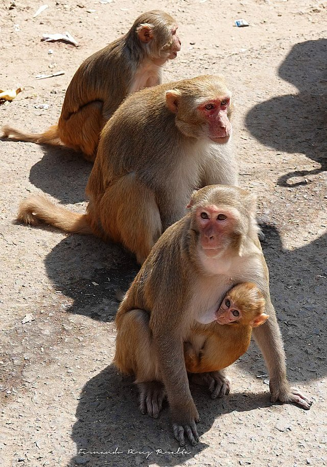{ width="200" }

    - **[Pinguino](../cards/index.md#animal_penguin)** (RelatedTo)
    Un uccello che non sa volare ma nuota molto bene. Vive in luoghi freddi.

    { width="200" }

    - **[Elefante](../cards/index.md#animal_elephant)** (RelatedTo)
    Un grosso animale con una proboscide. Gli elefanti sono gli animali più grandi che camminano sulla terraferma. Hanno grandi orecchie e amano spruzzare acqua!

    { width="200" }

- Quests: [Lo zoo (pl_04)](../quests/quest/pl_04.md)

## France

### Baguette {#baguette}
- Description: the french bread famous all around the world!  
- Importance: Medium  
- Subjects: Food  
- Target Age: Ages3to5
- Core card:
    - **[Baguette francese](../cards/index.md#food_baguette)**
    Un pane lungo e croccante, il più famoso in Francia. I francesi comprano baguette fresche ogni giorno dal panettiere!

    { width="200" }

- Connected cards:
    - **[Parigi](../cards/index.md#capital_paris)** (LocatedIn)
    La capitale della Francia. Parigi ha una famosa torre alta chiamata Torre Eiffel!

    { width="200" }

    - **[Panettiere](../cards/index.md#person_baker)** (CreatedBy)
    Una persona che prepara pane, torte e pasticcini.

    { width="200" }

    - **[SALE](../cards/index.md#food_salt)** (MadeOf)
    Cristalli bianchi che migliorano il sapore del cibo.

    { width="200" }

    - **[Lievito](../cards/index.md#food_yeast)** (MadeOf)
    Il lievito è come una polvere magica che rende il pane morbido e gustoso!

    { width="200" }

    - **[Farina](../cards/index.md#food_flour)** (MadeOf)
    Polvere bianca ricavata dal grano, utilizzata per fare il pane.

    { width="200" }

    - **[Acqua](../cards/index.md#food_water)** (MadeOf)
    L'acqua è essenziale per tutta la vita

    { width="200" }

- Quests: [Parigi! (fr_01)](../quests/quest/fr_01.md)

---

### Bouillabaisse {#bouillabaisse}
- Importance: Low  
- Target Age: Ages6to10
- Core card:
    - **[Bouillabaisse](../cards/index.md#bouillabaisse)**
    Una zuppa di pesce speciale tipica di Marsiglia, nel sud della Francia. È preparata con molti tipi diversi di pesce e ha un profumo delizioso!

    { width="200" }

- Connected cards:
    - **[PANE](../cards/index.md#food_bread)** (MadeOf)
    Un alimento delizioso a base di farina e acqua. Puoi preparare dei panini con il pane!

    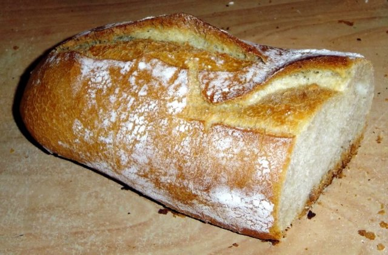{ width="200" }

    - **[PESCARE](../cards/index.md#food_fish)** (MadeOf)
    Un animale che vive e nuota nell'acqua. I pesci hanno pinne e branchie per respirare sott'acqua.

    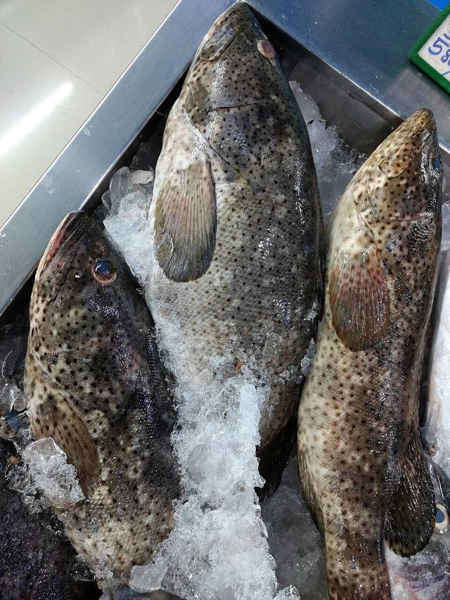{ width="200" }

    - **[Granchio](../cards/index.md#food_crab)** (MadeOf)
    Un animale marino con grandi chele e un guscio duro. I granchi camminano di traverso sulla spiaggia!

    { width="200" }

    - **[Latte](../cards/index.md#food_milk)** (MadeOf)
    Una bevanda bianca che proviene dalle mucche. Il latte aiuta a rafforzare ossa e denti!

    { width="200" }

    - **[Arancia](../cards/index.md#food_orange)** (MadeOf)
    Un frutto rotondo e arancione, dal sapore dolce e succoso. Le arance sono ricche di vitamina C!

    { width="200" }

    - **[Pomodoro](../cards/index.md#food_tomato)** (MadeOf)
    Un frutto rosso e rotondo che cresce sulle piante. I pomodori vengono usati per fare la salsa per la pizza!

    { width="200" }

    - **[Limone](../cards/index.md#food_lemon)** (MadeOf)
    Un frutto giallo dal sapore molto aspro. I limoni vengono usati per fare la limonata!

    { width="200" }

    - **[Olio d'oliva](../cards/index.md#food_olive_oil)** (MadeOf)
    Un olio speciale ricavato dalle olive. Viene utilizzato per cucinare piatti gustosi.

    { width="200" }

    - **[Sale al pepe](../cards/index.md#food_pepper_salt)** (MadeOf)
    Spezie che migliorano il sapore del cibo. Il sale è bianco e il pepe è nero, con pezzetti minuscoli.

    { width="200" }

- Quests: [Cibo e mercato (fr_09)](../quests/quest/fr_09.md)

Credits:
  - Valeria Passarella (Italy)

---

### Countries around France {#france_countries_around}
- Importance: Medium  
- Target Age: Ages6to10
- Core card:
    - **[Francia](../cards/index.md#country_france)**
    Un paese in Europa. La capitale è Parigi.

    { width="200" }

- Connected cards:
    - **[Svizzera](../cards/index.md#country_switzerland)** (RelatedTo)
    Un paese in Europa. La capitale è Berna. La Svizzera è famosa per le montagne e il formaggio.

    { width="200" }

    - **[Lussemburgo](../cards/index.md#country_luxembourg)** (RelatedTo)
    Uno stato europeo. La capitale è la città di Lussemburgo.

    { width="200" }

    - **[Italia](../cards/index.md#country_italy)** (RelatedTo)
    Un paese in Europa. La capitale è Roma.

    { width="200" }

    - **[Bandiera della Spagna](../cards/index.md#flag_spain)** (CulturalContext)
    La bandiera spagnola ha strisce orizzontali rosse e gialle. I colori sono quelli del sole e dei peperoni! La Spagna ha inventato il flamenco.

    { width="200" }

    - **[Bandiera della Germania](../cards/index.md#flag_germany)** (CulturalContext)
    La bandiera della Germania ha tre strisce orizzontali: nera, rossa e gialla. La Germania è famosa per le automobili, i castelli e le fiabe!

    { width="200" }

    - **[Bandiera dell'Italia](../cards/index.md#flag_italy)** (CulturalContext)
    La bandiera italiana ha tre strisce verticali: verde, bianco e rosso. I colori ricordano il basilico, la mozzarella e i pomodori sulla pizza!

    { width="200" }

    - **[Bandiera del Lussemburgo](../cards/index.md#flag_luxembourg)** (CulturalContext)
    La bandiera del Lussemburgo è a strisce orizzontali rosse, bianche e azzurre. Il Lussemburgo è un paese molto piccolo in cui si parlano tre lingue!

    { width="200" }

    - **[Bandiera del Belgio](../cards/index.md#flag_belgium)** (CulturalContext)
    La bandiera del Belgio ha tre strisce verticali: nera, gialla e rossa. Il Belgio è famoso per il cioccolato e i waffle!

    { width="200" }

    - **[Bandiera della Svizzera](../cards/index.md#flag_switzerland)** (CulturalContext)
    La bandiera svizzera è rossa con una croce bianca al centro. Sembra un kit di pronto soccorso! La Svizzera è famosa per le montagne e il formaggio.

    { width="200" }

    - **[Germania](../cards/index.md#country_germany)** (RelatedTo)
    Un paese in Europa. La capitale è Berlino.

    { width="200" }

    - **[Spagna](../cards/index.md#country_spain)** (RelatedTo)
    Un paese in Europa. La capitale è Madrid. La Spagna ha inventato il flamenco.

    { width="200" }

---

### Eiffel Tower {#eiffel-tower}
- Description: What we need to know about the iconic Paris landmark  
- Importance: Critical  
- Subjects: History  
- Target Age: Ages3to5
- Core card:
    - **[Torre Eiffel](../cards/index.md#eiffel_tower)**
    Un'alta torre, simbolo di Parigi. È fatta di ferro e alta 300 metri. È possibile salire e ammirare l'intera città.

    { width="200" }

- Connected cards:
    - **[Parigi](../cards/index.md#capital_paris)** (LocatedIn)
    La capitale della Francia. Parigi ha una famosa torre alta chiamata Torre Eiffel!

    { width="200" }

    - **[Gustave Eiffel](../cards/index.md#gustave_eiffel)** (CreatedBy)
    L'uomo che costruì la Torre Eiffel! Era un ingegnere che amava costruire in ferro e creò la torre più famosa del mondo.

    { width="200" }

    - **[Ferro](../cards/index.md#iron_material)** (MadeOf)
    Uno strumento caldo utilizzato per rendere i vestiti stropicciati lisci e piatti. Attenzione, i ferri da stiro sono molto caldi!

    { width="200" }

    - **[Mappa della Torre Eiffel](../cards/index.md#eiffel_tower_map)** (RelatedTo)
    Una mappa che mostra dove si trova la famosa torre alta di Parigi.

    { width="200" }

    - **[biglietto per la Torre Eiffel](../cards/index.md#eiffel_tower_ticket)** (RelatedTo)
    Una carta speciale che ti consente di visitare la famosa torre alta di Parigi, in Francia.

    { width="200" }

- Quests: [Parigi! (fr_01)](../quests/quest/fr_01.md)

---

### France country {#france-country}
- Importance: Critical  
- Target Age: Ages6to10
- Core card:
    - **[Francia](../cards/index.md#country_france)**
    Un paese in Europa. La capitale è Parigi.

    { width="200" }

- Connected cards:
    - **[Bandiera della Francia](../cards/index.md#flag_france)** (CulturalContext)
    La bandiera francese ha tre strisce verticali: blu, bianco e rosso. Questi colori rappresentano libertà, uguaglianza e fratellanza!

    { width="200" }

    - **[Parigi](../cards/index.md#capital_paris)** (RelatedTo)
    La capitale della Francia. Parigi ha una famosa torre alta chiamata Torre Eiffel!

    { width="200" }

- Quests: [I vicini della Francia (fr_00)](../quests/quest/fr_00.md)

---

### French School {#frenchschool}
- Importance: High  
- Subjects: Education  
- Target Age: Ages6to10
- Core card:
    - **[French Schools](../cards/index.md#french_schools)**
    In France, school happens in four main steps: maternelle (play-and-learn for little kids), école élémentaire (reading, writing, maths), collège (middle school), and lycée (high school). At the end of lycée, many students take a big exam called the baccalauréat (‘le bac’)

- Connected cards:
    - **[École Maternelle](../cards/index.md#education_ecole_maternelle_fr)** (PartOf)
    Scuola per bambini dai 3 ai 5 anni. Si impara giocando ed esplorando.

    { width="200" }

    - **[Scuola primaria in Francia](../cards/index.md#education_ecole_primaire_fr)** (PartOf)
    Scuola per bambini dai 6 ai 10 anni. Si impara a leggere, scrivere e contare.

    { width="200" }

    - **[Liceo in Francia](../cards/index.md#education_lycee_fr)** (PartOf)
    Scuola superiore in Francia per adolescenti dai 16 ai 18 anni. Gli studenti studiano duramente per sostenere l'esame di Baccalauréat, che permette loro di accedere all'università.

    { width="200" }

    - **[Collège in Francia](../cards/index.md#education_college_fr)** (PartOf)
    Scuola media in Francia per ragazzi dagli 11 ai 15 anni. Gli studenti studiano molte materie e si preparano per la scuola superiore.

    { width="200" }

    - **[Scrittura corsiva](../cards/index.md#concept_cursive_writing)** (Purpose)
    Un modo speciale di scrivere in cui tutte le lettere di una parola sono collegate. In Francia, i bambini imparano a scrivere in questo modo a scuola.

    { width="200" }

    - **[Menù della mensa](../cards/index.md#object_canteen_menu)** (Purpose)
    Un elenco che mostra quali alimenti puoi mangiare a scuola. Ti aiuta a scegliere cosa mangiare!

    { width="200" }

    - **[Carta della Laicità](../cards/index.md#concept_charter_of_secularism)** (CulturalContext)
    Un insieme di regole per rispettare le convinzioni di tutti. Aiuta le persone a vivere insieme in pace.

    { width="200" }

- Quests: [Il sistema scolastico (fr_02)](../quests/quest/fr_02.md)

---

### Jules Verne {#jules_verne}
- Importance: Medium  
- Target Age: Ages6to10
- Core card:
    - **[Jules Verne](../cards/index.md#jules_verne)**
    A French writer who imagined amazing adventures before they were possible! He wrote about submarines, rockets, and traveling around the world.

    { width="200" }

- Connected cards:
    - **[Around the World in Eighty Days](../cards/index.md#book_around_the_world_80_days)** (RelatedTo)
    An exciting book by Jules Verne about traveling around the whole world very quickly using trains, ships, and hot air balloons!

    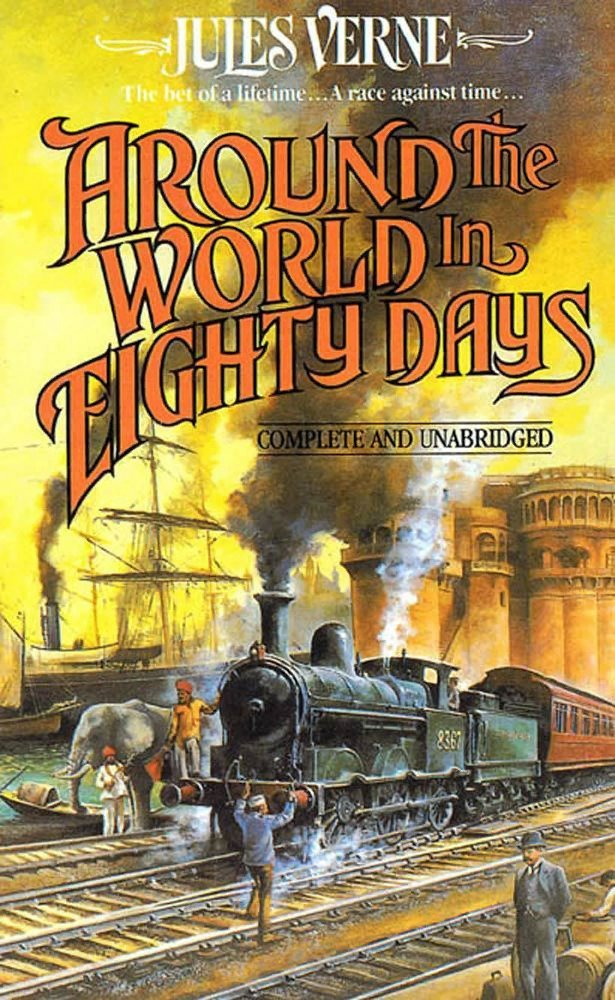{ width="200" }

    - **[From the Earth to the Moon](../cards/index.md#book_from_earth_to_moon)** (RelatedTo)
    A book by Jules Verne about going to the Moon in a big cannon! It was written before real rockets existed.

    { width="200" }

    - **[20000 Leagues Under the Sea](../cards/index.md#book_20000_leagues_under_the_sea)** (RelatedTo)
    A book by Jules Verne about underwater adventures in a submarine called the Nautilus. You meet giant sea creatures!

    { width="200" }

    - **[Hot-Air Balloon](../cards/index.md#hot_air_balloon)** (RelatedTo)
    A balloon that flies using hot air. The first one flew in France.

    { width="200" }

    - **[Razzo spaziale](../cards/index.md#space_rocket)** (RelatedTo)
    Un razzo che va nello spazio.

    { width="200" }

    - **[Sottomarino (Il Nautilus)](../cards/index.md#submarine_nautilus)** (RelatedTo)
    Un sottomarino tratto dal racconto di Jules Verne. Poteva esplorare le profondità marine.

    { width="200" }

- Quests: [Jules Verne e i trasporti (fr_03)](../quests/quest/fr_03.md)

Credits:
  - Lucie Paillat (France)

---

### Louvre {#louvre}
- Importance: Critical  
- Subjects: Art  
- Target Age: Ages6to10
- Core card:
    - **[Louvre](../cards/index.md#louvre)**
    Un enorme museo pieno d'arte. È lì che vive la Monna Lisa.

    { width="200" }

- Connected cards:
    - **[Parigi](../cards/index.md#capital_paris)** (LocatedIn)
    La capitale della Francia. Parigi ha una famosa torre alta chiamata Torre Eiffel!

    { width="200" }

    - **[Monna Lisa](../cards/index.md#art_monalisa)** (PartOf)
    Il dipinto più famoso del mondo! Una donna dal sorriso misterioso dipinta da Leonardo da Vinci. Sembra seguirti con lo sguardo.

    { width="200" }

    - **[Leonardo da Vinci](../cards/index.md#person_leonardodavinci)** (RelatedTo)
    Un artista e scienziato italiano straordinario. Ha dipinto la Gioconda e inventato macchine volanti centinaia di anni prima degli aeroplani!

    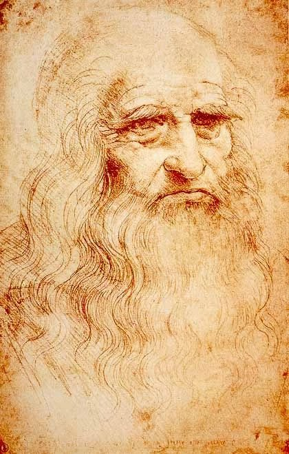{ width="200" }

    - **[La libertà che guida il popolo](../cards/index.md#art_liberty_leading_the_people)** (PartOf)
    Un famoso dipinto sulla libertà e il coraggio. Mostra una donna coraggiosa che regge la bandiera francese e guida il popolo nella lotta per i propri diritti.

    { width="200" }

    - **[Venere di Milo](../cards/index.md#art_venus_milo)** (PartOf)
    Una splendida statua antica di donna in marmo bianco. Le mancano le braccia, ma è comunque considerata una delle statue più belle mai realizzate.

    { width="200" }

- Quests: [Parigi! (fr_01)](../quests/quest/fr_01.md)

---

### market traders {#marketers}
- Description: People who sell food and goods at market stalls—like fishmongers, cheesemongers, and fruit sellers. They weigh, wrap, and call out today’s prices.  
- Importance: Medium  
- Target Age: Ages6to10
- Core card:
    - **[Market traders](../cards/index.md#market_traders)**
    People who sell food and goods at market stalls—like fishmongers, cheesemongers, and fruit sellers. They weigh, wrap, and call out today’s prices.

- Connected cards:
    - **[casaro](../cards/index.md#person_cheesemonger)** (RelatedTo)
    Una persona che vende molti tipi di formaggio.

    { width="200" }

    - **[Panettiere](../cards/index.md#person_baker)** (RelatedTo)
    Una persona che prepara pane, torte e pasticcini.

    { width="200" }

    - **[Fruttivendolo](../cards/index.md#person_greengrocer)** (RelatedTo)
    Una persona che vende frutta e verdura fresca.

    { width="200" }

    - **[Droghiere](../cards/index.md#person_grocer)** (RelatedTo)
    Persona che vende molti tipi di cibo e bevande.

    { width="200" }

    - **[Pescivendolo](../cards/index.md#person_fishmonger)** (RelatedTo)
    Persona che vende pesce fresco e frutti di mare.

    { width="200" }

- Quests: [Cibo e mercato (fr_09)](../quests/quest/fr_09.md)

---

### marseillaise music {#marseillaise_music}
- Importance: High  
- Target Age: Ages6to10
- Core card:
    - **[La Marsigliese](../cards/index.md#marseillaise_music)**
    L'inno nazionale francese. Viene cantato durante i grandi eventi e le partite sportive.

    { width="200" }

- Connected cards:
    - **[Rivoluzione francese](../cards/index.md#french_revolution)** (RelatedTo)
    Periodo degli anni 1790 in cui la Francia cambiò il suo governo.

    { width="200" }

    - **[Le jour de la gloire](../cards/index.md#marseillaise_3)** (RelatedTo)
    Parole dal primo verso dell'inno.

    { width="200" }

    - **[Allons enfants](../cards/index.md#marseillaise_1)** (RelatedTo)
    Le prime parole del primo verso dell'inno.

    { width="200" }

    - **[Della patria](../cards/index.md#marseillaise_2)** (RelatedTo)
    Parole dal primo verso dell'inno.

    { width="200" }

    - **[Est arrivé](../cards/index.md#marseillaise_4)** (RelatedTo)
    Parole dal primo verso dell'inno.

    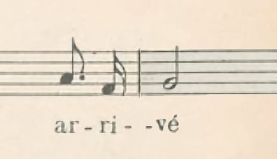{ width="200" }

- Quests: [La Marsigliese (fr_11)](../quests/quest/fr_11.md)

---

### mont blanc {#mont_blanc}
- Importance: Medium  
- Target Age: Ages6to10
- Core card:
    - **[Monte Bianco](../cards/index.md#place_mont_blanc)**
    La montagna più alta dell'Europa occidentale. Coperta di neve tutto l'anno.

    { width="200" }

- Connected cards:
    - **[Guida alpina](../cards/index.md#mountain_guide)** (RelatedTo)
    Una persona che aiuta le persone ad arrampicarsi in sicurezza.

    { width="200" }

    - **[Vento](../cards/index.md#wind)** (RelatedTo)
    Aria in movimento che può risultare forte in montagna.

    { width="200" }

    - **[Vertice](../cards/index.md#summit)** (RelatedTo)
    La cima di una montagna.

    { width="200" }

    - **[Alpi](../cards/index.md#alps)** (RelatedTo)
    Un'alta catena montuosa in Europa.

    { width="200" }

    - **[Montagna](../cards/index.md#mountain)** (RelatedTo)
    I pilastri della terra

    { width="200" }

    - **[Nevicare](../cards/index.md#snow)** (RelatedTo)
    Acqua ghiacciata che cade quando fa freddo.

    { width="200" }

    - **[Ghiaccio](../cards/index.md#ice)** (RelatedTo)
    Acqua ghiacciata che può essere molto scivolosa.

    { width="200" }

- Quests: [Monte Bianco e montagne (fr_08)](../quests/quest/fr_08.md)

---

### Notre Dame {#notredame}
- Importance: High  
- Subjects: Culture  
- Target Age: Ages6to10
- Core card:
    - **[Notre-Dame de Paris](../cards/index.md#notre_dame_de_paris)**
    Una splendida cattedrale di Parigi. Le sue vetrate colorate raccontano storie.

    { width="200" }

- Connected cards:
    - **[Parigi](../cards/index.md#capital_paris)** (LocatedIn)
    La capitale della Francia. Parigi ha una famosa torre alta chiamata Torre Eiffel!

    { width="200" }

    - **[Incendio di Notre-Dame](../cards/index.md#notre_dame_de_paris_fire)** (TimeContext)
    Nel 2019, un grande incendio ha danneggiato la splendida Cattedrale di Notre-Dame a Parigi. Molte persone hanno collaborato per salvare questo importante edificio.

    { width="200" }

    - **[Île-de-France](../cards/index.md#ile_de_france)** (LocatedIn)
    Una regione della Francia dove si trova la capitale Parigi. Qui vivono moltissime persone!

    { width="200" }

- Quests: [Parigi! (fr_01)](../quests/quest/fr_01.md)

---

### Seine Bridges {#seine_bridges}
- Importance: Medium  
- Target Age: Ages6to10
- Core card:
    - **[Ponte per auto](../cards/index.md#place_bridge_cars)**
    Una strada che attraversa l'acqua, consentendo alle auto di attraversare fiumi e laghi.

    { width="200" }

- Connected cards:
    - **[Passerelle](../cards/index.md#place_bridge_people)** (RelatedTo)
    Piccoli ponti per i pedoni. Ti proteggono dal traffico.

    { width="200" }

    - **[Ponte per treni](../cards/index.md#place_bridge_trains)** (RelatedTo)
    Un ponte speciale costruito in modo sufficientemente robusto da consentire ai treni pesanti di attraversare l'acqua.

    { width="200" }

    - **[barca fluviale](../cards/index.md#boat_river)** (RelatedTo)
    Una barca che naviga sui fiumi. I fiumi sono come strade fatte d'acqua!

    { width="200" }

- Quests: [Parigi Senna (fr_10)](../quests/quest/fr_10.md)

## Poland

### gdansk {#gdansk}
- Importance: Medium  
- Target Age: Ages6to10
- Core card:
    - **[Danzica](../cards/index.md#gdansk)**
    Città portuale in Polonia sul Mar Baltico.

    { width="200" }

- Connected cards:
    - **[Faro di Danzica](../cards/index.md#gdansk_lighthouse)** (RelatedTo)
    Un faro storico che aiuta le navi a trovare il porto.

    { width="200" }

    - **[Fiume Motława](../cards/index.md#motawa_river)** (RelatedTo)
    Il fiume che attraversa Danzica fino al mare.

    { width="200" }

    - **[Costa del Mar Baltico](../cards/index.md#baltic_sea_coast)** (RelatedTo)
    La costa sabbiosa lungo il Mar Baltico.

    { width="200" }

    - **[Mar Baltico](../cards/index.md#baltic_sea)** (RelatedTo)
    Un grande mare nel nord Europa, dove si incontrano Polonia, Germania e altri paesi. Ha spiagge bellissime ed è famoso per i tesori d'ambra!

    { width="200" }

---

### Gingerbread {#gingerbread}
- Importance: Medium  
- Subjects: Food  
- Target Age: Ages6to10
- Core card:
    - **[Pan di zenzero di Torun](../cards/index.md#gingerbread)**
    una delizia tradizionale polacca a base di spezie e miele, spesso decorata con bellissimi disegni.

    { width="200" }

- Connected cards:
    - **[Stampo per pan di zenzero](../cards/index.md#gingerbread_mold)** (RelatedTo)
    Uno strumento sagomato che consente di creare divertenti forme di biscotti.

    { width="200" }

    - **[Cannella](../cards/index.md#cinnamon)** (RelatedTo)
    Una spezia dolce ricavata dalla corteccia degli alberi.

    { width="200" }

    - **[Burro](../cards/index.md#butter)** (RelatedTo)
    Grasso giallo ricavato dal latte, utilizzato per cucinare e cuocere al forno.

    { width="200" }

    - **[Uova](../cards/index.md#eggs)** (RelatedTo)
    Cibo ricavato dai polli e utilizzato per cucinare e cuocere al forno.

    { width="200" }

    - **[Zenzero](../cards/index.md#ginger)** (RelatedTo)
    Radice piccante utilizzata in cucina e per preparare biscotti.

    { width="200" }

    - **[Miele](../cards/index.md#honey)** (RelatedTo)
    Un alimento dolce prodotto dalle api.

    { width="200" }

---

### Neptune's fountain {#neptune_fountain}
- Importance: Medium  
- Target Age: Ages6to10
- Core card:
    - **[Fontana di Nettuno](../cards/index.md#neptune_s_fountain)**
    Una famosa fontana di Danzica con la statua del dio del mare.

    { width="200" }

- Connected cards:
    - **[Ambra](../cards/index.md#amber)** (RelatedTo)
    Resina fossile lucida di albero chiamata "oro baltico".

    { width="200" }

    - **[Camera d'Ambra](../cards/index.md#amber_room)** (RelatedTo)
    Una famosa stanza fatta di ambra con una storia misteriosa.

    { width="200" }

    - **[Conchiglia](../cards/index.md#seashell)** (RelatedTo)
    Un guscio duro di un animale marino, ottimo per i lavoretti.

    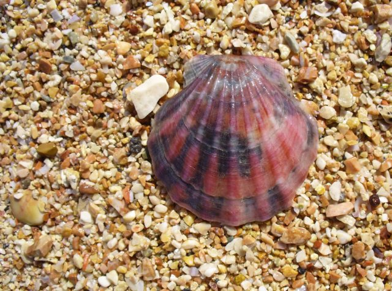{ width="200" }

    - **[Collana](../cards/index.md#necklace)** (RelatedTo)
    Una collana di perline o conchiglie da indossare intorno al collo.

    { width="200" }

    - **[Danzica](../cards/index.md#gdansk)** (RelatedTo)
    Città portuale in Polonia sul Mar Baltico.

    { width="200" }

---

### Odra river {#odra_river}
- Importance: Medium  
- Target Age: Ages6to10
- Core card:
    - **[fiume Odra](../cards/index.md#place_odra_river)**
    Un grande fiume nella Polonia occidentale. Aiuta le navi a viaggiare e commerciare.

    { width="200" }

- Connected cards:
    - **[Passerella](../cards/index.md#footbridge)** (RelatedTo)
    Un ponte su cui le persone possono camminare. Niente auto.

    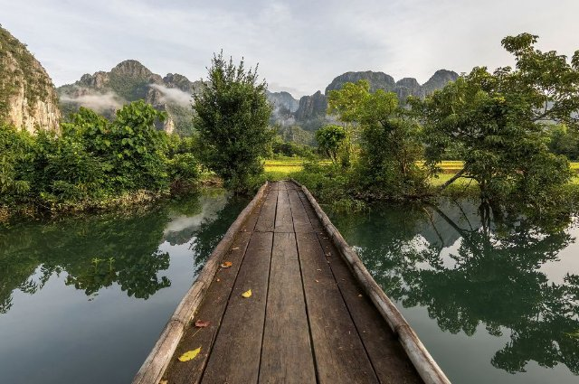{ width="200" }

    - **[Ponte Tumski](../cards/index.md#tumski_bridge)** (RelatedTo)
    Un famoso ponte con lucchetti dell'amore e lanterne a gas.

    { width="200" }

    - **[Ponte Rędziński](../cards/index.md#redzinski_bridge)** (RelatedTo)
    Il ponte strallato più lungo della Polonia.

    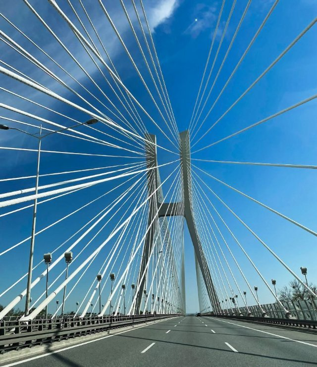{ width="200" }

    - **[Ponte stradale](../cards/index.md#road_bridge)** (RelatedTo)
    Un ponte per auto e autobus.

    { width="200" }

    - **[Casa galleggiante](../cards/index.md#houseboat)** (RelatedTo)
    Una barca fatta per vivere.

    { width="200" }

    - **[Ponte ferroviario](../cards/index.md#train_bridge)** (RelatedTo)
    Un ponte con binari per treni.

    { width="200" }

    - **[Ponti di Breslavia](../cards/index.md#wroclaw_bridges)** (RelatedTo)
    A Breslavia ci sono molti ponti che attraversano il fiume Odra.

    { width="200" }

    - **[fiume Vistola (Wisła)](../cards/index.md#place_vistula_river)** (RelatedTo)
    Il fiume più lungo della Polonia si chiama Wisła o Vistola. Scorre attraverso Cracovia e Varsavia.

    { width="200" }

---

### Pierogi Recipe {#pierogi}
- Importance: Medium  
- Target Age: Ages6to10
- Core card:
    - **[Pierogi Recipe](../cards/index.md#pierogi_recipe)**
    Make a soft dough, fill with mashed potatoes and farmer’s cheese, seal, boil until they float—then pan-fry in butter with onions.

- Connected cards:
    - **[Pierogi polacchi](../cards/index.md#pierogi)** (RelatedTo)
    Ravioli ripieni di patate, formaggio o frutta. Sono un famoso piatto polacco.

    { width="200" }

    - **[Valuta Zloty](../cards/index.md#currency_zloty)** (RelatedTo)
    La valuta polacca si chiama złoty. Monete e banconote riportano simboli polacchi.

    { width="200" }

    - **[Pan di zenzero di Torun](../cards/index.md#gingerbread)** (RelatedTo)
    una delizia tradizionale polacca a base di spezie e miele, spesso decorata con bellissimi disegni.

    { width="200" }

- Quests: [Pan di zenzero e mercato alimentare (pl_06)](../quests/quest/pl_06.md)

---

### Poland Countries {#poland_countries_around}
- Importance: Medium  
- Target Age: Ages6to10
- Core card:
    - **[Polonia](../cards/index.md#country_poland)**
    Un paese in Europa. La capitale è Varsavia. La Polonia è famosa per scienziati come Copernico e per i deliziosi pierogi!

    { width="200" }

- Connected cards:
    - **[Slovacchia](../cards/index.md#country_slovakia)** (RelatedTo)
    Un paese in Europa. La capitale è Bratislava.

    { width="200" }

    - **[Repubblica Ceca](../cards/index.md#country_czech_republic)** (RelatedTo)
    Un paese in Europa. La capitale è Praga.

    { width="200" }

    - **[Lituania](../cards/index.md#country_lithuania)** (RelatedTo)
    Un paese in Europa. La capitale è Vilnius.

    { width="200" }

    - **[Bielorussia](../cards/index.md#country_belarus)** (RelatedTo)
    Un paese in Europa. La capitale è Minsk.

    { width="200" }

    - **[Bandiera della Bielorussia](../cards/index.md#flag_belarus)** (CulturalContext)
    La bandiera della Bielorussia presenta strisce orizzontali rosse e verdi con splendidi motivi tradizionali sui lati. La Bielorussia è uno stato vicino alla Polonia.

    { width="200" }

    - **[Bandiera della Russia](../cards/index.md#flag_russia)** (CulturalContext)
    Una bandiera a strisce bianche, blu e rosse. Rappresenta la Russia.

    { width="200" }

    - **[Bandiera della Slovacchia](../cards/index.md#flag_slovakia)** (CulturalContext)
    Una bandiera con i colori bianco, blu e rosso. Rappresenta la Slovacchia.

    { width="200" }

    - **[Flag of Czech Republic](../cards/index.md#flag_czech_republic)** (CulturalContext)
    The flag has white and red stripes with a blue triangle. The Czech Republic is famous for beautiful Prague castle and crystal glass.

    { width="200" }

    - **[Bandiera della Lituania](../cards/index.md#flag_lithuania)** (CulturalContext)
    La bandiera presenta strisce orizzontali gialle, verdi e rosse. La Lituania è un paese baltico con splendide foreste e spiagge.

    { width="200" }

    - **[Bandiera dell'Ucraina](../cards/index.md#flag_ukraine)** (CulturalContext)
    Una bandiera con i colori blu e giallo, come il cielo e il sole. Rappresenta il paese dell'Ucraina.

    { width="200" }

    - **[Bandiera della Germania](../cards/index.md#flag_germany)** (CulturalContext)
    La bandiera della Germania ha tre strisce orizzontali: nera, rossa e gialla. La Germania è famosa per le automobili, i castelli e le fiabe!

    { width="200" }

    - **[Germania](../cards/index.md#country_germany)** (RelatedTo)
    Un paese in Europa. La capitale è Berlino.

    { width="200" }

    - **[Russia](../cards/index.md#country_russia)** (RelatedTo)
    Un paese in Europa. La capitale è Mosca.

    { width="200" }

---

### Poland country {#poland-country}
- Importance: Critical  
- Target Age: Ages6to10
- Core card:
    - **[Polonia](../cards/index.md#country_poland)**
    Un paese in Europa. La capitale è Varsavia. La Polonia è famosa per scienziati come Copernico e per i deliziosi pierogi!

    { width="200" }

- Connected cards:
    - **[Bandiera della Polonia](../cards/index.md#flag_poland)** (CulturalContext)
    La bandiera della Polonia è a strisce orizzontali bianche e rosse. La Polonia è famosa per scienziati come Copernico e per i deliziosi pierogi!

    { width="200" }

    - **[Varsavia](../cards/index.md#capital_warsaw)** (RelatedTo)
    La capitale della Polonia.

    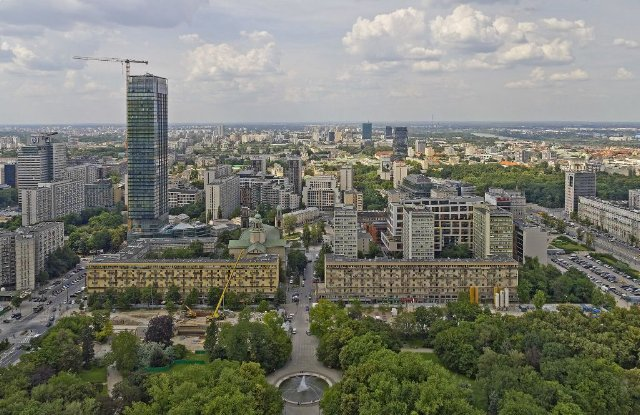{ width="200" }

- Quests: [I vicini della Polonia (pl_00)](../quests/quest/pl_00.md)

---

### Warsaw {#warsaw}
- Importance: Medium  
- Target Age: Ages6to10
- Core card:
    - **[Monumento a Chopin](../cards/index.md#chopin_monument)**
    Una grande statua nel Parco Łazienki di Varsavia, dedicata a Frédéric Chopin. È anche sede di popolari concerti di pianoforte all'aperto in estate. (L'albero speciale sotto cui è seduto è un tipico salice polacco)

    { width="200" }

- Connected cards:
    - **[Sirena di Varsavia](../cards/index.md#mermaid_of_warsaw)** (RelatedTo)
    Il simbolo della città è una coraggiosa sirena con spada e scudo. La sua statua è visibile lungo il fiume.

    { width="200" }

    - **[Guerre e Sawa](../cards/index.md#wars_and_sawa)** (RelatedTo)
    Due figure leggendarie che diedero il nome a Varsavia: Wars era un coraggioso guerriero e Sawa era una bellissima sirena che viveva nel fiume Vistola.

    { width="200" }

    - **[Fryderyk Chopin](../cards/index.md#fryderyk_chopin)** (RelatedTo)
    Un famoso compositore polacco per pianoforte. Ha scritto musica meravigliosa che sembra danzare o raccontare storie. La sua musica trasmette felicità o tristezza.

    { width="200" }

- Quests: [Scopri Varsavia (pl_01)](../quests/quest/pl_01.md)

---

### Wroclaw {#wroclaw}
- Importance: Medium  
- Target Age: Ages6to10
- Core card:
    - **[Breslavia](../cards/index.md#wroclaw)**
    Una città in Polonia con fiumi, ponti e storia.

    { width="200" }

- Connected cards:
    - **[Ponti di Breslavia](../cards/index.md#wroclaw_bridges)** (RelatedTo)
    A Breslavia ci sono molti ponti che attraversano il fiume Odra.

    { width="200" }

    - **[fiume Odra](../cards/index.md#place_odra_river)** (RelatedTo)
    Un grande fiume nella Polonia occidentale. Aiuta le navi a viaggiare e commerciare.

    { width="200" }

    - **[fiume Vistola (Wisła)](../cards/index.md#place_vistula_river)** (RelatedTo)
    Il fiume più lungo della Polonia si chiama Wisła o Vistola. Scorre attraverso Cracovia e Varsavia.

    { width="200" }

---

### Wroclaw Dwarves {#wroclaw_dwarves}
- Importance: Medium  
- Target Age: Ages6to10
- Core card:
    - **[Nani di Breslavia](../cards/index.md#wroclaw_dwarfs)**
    Piccole statue sparse per la città che amano fare scherzi.

    { width="200" }

- Connected cards:
    - **[Nano amante degli animali](../cards/index.md#animal_lover_dwarf)** (RelatedTo)
    Una statua di un nano che ama lo zoo e gli animali.

    { width="200" }

    - **[Vescovo nano](../cards/index.md#bishop_dwarf)** (RelatedTo)
    Una statua nana che pone una domanda in chiesa.

    { width="200" }

    - **[Esperto di nani](../cards/index.md#dwarf_expert)** (RelatedTo)
    Una guida amichevole che sa tutto sui nani.

    { width="200" }

    - **[Maestro delle Chiavi Nano](../cards/index.md#keymaster_dwarf)** (RelatedTo)
    Una statua nana sorveglia l'ascensore con una grande chiave.

    { width="200" }

    - **[Nano polacco (gnomi di Breslavia)](../cards/index.md#polish_dwarf)** (RelatedTo)
    Piccole statue di nani si nascondono in giro per Breslavia. Trovarle è un divertente gioco cittadino.

    { width="200" }

    - **[Statua del nano di Breslavia](../cards/index.md#wroclaw_dwarf_statue)** (RelatedTo)
    Una piccola statua cittadina; i nani sono il simbolo di Breslavia.

    { width="200" }

    - **[Breslavia](../cards/index.md#wroclaw)** (LocatedIn)
    Una città in Polonia con fiumi, ponti e storia.

    { width="200" }

- Quests: [Il grande salvataggio dei nani di Breslavia (pl_02)](../quests/quest/pl_02.md)

---

### wroclaw zoo {#wroclaw_zoo}
- Importance: Medium  
- Target Age: Ages6to10
- Core card:
    - **[Zoo di Breslavia](../cards/index.md#wroclaw_zoo)**
    Un grande zoo a Breslavia con molti animali da scoprire.

    { width="200" }

- Connected cards:
    - **[guardiano dello zoo](../cards/index.md#zoo_keeper)** (RelatedTo)
    Una persona che si prende cura degli animali allo zoo.

    { width="200" }

    - **[Recinto per animali](../cards/index.md#animal_enclosure)** (RelatedTo)
    Uno spazio sicuro pensato per far vivere gli animali allo zoo.

    { width="200" }

    - **[Direttore dello zoo](../cards/index.md#zoo_director)** (RelatedTo)
    La persona che gestisce lo zoo e aiuta i visitatori.

    { width="200" }

- Quests: [Lo zoo (pl_04)](../quests/quest/pl_04.md)

