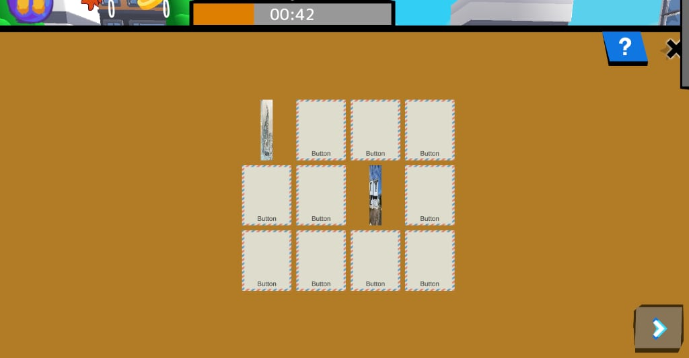

# How to play Discover quests

## Choose a quest

- Start from the Earth menu and select a country or a Location Pin (generally a town).  
- Pick a quest to see its title, a short description and its content.  
- In Classroom mode: your teacher may lock the country and let you choose any quest inside.  
- In Home mode: quests usually unlock one by one. Replaying improves your score and reveals extra cards.  

!!! Tip
    If you’re new, start with the tutorial quest in each country.  

## Player controls

**PC / Desktop**  

- ASDW keys = move (hold 2 seconds to run)  
- SPACE = jump / interact / advance dialogues  
- SHIFT = run (secret, since it's not mandatory)  
- Mouse + right button = move camera  
- Mouse left button = interact  

**Touch**  

- Left finger = move (hold 2 seconds to run)  
- Button = jump / interact  
- Tap objects = interact  
- Tap and drag on screen = move camera  

!!! info "Classroom tip"
    Project controls on the board for the first session. Pair students so one reads prompts while the other controls, then swap roles.  

## Map and tasks

- Map button: opens a simple map with your current position and main objective.  
- Target point: a waypoint marker and guiding beam show where to go next.  
- Task panel: short text hints appear on screen when the goal changes (e.g., “Talk to the Baker”).  

!!! tip "Classroom tip"
    Ask students to restate the current objective in their own words before moving.  

## Interaction types

- **Talk**: approach an character and press interact to start a short dialogue.
- **Look**: look at signs, posters, or objects to unlock knowledge cards in the Book.  
- **Collect**: pick up items that go into the inventory (auto‑use when needed).  
- **Use**: press buttons, levers, or floor switches to open doors or trigger events.  
- Navigate: jump across platforms, avoid hazards, follow safe paths (e.g., cross on green).  
- Activities: some interactions launch an activity (see below) to practice a card or a skill.  

!!! Note
    Interact is the same button as Jump when close to an NPC/object.

## Inventory and items

- Up to 5 quick slots; items disappear when used for their task.  

## Progress and rewards

- **Stars**: overall quest score (3 = perfect).  
- **Knowledge cards**: unlocked by exploring, talking, reading signs, and finishing tasks.  
- **Gems**: mastery currency earned by completing quests and special cards.  
- **Cookies**: fun currency used to buy cosmetic props.  
- **Achievements**: milestones like “Finish 3 quests” or “Collect 20 cards.”  
- **Bonus/Malus**: good actions (talking to NPCs, cleaning) vs. risky actions (crossing on red, trampling flowers).  

## Activities inside quests

Quick practice games appear during quests. Details of each activity are here: [Activities overview](../content/activities/index.md).  

### [Canvas](../content/activities/index.md#CleanCanvas)  
reveal the image while avoiding obstacles.

  

### [Jigsaw Puzzle](../content/activities/index.md#JigsawPuzzle)
rebuild the full picture from pieces.  

  

### [Match](../content/activities/index.md#Match)
pair items that belong together.  

  

### [Memory](../content/activities/index.md#Memory)
find matching pairs from memory.  

  

### [Count the Money](../content/activities/index.md#MoneyCount)
pick coins/notes to reach the target sum.  

  

### [Order](../content/activities/index.md#Order)
arrange steps in the correct sequence.  

  

### [Piano](../content/activities/index.md#Piano)
repeat sequences of colors / sound / notes.  

  

## Accessibility and modes

- Classroom mode reduces noise and keeps focus on one country.  
- Subtitles and icon prompts support early readers and multilingual contexts.  
- Short sessions (5–15 minutes) help maintain attention and enable quick debriefs.  

## Customization (TBD)

- Use cookies to buy hats, backpacks, and small props for your Cat avatar.  
- Some items unlock after certain gem levels or achievements.  
- More details and previews coming soon (the Player Space isn't already finished)  
