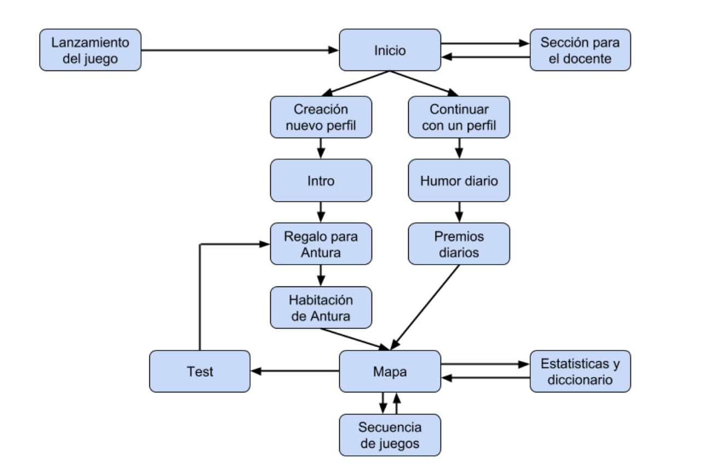
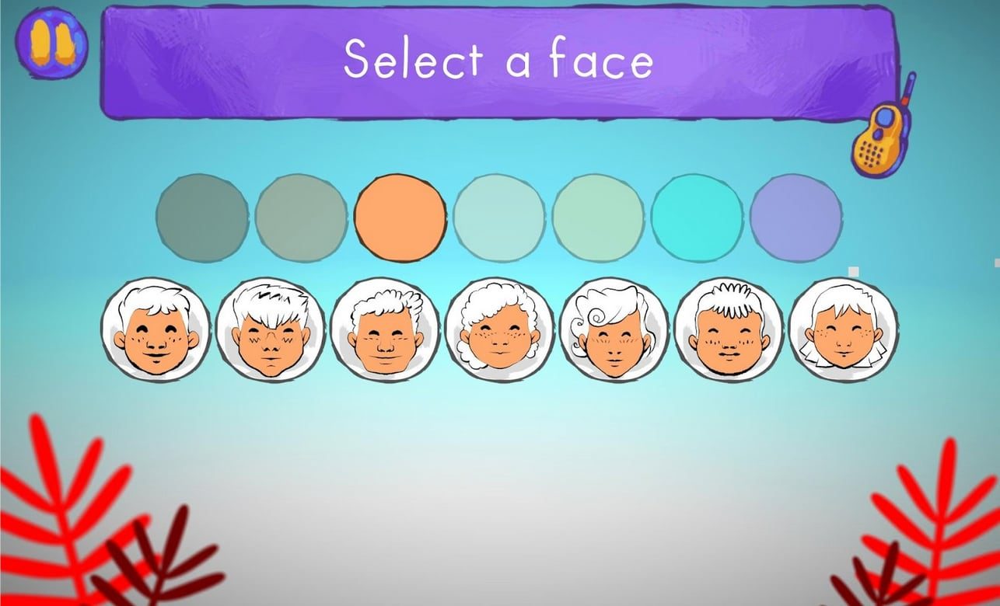
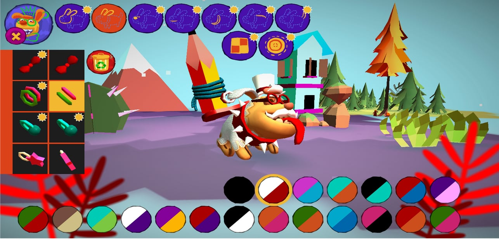
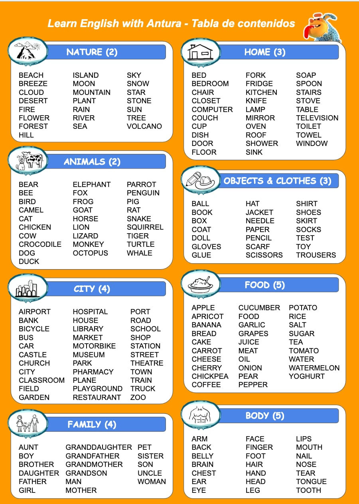

# Learn Languages

Learn with Antura is a game for the introduction to different languages (ENglish, French, Polish, Spanish, Arabics...) as a second language, aimed at children between 5 and 9 years old; equivalent to the contents of **PreA1** according to the **Common European Framework of Reference for Languages**.  

Throughout the game, children learn the entire  alphabet, more than 250 words and a series of phrases and expressions. words and a series of simple phrases and expressions in a playful way.

The game is organized in 6 different worlds each world includes between 15 and 20 didactic 20 didactic units, each one with a specific pedagogical specific pedagogical objective that is learned learning thanks to a series of mini-games and a final and concludes with a final test to reinforce the learning process.

To pass the different mini-games words, images and sounds so that the learning process sounds so that the learning process and the learning process and progress in the game go hand in hand.

## Current Learning Modules

### Learning a new Language

- Learn English
- Learn French
- Learn German
- Learn Hungarian
- Learn Italian
- Learn Polish
- Learn Romanian
- Learn Spanish

### Learning to read your own language

- Learn To Read Arabic
- Learn To Read Persian Dari
- Learn To Read Pashto (in progress)
- Learn To Read Ukrainian (in progress)

### Supported native languages
(the language used to speak to the player)

- Arabic
- English
- French
- German
- Hungarian
- Italian
- Pashto (in progress)
- Persian Dari
- Polish
- Romanian
- Russian
- Spanish
- Ukrainian

## Objectives

Learn with Antura aims to introduce to the language without the need to have had previous contact with it; this can take place in both academic and informal contexts, serving as a teaching support tool and a playful approach to learning English as a second language.

Our main objective will be to familiarize children with basic English vocabulary and with the sonority of English at a level equivalent to PreA1; all this with great attention to the speaking part, which becomes a constant element throughout the game.

The vocabulary chosen consists of more than 250 words organized in thematic groups as well as various expressions and phrases that will serve to introduce syntactic and grammatical questions that, although they are outside the explicit contents, appear in a transversal way with the objective of educating the ear.

For the selection of this vocabulary we have taken into account the use of close and everyday objects together with the phonetic component so that we have all the phonemes represented in it.

## Methodology

Learn with Antura bases its **pedagogical model on meaningful learning** through a playful learning environment reinforced by a reward system. It complements learning models based on the communicative approach and oral communication with game systems that favor **Stealth Learning**, a method that allows children to focus on the game and the challenges it entails, without really having to make an effort to learn or memorize concepts.

The game introduces new concepts without any theoretical explanation, it simply proposes a challenge and guides the player through the first steps so that he/she can then advance on his/her own, creating his/her own mental model of knowledge. Each time the player interacts with a letter or a word, the game pronounces it in the correct way, reinforcing the learning process.

The content has been organized around the learning of words through pictograms, locutions and their written forms so that they are related in a triangular way giving rise to inferences and deductions that serve to grasp the proposed vocabulary through its use in the various game mechanics.

Priority is given to the listening process, the association of sound and pictogram and the sonority of all clickable elements to reinforce at all times the phonetic issues and familiarization with the English sonority.

In addition, the game offers rewards in the form of cookies that can be used to purchase aesthetic accessories to add to Antura's character, who will be our companion in our adventures throughout the game. This way we add an additional motivation to complete the different levels properly and to use the application frequently.

## Pedagogical path

The game is composed of 6 different worlds that we will go through playing the different didactic units and tests. Each of the worlds includes several groups of words, in each one we will work with around 50 words organized in groups of between 8 and 12.

Each group of words will be introduced through blocks of mini-games in a progressive way, first presenting games with the objective of making us discover the words and then later challenging us to recognize the words previously presented. At the end of each 2 or 3 groups of words there will be a series of mini-games dedicated to familiarize us with their use in sentences. At the end of each group of mini-games, there are settlement phases with specific tests to review the contents before advancing.

We start with an introductory world where you will become familiar with English phonetics through the alphabet and where we will see the first vocabulary words that will be added transversely to the rest of the worlds. The different worlds are as follows:

1. Alphabet
2. Nature and animals
3. Home, objects and clothes
4. City and family
5. Body parts and food
6. Calendar, Colors and Numbers

## Development

This is the flowchart of the entire application with the transitions between the different sections of the application:

### Start
The first screen of the game offers the possibility to create a new profile or to continue playing with a previously created profile. Also from this section you can access the options (e.g. to turn on or off the background music) and the section reserved for the teacher.

### Profile creation

The game allows you to create custom profiles with different faces, colors for the skin, hair and background of your avatar. For the creation of teacher profiles we will have to access the Teacher Section.

### Gifts for Antura
As soon as you create a profile you will receive the first gift to customize Antura. You will receive more gifts every time you finish a didactic unit, after completing each settlement phase. In total there are more than 90 gifts in the game, each one customizable with 16 color combinations.

### Antura Space

In this section the player can customize Antura with the gifts he has received and can also use the bone-shaped cookies that he will earn by advancing in the game.

The cookies can be thrown to Antura or can be spent to buy decorations for her room. In addition, with the cookies the player can take pictures of Antura in her room. The photos are automatically stored in the device's photo gallery.

### The map
Learning the English language is represented by a journey through 6 worlds, each with a different environment: mountains, islands, prairie, desert, forest and city.

The journey is divided into many steps and each time the player successfully completes a game session (mini-game sequence or quiz) he advances to the next step. This does not prevent him to go back and play again a previous session, either to review the didactic contents or to get the highest score (3 stars). The map not only allows you to visualize very explicitly the progress along the journey, it also allows you to access other key sections such as Antura's room and the dictionary.

## Statistics and dictionary
This section allows the player to check his main statistics and consult the dictionary. The dictionary includes all the selected words and an alphabet that shows the different phonemes associated with each spelling. In addition, all the mini-games can be launched directly from this section, to practice with them.

## Mood
When a player launches the game and starts playing with an existing profile, the first section presented to him/her is this one; it will appear the first time the game is started each day. We are in a moment of reflection on their mood thanks to a simple question: "How are you feeling today?" It is answered simply by touching one of the 5 emoticons that appear on the screen.

## Daily prizes
Every day the player will **receive cookies just for launching the game** and answering the question about his/her mood. The number of cookies increases each time the player plays again the next day, motivating a daily use of the game.

## Teacher Panel
This section is protected by a question (so children cannot access it on their own) and will offer all the functionalities exclusively for teachers:
Possibility to create a Teacher profile to freely access all the contents of the game. Possibility to consult the progress of the profile as an external observer.

CODE TO ACCESS THE TEACHER PROFILE: press the green button 5 times and then press the red button once. When entering with the teacher profile we will start at the end of the game, right at the end of the last didactic unit of the last world; this way we will be able to move around the map without restrictions and access all the didactic units.

## Educational units
Each world includes between 15 and 20 teaching units, each with a specific pedagogical objective. Each unit consists of a series of mini-games and concludes with a final test to consolidate learning. The didactic units will be marked on the map by threaded markers, the settlement phases by pencils and the units dedicated to experimenting with phrases by mailboxes.

## Vocabulary Content

### World 1: Alphabet

There are 5 letter groups:

1. A, E, C, R, S, T
2. O, D, L, M, N
3. I, F, G, H, W
4. U, B, K, P, V
5. Y, J, Q, X, Z

For each group of letters the playr will repeat the same pedagogucal steps and activities, oerganized i nthe following sequence of 3 didactical units:

**1. Discover Letters and their name**

- ColorTickle_LetterName
- ThrowBalls_LetterName
- FastCrowd_LetterName
- Assessment_LetterName (test)

**2. Recognize letters by its name**

- Song_Alphabet
- Egg_LetterName
- HideSeek_LetterName
- Assessment_LetterName (test)

**3. Discover words using known letters**

- FastCrowd_BuildWord
- ThrowBalls_BuildWord
- Egg_BuildWord
- Assessment_OrderLettersOfWord (test)

### Discover vocabulary
Each world from 2 to 6 wil work with about 50 words organized in several subgroup of 10 words each. For each group will be repeated the same pedagogycal steps and the same activities, organized like in the following sequences of 4 didactical units:

1. Discover and recognize words by their image and sound
    - ColorTickle_Image
    - ThrowBalls_Image
    - FastCrowd_Image
    - Balloons_Image
    - Egg_Image
    - HideSeek_Image
    - Assessment_MatchWordToImage (test)
2. Discover words by its lettering, sounds and drawings
    - ThrowBalls_BuildWord
    - FastCrowd_BuildWord
    - Egg_BuildWord
    - MixedLetters_BuildWord
    - Assessment_MatchWordToImage (test)
3. Recognize words by it's lettering, sounds and drawing
    - ThrowBalls_Word
    - FastCrowd_Word
    - Balloons_Word
    - Assessment_SelectPronouncedWord (test)
4. Get used to short sentences using the learned words
    - Song_Word
    - ReadingGame_Phrase
    - MissingLetter_Phrase
    - Assessment_QuestionAndReply (test)

### World 2: Animals and Nature

**Nature**  
BEACH, BREEZE, CLOUD, DESERT, FIRE, FLOWER, FOREST, HILL, ISLAND, MOON, MOUNTAIN, PLANT, RAIN, RIVER, SEA, SKY, SNOW, STAR, STONE, SUN, TREE, VOLCANO

**Animals**  
BEAR, BEE, BIRD, CAMEL, CAT, CHICKEN, COW, CROCODILE, DOG, DUCK, ELEPHANT, FOX, FROG, GOAT, HORSE, LION, LIZARD, MONKEY, OCTOPUS, PARROT, PENGUIN, PIG, RAT, SNAKE, SQUIRREL, TIGER, TURTLE, WHALE

### World 3: Home, Objects, Cloths

**Home**  
BED, BEDROOM, CHAIR, CLOSET, COMPUTER, COUCH, CUP, DISH, DOOR, FLOOR, FORK, FRIDGE, KITCHEN, KNIFE, LAMP, MIRROR, OVEN, ROOF, SHOWER, SINK, SOAP, SPOON, STAIRS, STOVE, TABLE, TELEVISION, TOILET, TOWEL, WINDOW

**Objects and Clothes**  
BALL, BOOK, BOX, COAT, DOLL, GLOVES, GLUE, HAT, JACKET, NEEDLE, PAPER, PENCIL, SCARF, SCISSORS, SHIRT, SHOES, SKIRT, SOCKS, TEST, TOY, TROUSERS

### World 4: City, Family

**City**  
AIRPORT, BANK, BICYCLE, BUS, CAR, CASTLE, CHURCH, CITY, CLASSROOM, FIELD, GARDEN, HOSPITAL, HOUSE, LIBRARY, MARKET, MOTORBIKE, MUSEUM, PARK, PHARMACY, PLANE, PLAYGROUND, RESTAURANT, PORT, ROAD, SCHOOL, SHOP, STATION, STREET, THEATRE, TOWN, TRAIN, TRUCK, Z, ## Fami, AUNT, BOY, BROTHER, DAUGHTER, FATHER, GIRL, GRANDDAUGHTER, GRANDFATHER, GRANDMOTHER, GRANDSON, MAN, MOTHER, PET, SISTER, SON, UNCLE, WOMAN

### World 5: Food, Body

**Food**  
APPLE, APRICOT, BANANA, BREAD, CAKE, CARROT, CHEESE, CHERRY, CHICKPEA, COFFEE, CUCUMBER, FOOD, GARLIC, GRAPES, JUICE, MEAT, OIL, ONION, PEAR, PEPPER, POTATO, RICE, SALT, SUGAR, TEA, TOMATO, WATER, WATERMELON, YOGHURT

**Body**  
ARM, BACK, BELLY, BRAIN, CHEST, EAR, EYE, FACE, FINGER, FOOT, HAIR, HAND, HEAD, LEG, LIPS, MOUTH, NAIL, NOSE, TEAR, TONGUE, TOOTH

### World 6: Calendar, Colors, Numbers

**Colors**  
BLACK, BLUE, BROWN, GREEN, GREY, ORANGE, PINK, PURPLE, RED, WHITE, YELLOW

**Days & Seasons**  
MONDAY, TUESDAY, WEDNESDAY, THURSDAY, FRIDAY, SATURDAY, SUNDAY, SPRING, SUMMER, AUTUMN, WINTER

**Numbers**  
ZERO, ONE, TWO, THREE, FOUR, FIVE, SIX, SEVEN, EIGHT, NINE, TEN, ELEVEN, TWELVE, THIRTEEN, FOURTEEN, FIFTEEN, SIXTEEN, SEVENTEEN, EIGHTEEN, NINETEEN, TWENTY

**Months**  
JANUARY, FEBRUARY, MARCH, APRIL, MAY, JUNE, JULY, AUGUST, SEPTEMBER, OCTOBER, NOVEMBER, DECEMBER

