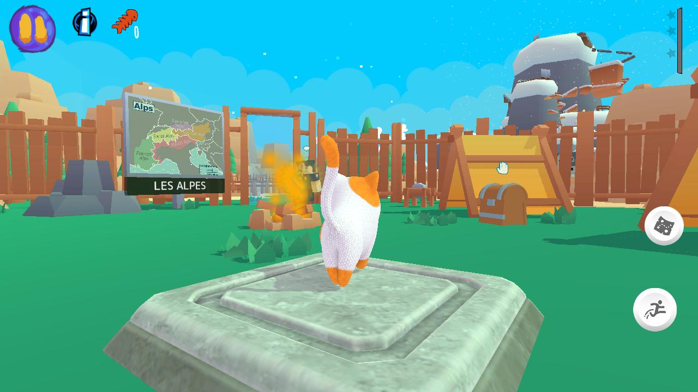
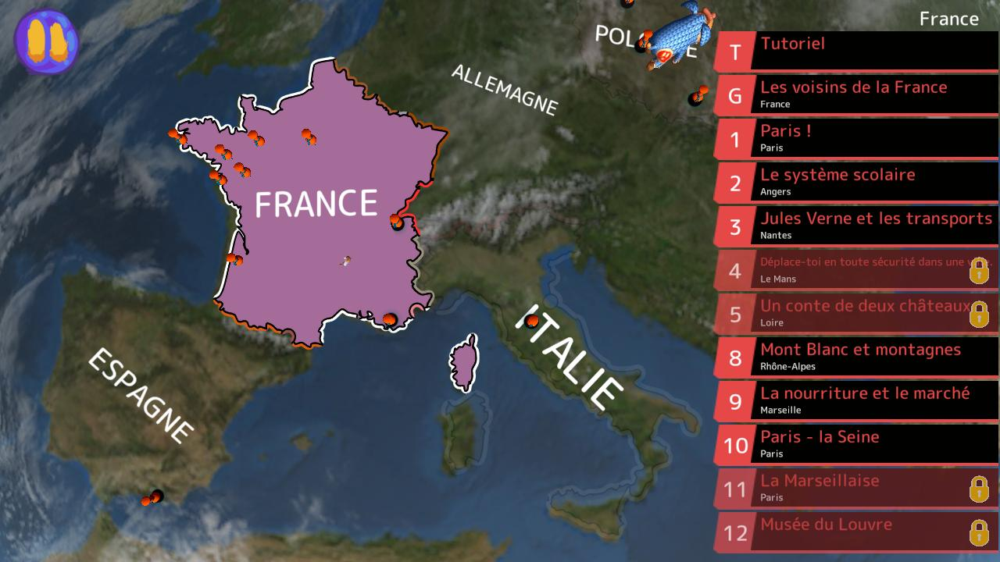
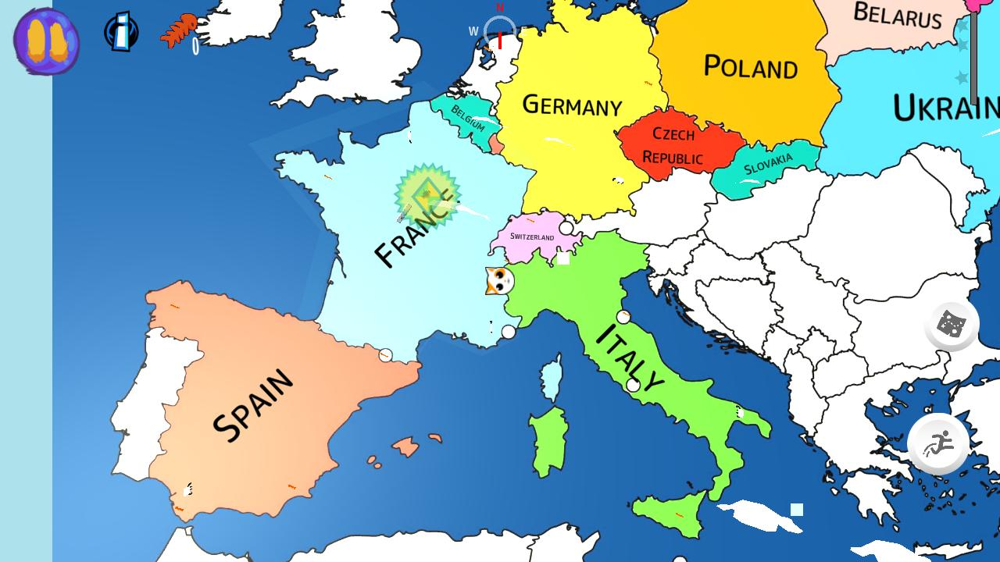

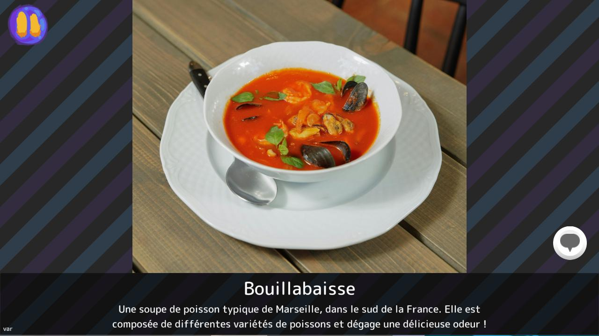
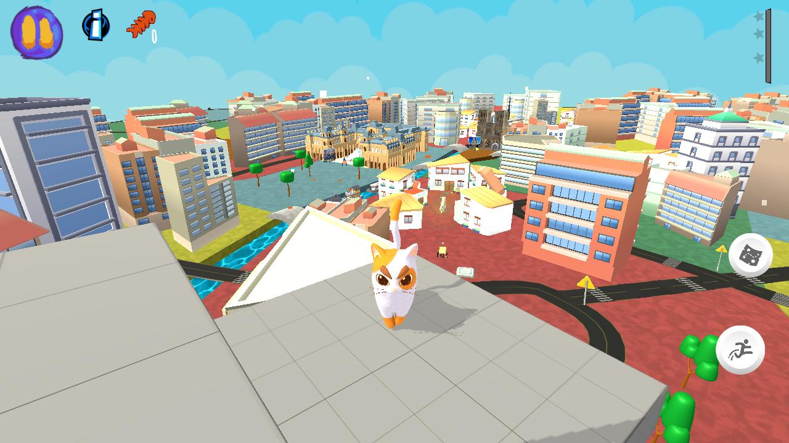
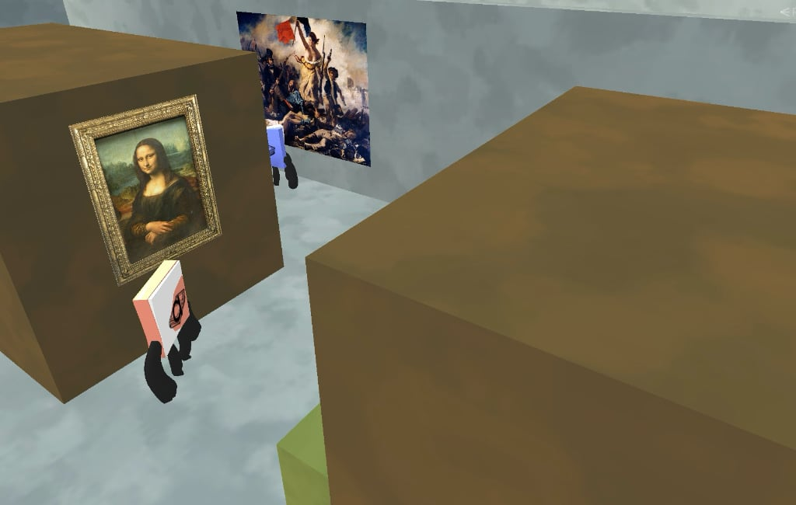
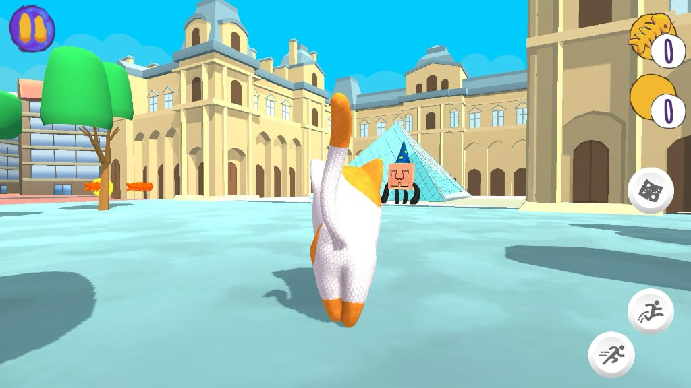
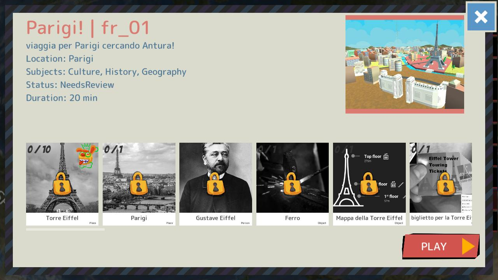
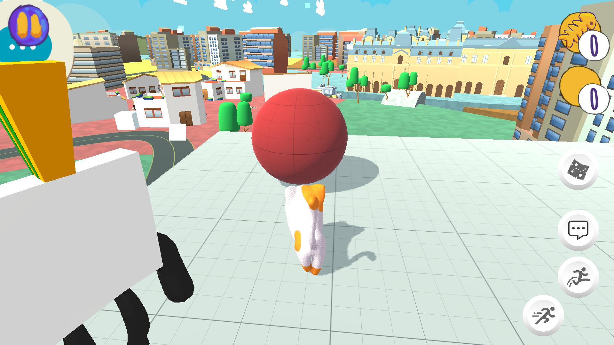
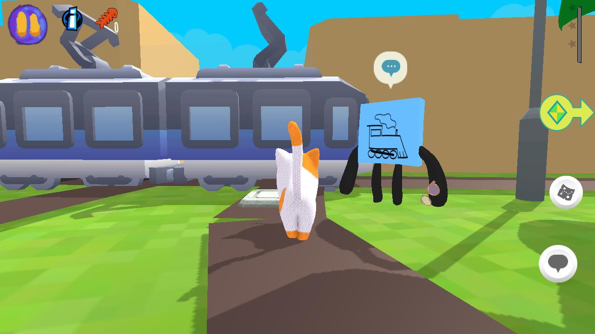
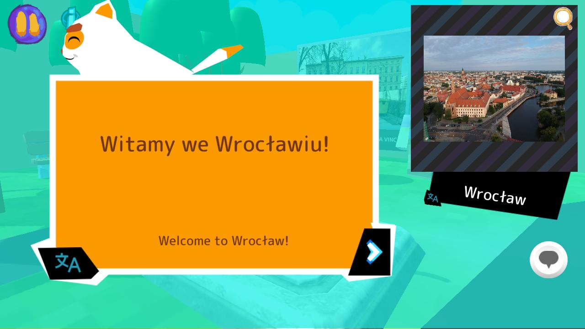

> [!NOTE] Nauczyciele 👩‍🏫  
> Uzyskaj dostęp do pełnych aktywności po grze, korzystaj z **Trybu Klasowego** i skorzystaj z **Przewodnika dla nauczyciela**.  
> Antura oferuje bogate **treści dydaktyczne** stworzone z myślą o szkole.

> [!TIP] Rodzice i Rodziny 👨‍👩‍👧  
> Grajcie razem w domu, **śledźcie postępy dziecka** i poznawajcie pełną zawartość gry.  
> Bezpieczna, darmowa i zabawna dla każdego dziecka.

> [!IMPORTANT] Projektanci gier i Deweloperzy 🎨  
> Stwórz nowe zadanie w zaledwie **24 godziny** dzięki naszej pełnej bibliotece gotowych zasobów.  
> Oparte na silniku skryptowym **Yarn Spinner** do obsługi dialogów i kontroli narracji.

> [!WARNING] Filantropi i Fundacje 🤝  
> Antura to **10-letnia inicjatywa** z długofalową wizją.  
> Wesprzyj nas, abyśmy mogli dalej tworzyć **darmowe gry edukacyjne dla wszystkich dzieci**.
