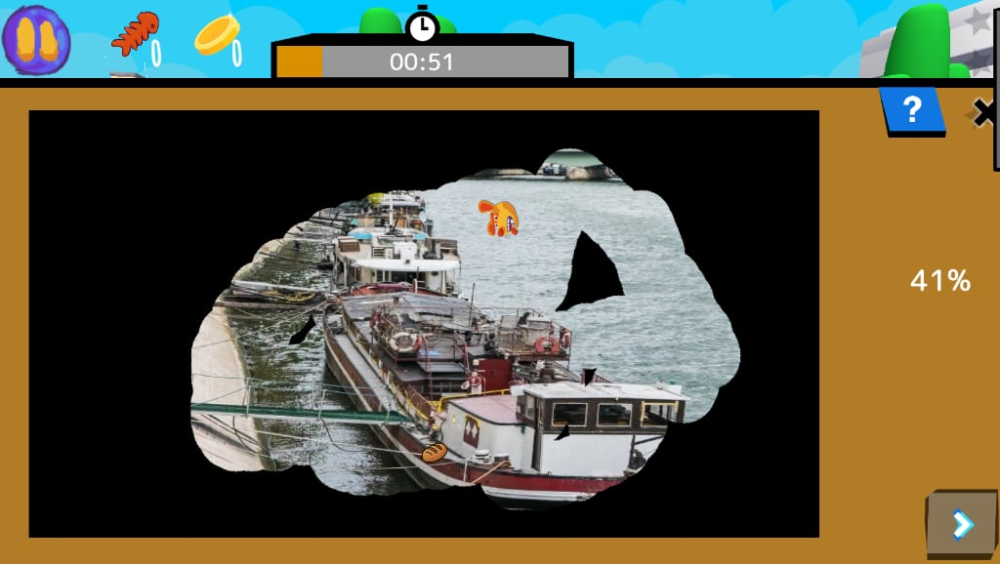
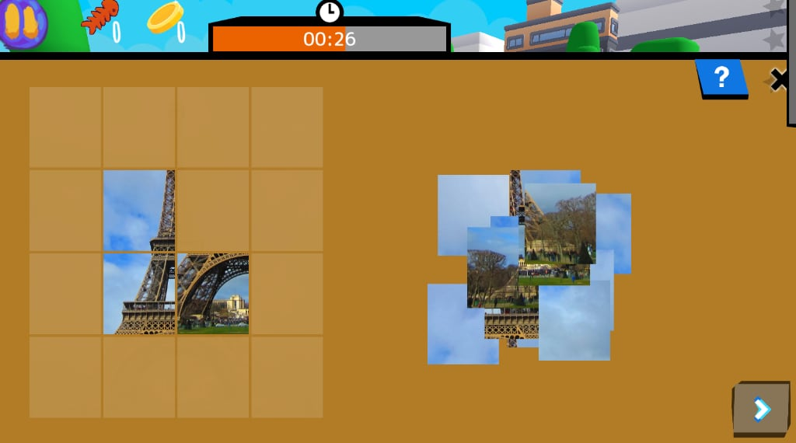
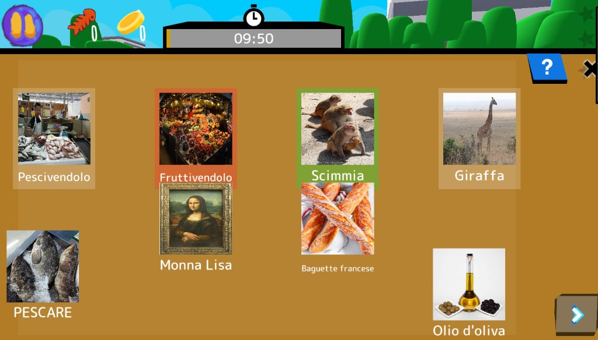
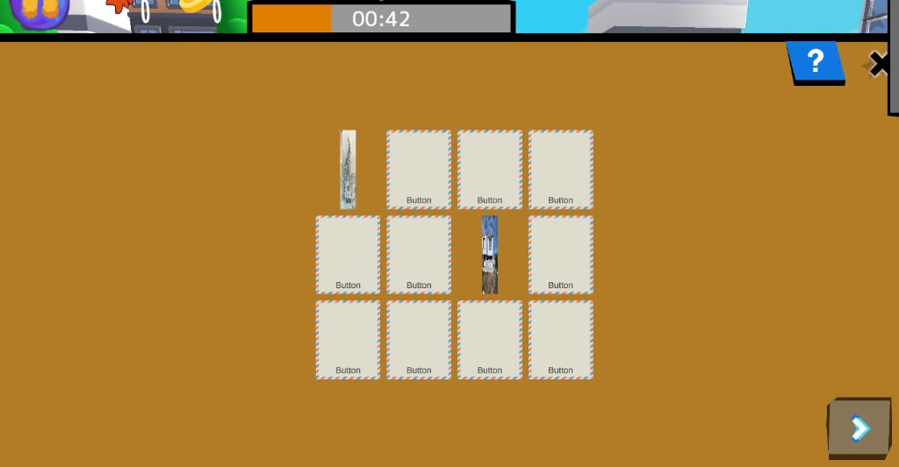
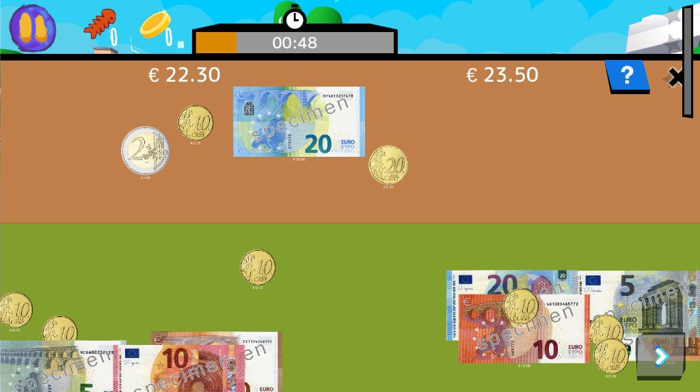
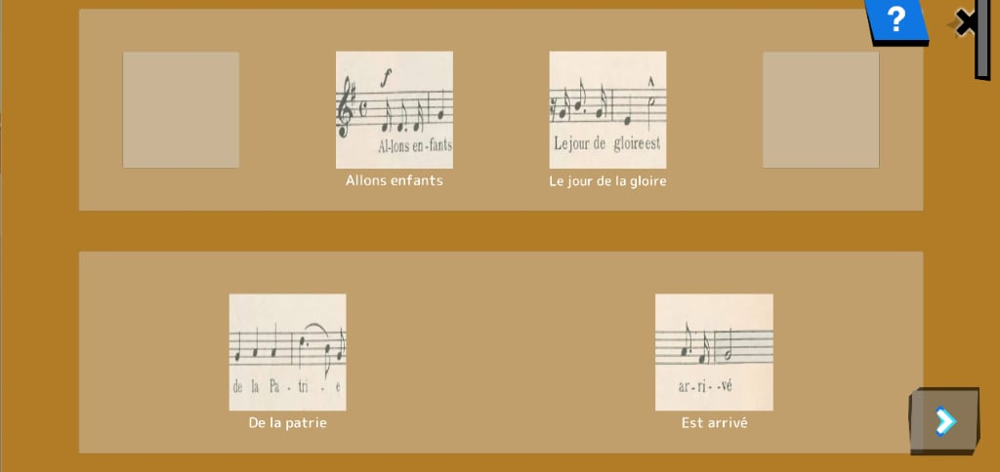
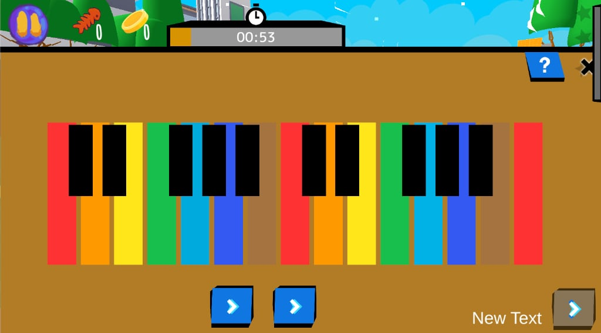

# Activities

## Płótno

Wyczyść całą powierzchnię

Categories:

  - **Koordynacja**: Kontrola precyzyjnych ruchów i wyczucia czasu.
  - **Obserwacja**: Dostrzeganie detali i wzorów na obrazach/scenach.
  - **Uwaga**: Skupienie na ważnych bodźcach i ignorowanie rozpraszaczy.

Skills:

  - **Koordynacja i wyczucie czasu**: Pulsar
  - **Mała motoryka**: Precyzyjne
  - **Uwaga podzielna**: Radzić sobie z kilkoma zadaniami jednocześnie.
  - **Rozróżnianie wzrokowe**: Dostrzegać różnice i dopasowywać obrazy.

A 2D minigame where the player is tasked with dragging a finger across the screen to clean a canvas. There will be obstacles scattered around the screen, moving between two points at varying speeds depending on the difficulty. If the player touches at least 1 of them, a point will be deducted once the minigame is finished (the amount of points deducted does not increase as the player makes more mistakes). A point will also be deducted upon skipping the minigame. There may be treasures hidden under the line: when the player traces over them, they are revealed and glow a little. The player can pick them up by tapping them.
Input Variable: Background image and the images of the moving obstacles

Credits:
  - Valeria Passarella (Italy)
  - [Stefano Cecere](https://stefanocecere.com) (Italy)

## Układanka

Odłóż elementy na miejsce

Categories:

  - **Rozwiązywanie problemów**: Analiza sytuacji i znajdowanie skutecznych rozwiązań.
  - **Obserwacja**: Dostrzeganie detali i wzorów na obrazach/scenach.

Skills:

  - **Rozumowanie przestrzenne**:  ensamblar o encajar formas mentalmente.
  - **Wizualizacja**: Wyobrażać sobie obiekty i czynności.
  - **Rozróżnianie wzrokowe**: Dostrzegać różnice i dopasowywać obrazy.
  - **Planowanie**: Dobór kroków i kolejności

Goal: Remember pictures better by interacting with them and not just looking at them
gameplay: Reconstructing an image based on parts of it Moving objects with  your cursor / mouse
Input Variable:  image 

Credits:
  - Vieri Toti (Italy)
  - [Stefano Cecere](https://stefanocecere.com) (Italy)

## Mecz

dopasuj elementy według czegoś wspólnego

Categories:

  - **Obserwacja**: Dostrzeganie detali i wzorów na obrazach/scenach.
  - **Uwaga**: Skupienie na ważnych bodźcach i ignorowanie rozpraszaczy.

Skills:

  - **Pamięć robocza**: Przechowywać niewielkie informacje przez krótki czas.
  - **Pamięć przestrzenna**:  wo Dinge liegen.
  - **Parowanie i kojarzenie**:  die zusammengehören
  - **Uwaga selektywna**:  Ablenkungen ausblenden.

**goal**: couple the pairs of cards, by similitude, logic, relationship, category

**gameplay**: Drag and drop the items to be "paired" 

**controls**: drag with the finger or the mouse

**input Variables**:

- How many items (from 2 to 7)
- a list of coupled  images

Credits:
  - [Stefano Cecere](https://stefanocecere.com) (Italy)

## Pamięć

klasyczna gra pamięciowa

Categories:

  - **Pamięć**: Przechowywanie i aktualizowanie informacji krótkotrwale.
  - **Obserwacja**: Dostrzeganie detali i wzorów na obrazach/scenach.

Skills:

  - **Pamięć robocza**: Przechowywać niewielkie informacje przez krótki czas.
  - **Pamięć przestrzenna**:  wo Dinge liegen.
  - **Parowanie i kojarzenie**:  die zusammengehören
  - **Uwaga selektywna**:  Ablenkungen ausblenden.

goal: select all the couples of identical images
gameplay: you are given a set of covered images. you click two images to uncover them if they are identical the stay front side. you win when you find them all
input variables: a set of images

Credits:
  - [Stefano Cecere](https://stefanocecere.com) (Italy)

## Policz pieniądze

klasyczna gra pamięciowa

Categories:

  - **Umiejętności liczbowe**: Używanie liczb i pieniędzy w sytuacjach codziennych.
  - **Rozwiązywanie problemów**: Analiza sytuacji i znajdowanie skutecznych rozwiązań.
  - **Matematyka**: Matematyka formalna i uporządkowane rozwiązywanie zadań.

Skills:

  - **Obliczenia pieniężne**: Dodawać i łączyć monety/banknoty do celu.
  - **Obliczenia liczbowe**:  soustraire
  - **Rozumowanie proporcjonalne**: Porównywać proporcje i skalować wielkości.
  - **Planowanie**: Dobór kroków i kolejności
  - **Uwaga selektywna**:  Ablenkungen ausblenden.

goal: Examine the coins and banknotes given and select the ones that add up to the amount of money requested.
gameplay: the player is tasked with analysing and understanding the value of a sum of coins. The minigame uses a combination of both metal coins and banknotes, so that it may be adapted to the specific currency of many different countries.
  

Credits:
  - Valeria Passarella (Italy)
  - [Stefano Cecere](https://stefanocecere.com) (Italy)

## Zamówienie

ułóż elementy we właściwej kolejności

Categories:

  - **Sekwencjonowanie**: Ustawianie elementów w porządku logicznym lub czasowym.
  - **Obserwacja**: Dostrzeganie detali i wzorów na obrazach/scenach.

Skills:

  - **Porządkowanie i sekwencja**: Układać kroki/zdarzenia we właściwej kolejności.
  - **Parowanie i kojarzenie**:  die zusammengehören
  - **Uwaga selektywna**:  Ablenkungen ausblenden.
  - **Rozróżnianie wzrokowe**: Dostrzegać różnice i dopasowywać obrazy.
  - **Planowanie**: Dobór kroków i kolejności

**goal**: Find the right sequence of items and drag them in place
**gameplay**: Drag and drop the items in the correct order. 
**controls**: drag with the finger or the mouse

Input Variables:
- How many items (from 3 to 7)
- Items images

Credits:
  - Lorenzo Castrovilli (Italy)
  - [Stefano Cecere](https://stefanocecere.com) (Italy)

## Fortepian

pamięć sekwencyjna i powtarzanie. także muzyczne

Categories:

  - **Muzyka**: Percibir y producir sonidos
  - **Pamięć**: Przechowywanie i aktualizowanie informacji krótkotrwale.
  - **Uwaga**: Skupienie na ważnych bodźcach i ignorowanie rozpraszaczy.

Skills:

  - **Poczucie rytmu**: Utrzymywać puls i odtwarzać rytmy.
  - **Pamięć słuchowa**: Zapamiętywać i powtarzać dźwięki/sekwencje mowy.
  - **Sekwencjonowanie**: Zapamiętywać kolejność elementów lub zdarzeń.
  - **Uwaga selektywna**:  Ablenkungen ausblenden.
  - **Mała motoryka**: Precyzyjne

goal: Play a given melody (by sounds / colors). it can work as a memory game also!
gameplay: We hear a notes sequence and have to repeat it. We press play and hear the sequence and highlight notes. When we press keys, we “play” a sequence. If done properly: we win.

Input Variables:
- Notes sequence
- Scoresheet texture

Credits:
  - [Stefano Cecere](https://stefanocecere.com) (Italy)

