# Paryż! (fr_01)
> [!note] Educators & Designers: help improving this quest!
> **Comments and feedback**: [discuss in the Forum](https://antura.discourse.group/t/fr-01-paris/23/1)  
> **Improve script translations**: [comment the Google Sheet](https://docs.google.com/spreadsheets/d/1FPFOy8CHor5ArSg57xMuPAG7WM27-ecDOiU-OmtHgjw/edit?gid=755037318#gid=755037318)  
> **Improve Cards translations**: [comment the Google Sheet](https://docs.google.com/spreadsheets/d/1M3uOeqkbE4uyDs5us5vO-nAFT8Aq0LGBxjjT_CSScWw/edit?gid=415931977#gid=415931977)  
> **Improve the script**: [propose an edit here](https://github.com/vgwb/Antura/blob/main/Assets/_discover/_quests/FR_01%20Paris/FR_01%20Paris%20-%20Yarn%20Script.yarn)  

- Version: 1.00
- Status: Production
- Location: France - Paryż

- Difficulty: Normal
- Duration (min): 20
- Kind:
  - Parkour
  - Seek
  - Orientation
- Description: podróżuj po Paryżu szukając Antury!

## Design Notes
## Game Design Notes

Explore Paris tour through iconic landmarks.

Location:
Paris, France

1. Learn about Eiffel Tower construction
2. Bakery and French baguette making with ingredient collection
3. visit Notre-Dame architecture

### Flow

Guide welcomes

**Part 1: La Tour Eiffel and Gustave Eiffel**
Mission: Climb the Eiffel Tower with the elevator.

Collect 5 coins to buy ticket

**Part 2: Notre Dame de Paris**
Mission: find the 3 pieces of the map

**Part 3: La Baguette**
Mission: Learn the art of making the perfect baguette and discover its cultural significance in French society.

## Topics
### Eiffel Tower {#eiffel-tower}
[Open topic page](../../topics/index.md#eiffel-tower)  

What we need to know about the iconic Paris landmark

- Importance: Critical  
- Country: France  
- Target age: Ages3to5  
- Subjects: History

#### Core Card - Wieża Eiffla
Wysoka wieża i symbol Paryża. Jest wykonana z żelaza i ma 300 metrów wysokości. Można na nią wejść i zobaczyć całe miasto.

{ width="200" }
- Type: Place
- Subjects: Geography, History, Culture
- Year: 1889

#### Connection (LocatedIn) - Paryż
Stolica Francji. Paryż ma słynną wysoką wieżę zwaną Wieżą Eiffla!

{ width="200" }
- Type: Place
- Subjects: Geography, Culture

#### Connection (CreatedBy): Gustave Eiffel designed and built the tower - Gustave Eiffel
Inżynier, który zbudował Wieżę Eiffla! Uwielbiał konstruować z żelaza i stworzył najsłynniejszą wieżę na świecie.

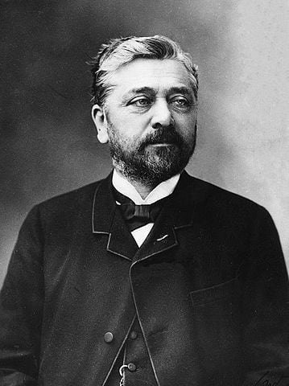{ width="200" }
- Type: Person
- Subjects: History, Culture, Science
- Year: 1832

#### Connection (MadeOf) - Żelazo
Gorące narzędzie służące do wygładzania i prostowania pogniecionych ubrań. Uwaga, żelazka są bardzo gorące!

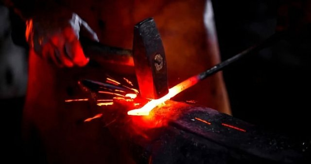{ width="200" }
- Type: Object
- Subjects: Science

#### Connection (RelatedTo) - Mapa Wieży Eiffla
Mapa pokazująca lokalizację słynnej wysokiej wieży w Paryżu.

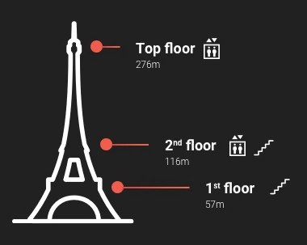{ width="200" }
- Type: Object
- Subjects: Community, Culture

#### Connection (RelatedTo) - Bilet na Wieżę Eiffla
Specjalny dokument umożliwiający odwiedzenie słynnej wysokiej wieży w Paryżu, we Francji.

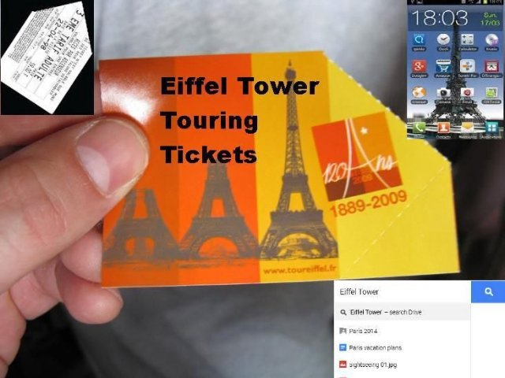{ width="200" }
- Type: Object
- Subjects: Science

### Notre Dame {#notredame}
[Open topic page](../../topics/index.md#notredame)  

- Importance: High  
- Country: France  
- Target age: Ages6to10  
- Subjects: Culture

#### Core Card - Katedra Notre-Dame w Paryżu
Piękna katedra w Paryżu. Jej kolorowe witraże opowiadają historie.

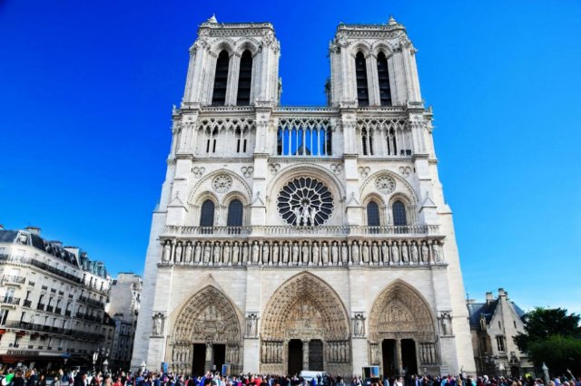{ width="200" }
- Type: Place
- Subjects: Geography, Environment
- Year: 1885

#### Connection (LocatedIn) - Paryż
Stolica Francji. Paryż ma słynną wysoką wieżę zwaną Wieżą Eiffla!

{ width="200" }
- Type: Place
- Subjects: Geography, Culture

#### Connection (TimeContext): notable event - Pożar Notre-Dame
W 2019 roku wielki pożar zniszczył piękną katedrę Notre-Dame w Paryżu. Wiele osób współpracowało, aby uratować ten ważny budynek.

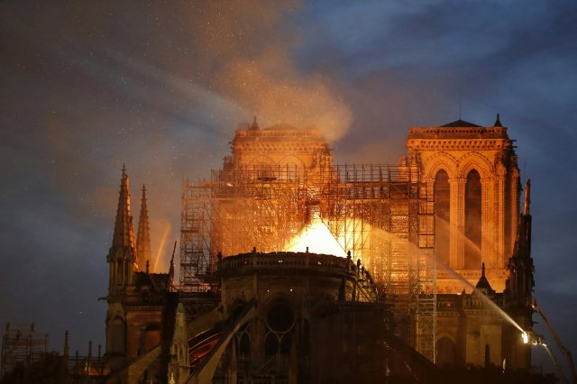{ width="200" }
- Rationale: This event teaches kids about protecting cultural heritage and community cooperation
- Type: Concept
- Subjects: History, Culture, Environment
- Year: 2019

#### Connection (LocatedIn) - Ile-de-France
Region we Francji, w którym znajduje się stolica, Paryż. Mieszka tu wielu ludzi!

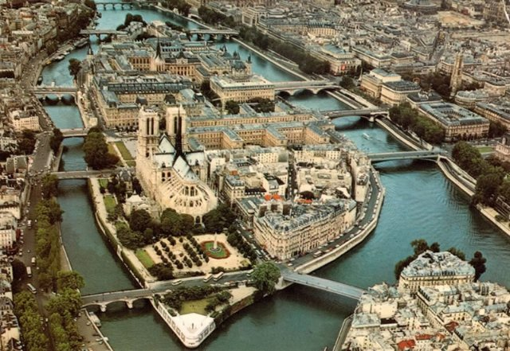{ width="200" }
- Type: Place
- Subjects: Geography, Environment

### Baguette {#baguette}
[Open topic page](../../topics/index.md#baguette)  

the french bread famous all around the world!

- Importance: Medium  
- Country: France  
- Target age: Ages3to5  
- Subjects: Food

#### Core Card - Bagietka francuska
Długi chrupiący chleb. Najsłynniejsze pieczywo w całej Francji. Francuzi codziennie kupują świeże bagietki w piekarni.

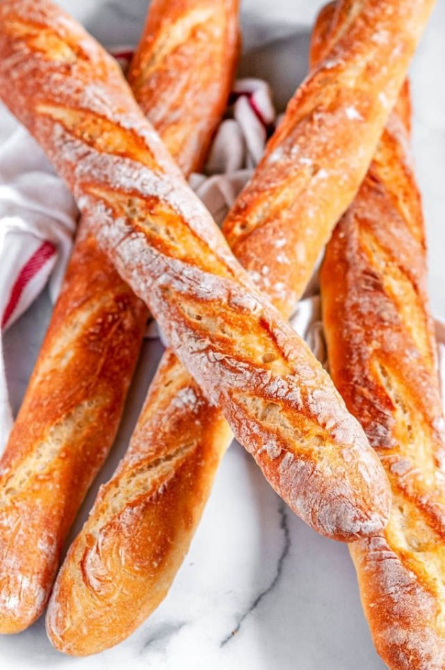{ width="200" }
- Rationale: Baguettes are iconic French culture that kids can easily understand and remember
- Type: Object
- Subjects: Food, Culture
- Year: 1700

#### Connection (LocatedIn) - Paryż
Stolica Francji. Paryż ma słynną wysoką wieżę zwaną Wieżą Eiffla!

{ width="200" }
- Type: Place
- Subjects: Geography, Culture

#### Connection (CreatedBy) - Piekarz
Osoba, która piecze chleb, bułki i różne ciasta.

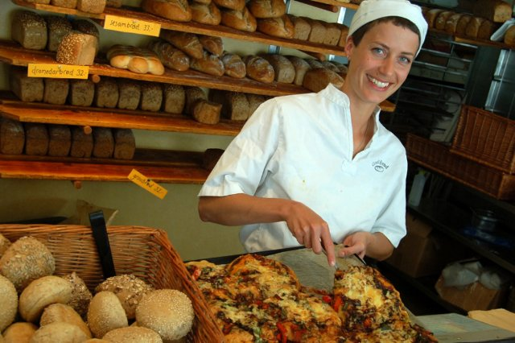{ width="200" }
- Type: Person
- Subjects: History, Culture

#### Connection (MadeOf) - Sól
Białe kryształy, które poprawiają smak potraw.

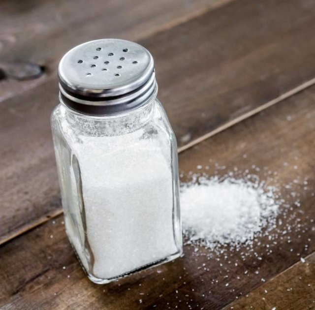{ width="200" }
- Type: Object
- Subjects: Food, Culture

#### Connection (MadeOf) - Drożdże
Drożdże to magiczny proszek, który sprawia, że ​​chleb jest miękki i smaczny!

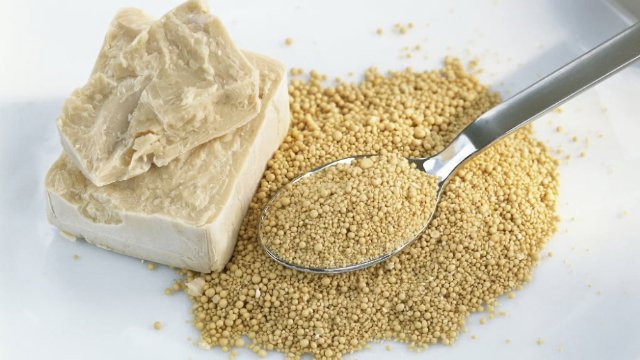{ width="200" }
- Type: Object
- Subjects: Food, Culture

#### Connection (MadeOf) - Mąka
Zmielona pszenica, używana do wypieku chleba.

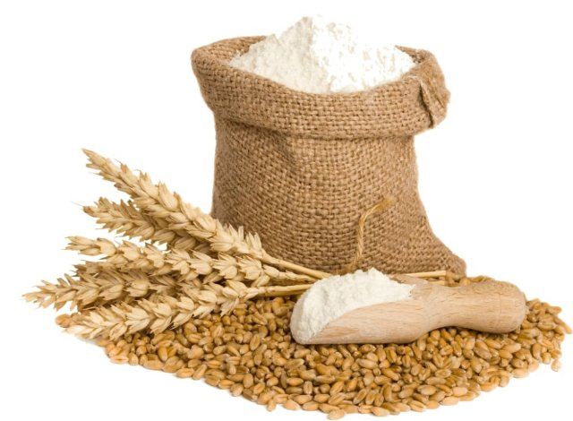{ width="200" }
- Type: Object
- Subjects: Food, Science

#### Connection (MadeOf) - Woda
Woda jest niezbędna do życia

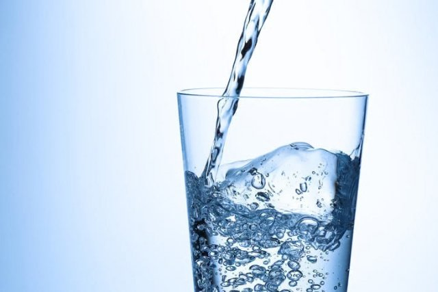{ width="200" }
- Type: Object
- Subjects: Food, Culture

## Additional Cards
#### Louvre
Ogromne muzeum pełne sztuki. To tu mieszka Mona Lisa.

{ width="200" }
- Type: Place
- Subjects: Art, Culture, History
- Year: 1793

#### Katedra
Bardzo duży i ważny kościół w mieście.

{ width="200" }
- Type: Place
- Subjects: Culture, History, Education

#### Kościół
Specjalny budynek, w którym ludzie spotykają się, aby modlić się i śpiewać.

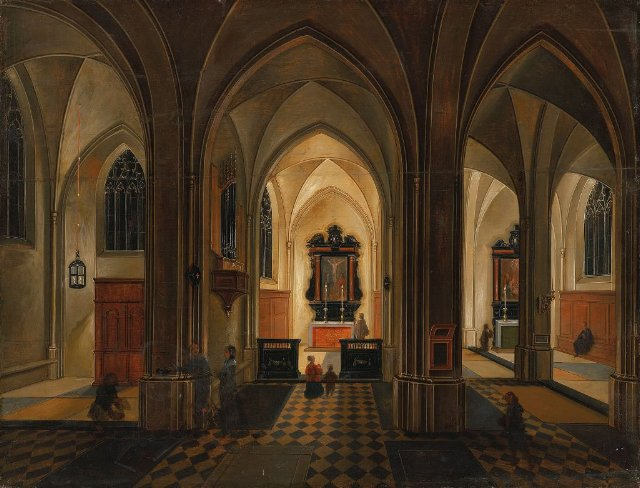{ width="200" }
- Type: Place
- Subjects: Culture, Civics, Education

#### Windy Wieży Eiffla
Windy, którymi zwiedzający mogą wjechać na żelazną wieżę.

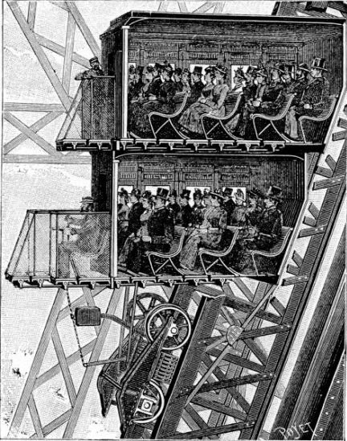{ width="200" }
- Type: Object
- Subjects: Technology, Transportation

#### Łuk przyporowy
Kamienne zewnętrzne ramiona, które pomagają podtrzymywać wysokie mury.

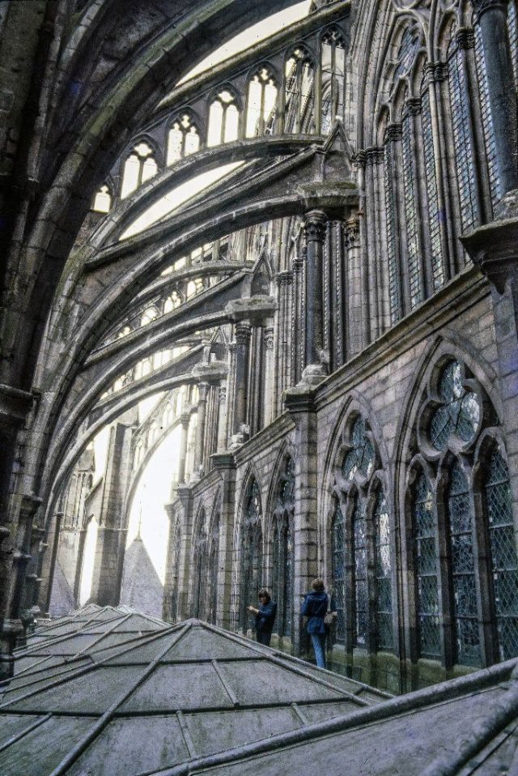{ width="200" }
- Type: Concept
- Subjects: Technology, History, Art

#### Gargulec
Zabawna lub straszna figurka, która pełni również funkcję rynny deszczowej.

{ width="200" }
- Type: Concept
- Subjects: Art, Technology, History

#### Okno rozetowe
Duży, okrągły witraż opowiadający historie światłem.

{ width="200" }
- Type: Concept
- Subjects: Art, Culture, History

#### Wystawa światowa (1889)
Wielka światowa wystawa, na której pokazano Wieżę Eiffla.

{ width="200" }
- Type: Concept
- Subjects: History, Culture

#### Łuk Triumfalny
Wielki łuk w Paryżu wzniesiony ku czci bohaterów. Lśni tak, że widać go z drugiego końca długiej alei!

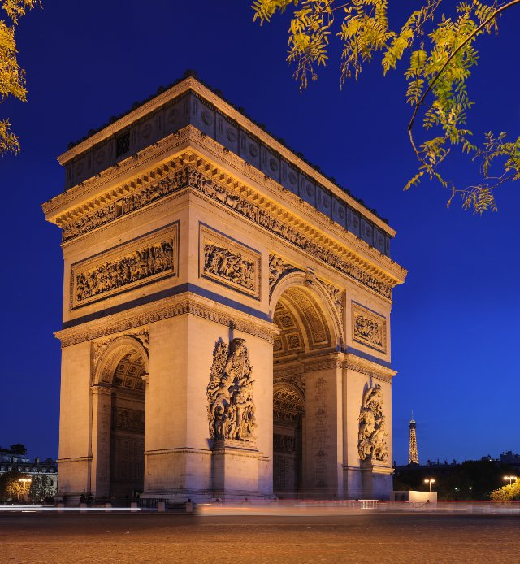{ width="200" }
- Type: Place

#### Louvre
Ogromne muzeum pełne sztuki. To tu mieszka Mona Lisa.

{ width="200" }
- Type: Place
- Subjects: Art, Culture, History
- Year: 1793

## Quest Script

[See the full script here](./fr_01-script.md)

## Words
## Activities
- [JigsawPuzzle](../../activities/index.md#JigsawPuzzle)
- [Memory](../../activities/index.md#Memory)
- [MoneyCount](../../activities/index.md#MoneyCount)
- [Memory](../../activities/index.md#Memory)
- [CleanCanvas](../../activities/index.md#CleanCanvas)
- [JigsawPuzzle](../../activities/index.md#JigsawPuzzle)
- [Match](../../activities/index.md#Match)

## Tasks
- [Interact] go_eiffell
- [Collect] collect_coins
- [Interact] go_notredame
- [Interact] go_arc
- [Interact] go_louvre
- [Interact] go_baker
## Credits
- Anne (France) (content)
- Fabio Cecere (Italy) (design)
- Lucie Paillat (France) (content)
- [Stefano Cecere](https://stefanocecere.com) (Italy) (design, development)
