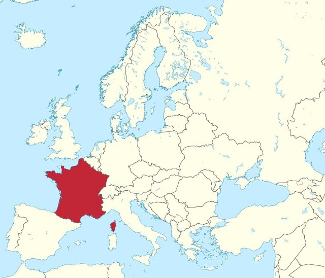
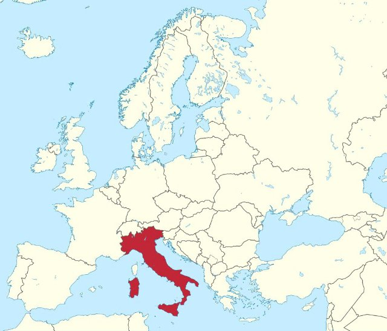
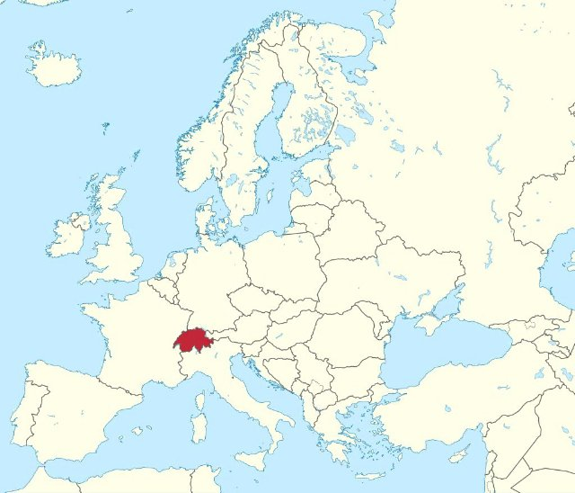

# Mont Blanc i góry (fr_08)
> [!note] Educators & Designers: help improving this quest!
> **Comments and feedback**: [discuss in the Forum](https://antura.discourse.group/t/fr-08-mont-blanc-mountains/27/1)  
> **Improve script translations**: [comment the Google Sheet](https://docs.google.com/spreadsheets/d/1FPFOy8CHor5ArSg57xMuPAG7WM27-ecDOiU-OmtHgjw/edit?gid=736863861#gid=736863861)  
> **Improve Cards translations**: [comment the Google Sheet](https://docs.google.com/spreadsheets/d/1M3uOeqkbE4uyDs5us5vO-nAFT8Aq0LGBxjjT_CSScWw/edit?gid=415931977#gid=415931977)  
> **Improve the script**: [propose an edit here](https://github.com/vgwb/Antura/blob/main/Assets/_discover/_quests/FR_08%20Mont%20Blanc/FR_08%20Mont%20Blanc%20-%20Yarn%20Script.yarn)  

- Version: 1.00
- Status: Production
- Location: France - Alpy Rodańskie

- Difficulty: Normal
- Duration (min): 15
- Description: Odkryj Mont Blanc i poznaj niezbędny sprzęt górski, który umożliwi Ci zdobycie szczytu podczas tej wspinaczkowej przygody!

## Design Notes
### Overview

Explore **Mont Blanc** and climb from the valley floor to the summit while collecting essential mountain gear. Along the way, meet guides and climbers, learn key facts about the **Alps**, and discover how preparation and safety help make high-altitude travel possible.

Each stage introduces a new part of the mountain environment and rewards the player with equipment needed to continue the ascent.

### Characters

- **Mountain Guide**: Welcomes the player at Base Camp, introduces the mission, and helps begin the journey.
- **Alpinists and Experts**: Climbers and specialists placed at each base who share facts, ask questions, and guard reward chests.
- **Mountain Wildlife**: Marmots and other natural details that give the setting atmosphere and a stronger sense of place.

### Learning Goals

- **Geography**: Mont Blanc is the highest mountain in the **Alps**, reaching **4,807 meters**. From the summit, players learn about **France**, **Italy**, and **Switzerland**.
- **Vocabulary**: mountain, peak, snow, ice, sun, and wind.
- **Gear and Safety**: Players identify and collect essential climbing items, including a backpack, coat, hat, gloves, sunglasses, crampons, and rope.

### Gameplay Flow

#### Bonus Area

- A hidden chest rewards the player with a **scarf**.

#### Base Camp: The Beginning

- **Location**: The valley floor in Chamonix.
- **Encounter**: The player meets the **Mountain Guide**.
- **Knowledge Focus**: Mont Blanc is the highest peak in the **Alps**.
- **Objective**: Find a key and open a chest to collect the **Backpack**.
- **Progress Requirement**: The player needs the **Backpack** to continue.

#### Base 1: The Valley's End

- **Location**: The lower valley, at the foot of the mountain.
- **Encounter**: A hiker explains why dressing in layers is important.
- **Objectives**:
  - Complete a simple weather quiz to unlock a chest containing the **Hat**.
  - Find the **Coat** nearby.
- **Progress Requirement**: The player needs the **Coat** and **Hat** to continue.

#### Base 2: The Snow Line

- **Location**: The area where grass gives way to permanent **snow**.
- **Encounter**: An NPC explains that the **sun** can be especially strong in snowy conditions.
- **Objectives**:
  - Solve a mountain jigsaw puzzle to unlock a chest containing **Sunglasses**.
  - Find the **Gloves** nearby.
- **Progress Requirement**: The player needs the **Sunglasses** and **Gloves** to continue.

#### Base 3: The Glacier

- **Location**: A high-altitude area of **ice** and glacier terrain.
- **Encounter**: An expert explains why special equipment is needed to walk safely on ice.
- **Objectives**:
  - Answer a question about moving on ice to unlock **Crampons**.
  - Find the **Rope** nearby.
- **Progress Requirement**: The player needs the **Rope** and **Crampons** to continue.

#### Base 4: The Summit

- **Location**: The **4807-meter** summit of Mont Blanc.
- **Knowledge Focus**: Players identify **France**, **Italy**, and **Switzerland**.
- **Final Puzzle**: Match each country to its flag.

### Final Assessment

1. What is the name of the mountain range where Mont Blanc is located?
   - **The Alps**
   - The Pyrenees
   - The Apennines
2. How high is Mont Blanc?
   - **4807 meters**
   - 3705 meters
   - 5016 meters
3. Which countries can you see from the top of Mont Blanc?
   - **Italy, France, and Switzerland**
   - Italy, Austria, and France
   - Germany, France, and Switzerland

## Quest Script
[See the full script here](./fr_08-script.md)

## Topics
### mont blanc {#mont_blanc}
[Open topic page](../../topics/index.md#mont_blanc)  

- Importance: Medium  
- Country: France  
- Target age: Ages6to10

#### Core Card - Mont Blanc
Najwyższa góra w Europie Zachodniej. Pokryta śniegiem przez cały rok.

{ width="200" }
- Type: Place
- Subjects: Geography, Environment

#### Connection (RelatedTo) - Przewodnik górski
Osoba, która pomaga ludziom bezpiecznie się wspinać.

{ width="200" }
- Type: Person
- Subjects: Community, Safety, Education

#### Connection (RelatedTo) - Wiatr
Ruch powietrza, który w górach może być odczuwalnie silniejszy.

{ width="200" }
- Type: Concept
- Subjects: Weather, Environment

#### Connection (RelatedTo) - Szczyt
Najwyższy punkt góry.

{ width="200" }
- Type: Concept
- Subjects: Geography, Environment, Education

#### Connection (RelatedTo) - Alpy
Wysokie pasmo górskie w Europie.

{ width="200" }
- Type: Place
- Subjects: Geography, Environment

#### Connection (RelatedTo) - Góra
Filary ziemi

{ width="200" }
- Type: Concept
- Subjects: Environment, Education

#### Connection (RelatedTo) - Śnieg
Zamarznięta woda spadająca w zimne dni.

{ width="200" }
- Type: Concept
- Subjects: Weather, Environment, Science

#### Connection (RelatedTo) - Lód
Zamarznięta woda, która może być bardzo śliska.

{ width="200" }
- Type: Concept
- Subjects: Weather, Environment, Science

#### Connection (LocatedIn) - Francja
Kraj w Europie. Stolicą jest Paryż.

{ width="200" }
- Type: Place
- Subjects: Geography, Culture

#### Connection (LocatedIn) - Włochy
Państwo w Europie. Stolicą jest Rzym.

{ width="200" }
- Type: Place
- Subjects: Geography, Culture

#### Connection (LocatedIn) - Szwajcaria
Kraj w Europie. Stolicą jest Berno. Szwajcaria słynie z gór i sera.

{ width="200" }
- Type: Place
- Subjects: Geography, Culture

### mountain tools {#mountain_tools}
[Open topic page](../../topics/index.md#mountain_tools)  

what we need to stay safe in the mountain

- Importance: Medium  
- Country: International  
- Target age: Ages6to10

#### Core Card - Góra
Filary ziemi

{ width="200" }
- Type: Concept
- Subjects: Environment, Education

#### Connection (RelatedTo) - Rękawice
Ciepłe okrycia na dłonie.

{ width="200" }
- Type: Object
- Subjects: Health, Safety, Weather

#### Connection (RelatedTo) - Kapelusz
Ciepła czapka na głowę.

{ width="200" }
- Type: Object
- Subjects: Health, Safety, Weather

#### Connection (RelatedTo) - Plecak
Torba, którą nosisz na plecach.

{ width="200" }
- Type: Object
- Subjects: Recreation, Transportation, Education

#### Connection (RelatedTo) - Lina
Mocna lina używana do zapewnienia bezpieczeństwa podczas wspinaczki.

{ width="200" }
- Type: Object
- Subjects: Safety, Technology, Sport

#### Connection (RelatedTo) - Raki
Kolczaste metalowe uchwyty przymocowane do butów. Pozwalają chodzić po lodzie.

{ width="200" }
- Type: Object
- Subjects: Safety, Technology, Sport

#### Connection (RelatedTo) - Szalik
Ciepły kawałek materiału noszony wokół szyi.

{ width="200" }
- Type: Object
- Subjects: Health, Safety, Weather

#### Connection (RelatedTo) - Okulary przeciwsłoneczne
Okulary chroniące oczy przed jasnym światłem.

{ width="200" }
- Type: Object
- Subjects: Health, Safety, Weather

#### Connection (RelatedTo) - Płaszcz
Ciepła kurtka na zimne dni.

{ width="200" }
- Type: Object
- Subjects: Health, Safety, Weather

### mountain activities {#mountain_activities}
[Open topic page](../../topics/index.md#mountain_activities)  

- Importance: Medium  
- Country: International  
- Target age: Ages6to10

#### Core Card - Góra
Filary ziemi

{ width="200" }
- Type: Concept
- Subjects: Environment, Education

#### Connection (RelatedTo) - Przewodnik górski
Osoba, która pomaga ludziom bezpiecznie się wspinać.

{ width="200" }
- Type: Person
- Subjects: Community, Safety, Education

#### Connection (RelatedTo) - Turystyka piesza
Wędrówki po szlakach na łonie natury.

{ width="200" }
- Type: Concept
- Subjects: Recreation, Sport, Environment

#### Connection (RelatedTo) - Wspinaczka
Wchodzenie na strome skały lub lód przy użyciu specjalnego sprzętu.

{ width="200" }
- Type: Concept
- Subjects: Sport, Safety, Recreation

#### Connection (RelatedTo) - Narciarstwo
Zjeżdżanie na nartach po śniegu.

{ width="200" }
- Type: Concept
- Subjects: Sport, Recreation

## Additional Cards
#### Bobsleje
Szybkie sanki służące do zjeżdżania po lodzie.

{ width="200" }
- Type: Object
- Subjects: Sport, Recreation

#### Lodowiec
Wolno poruszający się lód występujący w wysokich górach.

{ width="200" }
- Type: Concept
- Subjects: Geography, Science, Environment

#### Świstak
Zwierzę górskie z grubym futrem, charakterystycznie gwiżdże.

{ width="200" }
- Type: Object
- Subjects: Animal, Environment, Science

#### Słoneczny
Jasne światło, które może odbijać się od śniegu.

{ width="200" }
- Type: Concept
- Subjects: Science, Weather, Environment

## Words
## Activities
- [JigsawPuzzle](../../activities/index.md#JigsawPuzzle)
- [CleanCanvas](../../activities/index.md#CleanCanvas)
- [Memory](../../activities/index.md#Memory)
- [Match](../../activities/index.md#Match)

## Tasks
- [Collect] get_backpack
- [Collect] get_hat
- [Collect] get_sunglasses
- [Collect] get_crampons
## Credits
- Anne (France) (content)
- Lucie Paillat (France) (content, design)
- [Stefano Cecere](https://stefanocecere.com) (Italy) (development)
- Valeria Passarella (Italy) (design)
