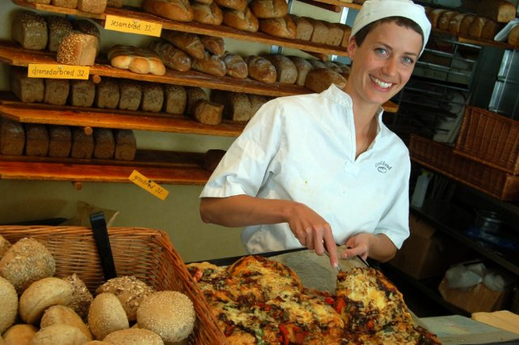
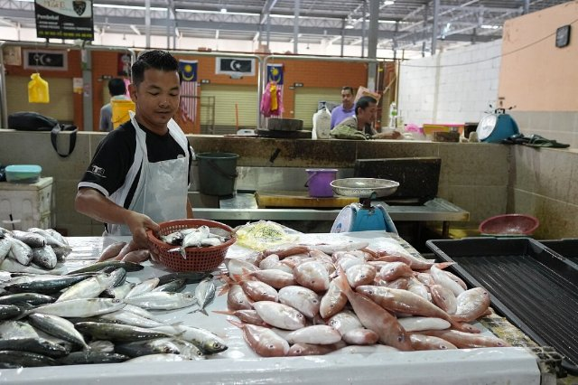
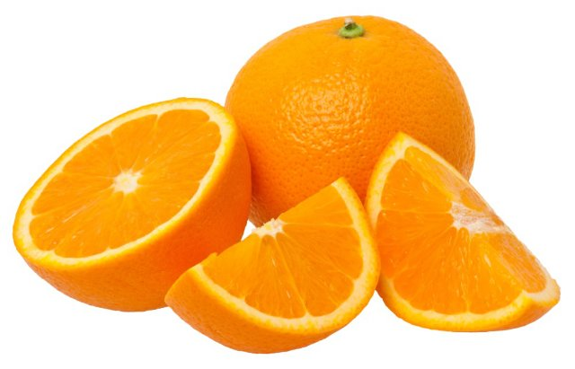

# Jedzenie i targ (fr_09)
> [!note] Educators & Designers: help improving this quest!
> **Comments and feedback**: [discuss in the Forum](https://antura.discourse.group/t/fr-09-the-colors-of-the-marseille-market/28/1)  
> **Improve script translations**: [comment the Google Sheet](https://docs.google.com/spreadsheets/d/1FPFOy8CHor5ArSg57xMuPAG7WM27-ecDOiU-OmtHgjw/edit?gid=1243903291#gid=1243903291)  
> **Improve Cards translations**: [comment the Google Sheet](https://docs.google.com/spreadsheets/d/1M3uOeqkbE4uyDs5us5vO-nAFT8Aq0LGBxjjT_CSScWw/edit?gid=415931977#gid=415931977)  
> **Improve the script**: [propose an edit here](https://github.com/vgwb/Antura/blob/main/Assets/_discover/_quests/FR_09%20Food%20&%20Market/FR_09%20Food%20&%20Market%20-%20Yarn%20Script.yarn)  

- Version: 1.00
- Status: Production
- Location: France - Marsylia

- Difficulty: Normal
- Duration (min): 15
- Kind:
  - Seek
  - Puzzles
- Description: Odwiedź tętniący życiem Stary Port w Marsylii! Naucz się grzecznych francuskich zwrotów, kupując składniki do słynnego lokalnego dania, bouillabaisse.

## Design Notes

**Core Subject:** Food, Commerce, and Social Etiquette.

**Player Objectives:**

1. **Culinary Mission:** The player meets a Chef who wants to prepare a traditional **Bouillabaisse** (fish stew) but lacks the ingredients.
2. **Market Exploration:** The player must visit four different vendors (Baker, Fishmonger, Cheesemonger, Greengrocer) to find specific items like **fish, bread, tomatoes, and olive oil**.
3. **Social Interaction:** To succeed, the player must use polite greetings ("Bonjour", "Merci") and select the correct items from each vendor's list.
4. **Financial Literacy:** The player pays for items using a mini-game that simulates counting money (Euros).
5. **Final Preparation:** After collecting all 9 ingredients, the player returns to the Chef to match the ingredients to their source (e.g., Fish comes from the Fishmonger) and "cook" the final dish.

**Educational Content:**

- **Cultural Dish:** Introduces _Bouillabaisse_ as a famous specialty of Marseille.
- **Vocabulary:** Focuses on food items (_Fish, Crab, Bread, Milk, Oil, Tomato, Lemon_) and professions (_Baker, Grocer, Fishmonger_).
- **Social Skills:** Reinforces the importance of politeness (greeting before asking) and basic commerce (exchanging money for goods).

## Topics
### market traders {#marketers}
[Open topic page](../../topics/index.md#marketers)  

People who sell food and goods at market stalls—like fishmongers, cheesemongers, and fruit sellers. They weigh, wrap, and call out today’s prices.

- Importance: Medium  
- Country: France  
- Target age: Ages6to10

#### Core Card - Sprzedawca na targu
Osoby sprzedające żywność i towary na targach - sprzedawcy ryb, serów, owoców. Ważą, pakują i wykrzykują ceny.

{ width="200" }
- Type: Person
- Subjects: Money, Community

#### Connection (RelatedTo) - Sprzedawca serów
Osoba sprzedająca wiele rodzajów sera.

{ width="200" }
- Type: Person
- Subjects: History, Culture

#### Connection (RelatedTo) - Piekarz
Osoba, która piecze chleb, bułki i różne ciasta.

{ width="200" }
- Type: Person
- Subjects: History, Culture

#### Connection (RelatedTo) - Sprzedawca warzyw i owoców
Osoba sprzedająca świeże owoce i warzywa.

{ width="200" }
- Type: Person
- Subjects: History, Culture

#### Connection (RelatedTo) - Sprzedawca artykułów spożywczych
Osoba sprzedająca różnego rodzaju żywność i napoje.

{ width="200" }
- Type: Person
- Subjects: History, Culture

#### Connection (RelatedTo): Previous core card - Sprzedawca ryb
Osoba sprzedająca świeże ryby i owoce morza.

{ width="200" }
- Type: Person
- Subjects: History, Culture

### Bouillabaisse {#bouillabaisse}
[Open topic page](../../topics/index.md#bouillabaisse)  

- Importance: Low  
- Country: France  
- Target age: Ages6to10

#### Core Card - Bouillabaisse
Wyjątkowa zupa rybna z Marsylii w południowej Francji. Przyrządzana z wielu różnych gatunków ryb, ma wspaniały zapach!

{ width="200" }
- Type: Object
- Subjects: Food, Culture
- Year: 1700

#### Connection (MadeOf) - Chleb
Pyszne pieczywo z mąki i wody, Z chleba można zrobić kanapki!

{ width="200" }
- Type: Object
- Subjects: Food, Culture

#### Connection (MadeOf) - Ryba
Zwierzę żyjące i pływające w wodzie. Ryby mają płetwy i skrzela, które umożliwiają im oddychanie pod wodą.

{ width="200" }
- Type: Object
- Subjects: Food, Culture

#### Connection (MadeOf) - Krab
Zwierzę morskie z dużymi szczypcami i twardą skorupą. Kraby chodzą po plaży bokiem!

{ width="200" }
- Type: Object
- Subjects: Food, Culture

#### Connection (MadeOf) - Mleko
Biały napój pochodzący od krów. Mleko wzmacnia kości i zęby!

{ width="200" }
- Type: Object
- Subjects: Food, Culture

#### Connection (MadeOf) - Pomarańcza
Okrągły, pomarańczowy owoc, słodki i soczysty. Pomarańcze mają mnóstwo witaminy C!

{ width="200" }
- Type: Object
- Subjects: Food, Culture

#### Connection (MadeOf) - Pomidor
Jest czerwony i okrągły. Można z niego zrobić sos do pizzy!

{ width="200" }
- Type: Object
- Subjects: Food, Culture

#### Connection (MadeOf) - Cytryna
Żółty, bardzo kwaśny owoc. Z cytryn można zrobić lemoniadę!

{ width="200" }
- Type: Object
- Subjects: Food, Culture

#### Connection (MadeOf) - Oliwa z oliwek
Specjalny olej z oliwek, używany do gotowania smacznych potraw.

{ width="200" }
- Type: Object
- Subjects: Food, Culture

#### Connection (MadeOf) - Pieprz i sól
Przyprawy, które poprawiają smak potraw. Sól jest biała, a pieprz czarny i ma drobne kawałki.

{ width="200" }
- Type: Object
- Subjects: Food, Culture

## Additional Cards
#### Francuscy piraci
Odważni żeglarze, którzy żeglowali po morzach dla króla Francji. Nazywano ich korsarzami i chronili francuskie statki przed wrogami.

{ width="200" }
- Rationale: Pirates capture kids' imagination while teaching about maritime history and French naval power
- Type: Concept
- Subjects: History, Culture, Transportation
- Year: 1600

#### Waluta euro
Waluta używana w wielu krajach Europy. Za euro można kupić zabawki i lody!

{ width="200" }
- Type: Concept
- Subjects: Money, Geography

## Quest Script

[See the full script here](./fr_09-script.md)

## Words
## Activities
- [MoneyCount](../../activities/index.md#MoneyCount)
- [MoneyCount](../../activities/index.md#MoneyCount)
- [MoneyCount](../../activities/index.md#MoneyCount)
- [MoneyCount](../../activities/index.md#MoneyCount)
- [MoneyCount](../../activities/index.md#MoneyCount)
- [Match](../../activities/index.md#Match)
- [JigsawPuzzle](../../activities/index.md#JigsawPuzzle)
- [MoneyCount](../../activities/index.md#MoneyCount)
- [MoneyCount](../../activities/index.md#MoneyCount)
- [MoneyCount](../../activities/index.md#MoneyCount)
- [MoneyCount](../../activities/index.md#MoneyCount)
- [MoneyCount](../../activities/index.md#MoneyCount)

## Tasks
- [Collect] COLLECT_THE_INGREDIENTS
- [Interact] go_back_chef
## Credits
- Anne (France) (content)
- Lucie Paillat (France) (content, design)
- [Stefano Cecere](https://stefanocecere.com) (Italy) (development)
- Valeria Passarella (Italy) (design)
