# Paryż Sekwana (fr_10)
> [!note] Educators & Designers: help improving this quest!
> **Comments and feedback**: [discuss in the Forum](https://antura.discourse.group/t/fr-10-paris-seine/29/1)  
> **Improve script translations**: [comment the Google Sheet](https://docs.google.com/spreadsheets/d/1FPFOy8CHor5ArSg57xMuPAG7WM27-ecDOiU-OmtHgjw/edit?gid=754141150#gid=754141150)  
> **Improve Cards translations**: [comment the Google Sheet](https://docs.google.com/spreadsheets/d/1M3uOeqkbE4uyDs5us5vO-nAFT8Aq0LGBxjjT_CSScWw/edit?gid=415931977#gid=415931977)  
> **Improve the script**: [propose an edit here](https://github.com/vgwb/Antura/blob/main/Assets/_discover/_quests/FR_10%20Paris%20Seine/FR_10%20Paris%20Seine%20-%20Yarn%20Script.yarn)  

- Version: 1.00
- Status: Production
- Location: France - Paryż

- Difficulty: Normal
- Duration (min): 10
- Kind:
  - Orientation
  - Journey
- Description: Odkryjmy główną rzekę Francji

## Teachers Resources

### Video

<iframe width="560" height="315" src="https://www.youtube.com/embed/RGOFuzdol9Q?si=rGWg53DhcCsMiMdi" title="YouTube video player" frameborder="0" allow="accelerometer; autoplay; clipboard-write; encrypted-media; gyroscope; picture-in-picture; web-share" referrerpolicy="strict-origin-when-cross-origin" allowfullscreen></iframe>

👉🏼 [Seine River Cruise in Paris, France](https://www.youtube.com/watch?v=RGOFuzdol9Q)

### Map

👉🏼 [Seine Map](https://en.wikipedia.org/wiki/Seine#/map/0)

### Activities

## Quest Script
[See the full script here](./fr_10-script.md)

## Topics
### Seine {#seine}
[Open topic page](../../topics/index.md#seine)  

- Importance: Medium  
- Country: France  
- Target age: Ages6to10  
- Subjects: Geography, Transportation, Civics

#### Core Card - Sekwana
Rzeka o długości 777 kilometrów w północnej Francji

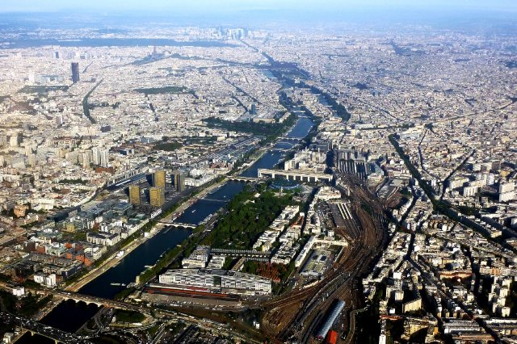{ width="200" }
- Type: Place
- Subjects: Geography

#### Connection (LocatedIn) - Paryż
Stolica Francji. Paryż ma słynną wysoką wieżę zwaną Wieżą Eiffla!

{ width="200" }
- Type: Place
- Subjects: Geography, Culture

#### Connection (RelatedTo) - Mapa Sekwany
Zdjęcie przedstawiające rzekę Sekwanę i jej przepływ przez ląd.

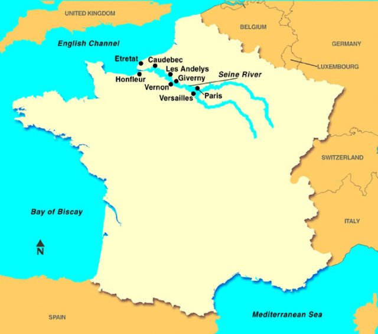{ width="200" }
- Type: Object
- Subjects: Geography, Environment

#### Connection (LocatedIn) - Mapa Sekwany w Paryżu
Zdjęcie przedstawiające jak Sekwana płynie przez Paryż.

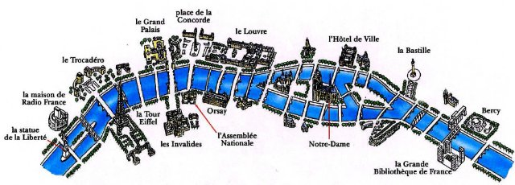{ width="200" }
- Type: Object
- Subjects: Science

#### Connection (RelatedTo) - Most dla samochodów
Droga biegnąca nad wodą, dzięki której samochody mogą pokonywać rzeki i jeziora.

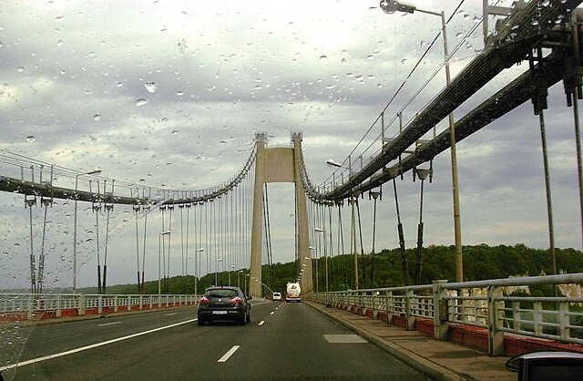{ width="200" }
- Type: Place
- Subjects: Geography, Environment

#### Connection (RelatedTo) - Kładki dla pieszych
Małe mostki dla pieszych, dzięki nim można bezpiecznie przejść na druga stronę ulicy.

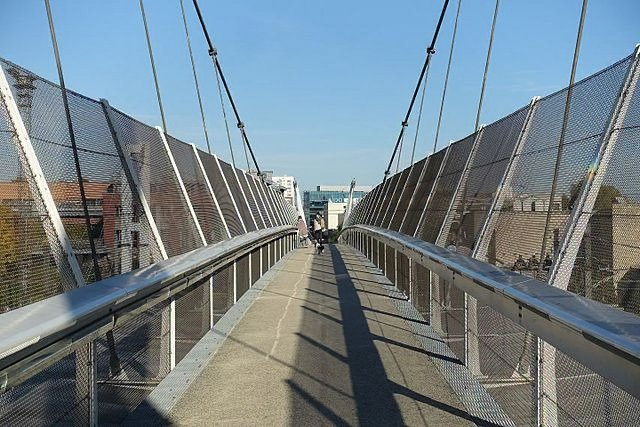{ width="200" }
- Type: Place
- Subjects: Geography, Environment

#### Connection (RelatedTo): Auto from quest fr_10 - Most dla pociągów
Specjalny most o konstrukcji wystarczająco wytrzymałej, aby umożliwić przejazd ciężkich pociągów nad wodą.

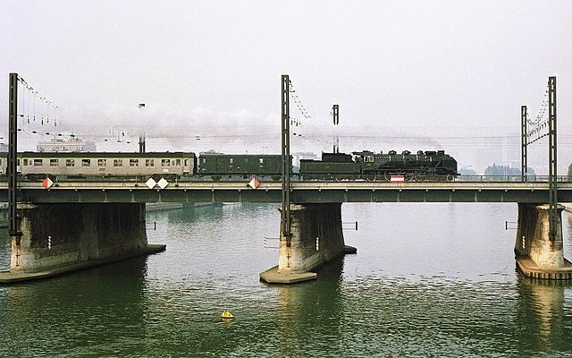{ width="200" }
- Type: Place
- Subjects: Geography, Environment

#### Connection (RelatedTo) - Most Aleksandra III
Piękny most w Paryżu z misternymi dekoracjami i złotymi posągami.

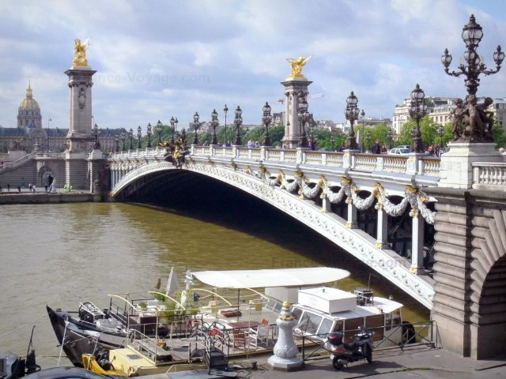{ width="200" }
- Type: Place
- Subjects: Geography, Environment

#### Connection (RelatedTo) - Łódź rzeczna
Łódź, która pływa po rzekach. Rzeki są jak drogi zbudowane z wody!

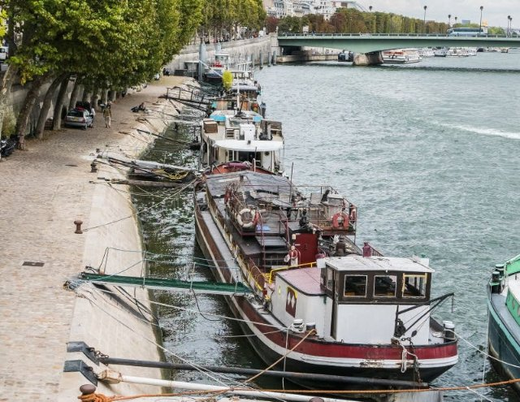{ width="200" }
- Type: Place
- Subjects: Geography, Environment

#### Connection (RelatedTo) - Łódź towarowa
Duża łódź, która przewozi paczki, żywność i inne rzeczy z miejsca na miejsce.

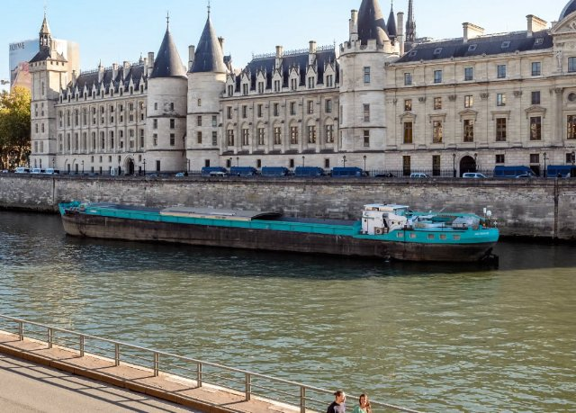{ width="200" }
- Type: Place
- Subjects: Geography, Environment

#### Connection (RelatedTo) - Dom na wodzie
Dom, który unosi się na wodzie jak łódź. Ludzie mogą mieszkać w domkach na łodziach!

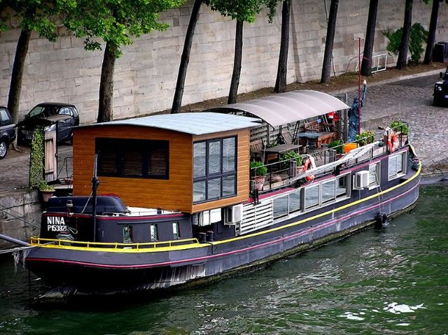{ width="200" }
- Type: Place
- Subjects: Geography, Environment

#### Connection (RelatedTo) - Łódź dla ludzi
Łódź przewożąca ludzi.

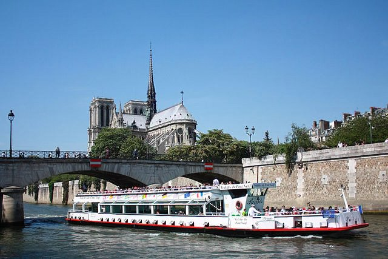{ width="200" }
- Type: Place
- Subjects: Geography, Environment

#### Connection (RelatedTo) - Statek na Sekwanie
Wyjątkowa łódź, która pływa po Sekwanie w Paryżu. Z wody widać Wieżę Eiffla i inne piękne budynki!

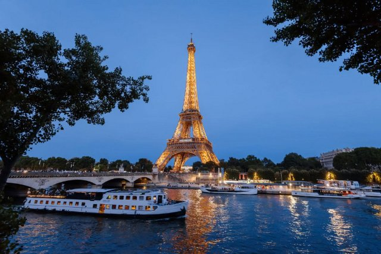{ width="200" }
- Rationale: Boat tours help kids see Paris from a different perspective and understand river transportation
- Type: Concept
- Subjects: Transportation, Geography, Culture
- Year: 1900

#### Connection (LocatedIn) - Ile-de-France
Region we Francji, w którym znajduje się stolica, Paryż. Mieszka tu wielu ludzi!

{ width="200" }
- Type: Place
- Subjects: Geography, Environment

## Words
## Activities
- [CleanCanvas](../../activities/index.md#CleanCanvas)
- [CleanCanvas](../../activities/index.md#CleanCanvas)
- [JigsawPuzzle](../../activities/index.md#JigsawPuzzle)
- [JigsawPuzzle](../../activities/index.md#JigsawPuzzle)
- [Match](../../activities/index.md#Match)
- [Memory](../../activities/index.md#Memory)
- [Memory](../../activities/index.md#Memory)

## Tasks
- [Collect] collect_cards
- [Collect] find_photos
- [Interact] go_back
## Credits
- Anne (France) (content)
- Lucie Paillat (France) (content, design)
- [Stefano Cecere](https://stefanocecere.com) (Italy) (content, design, development)
