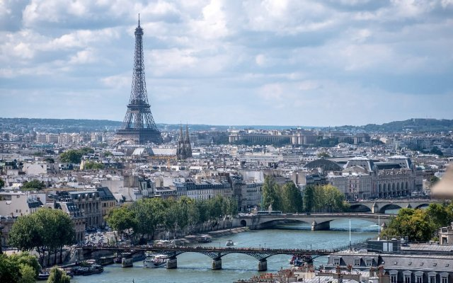
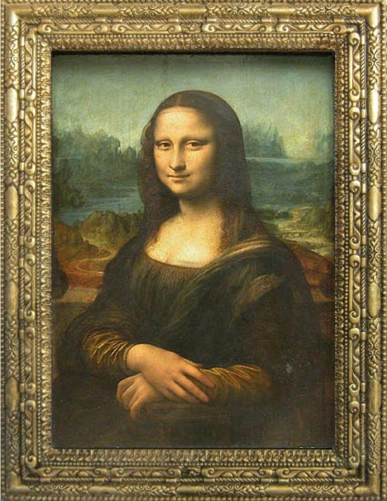
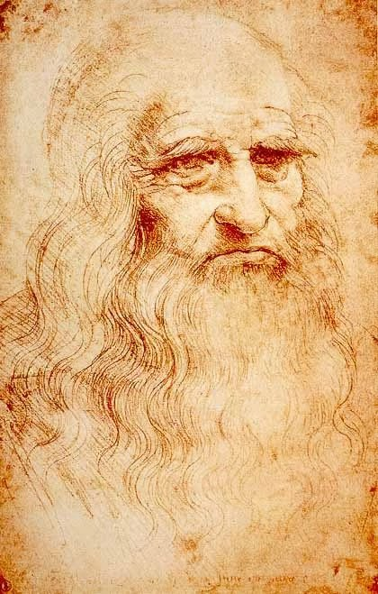
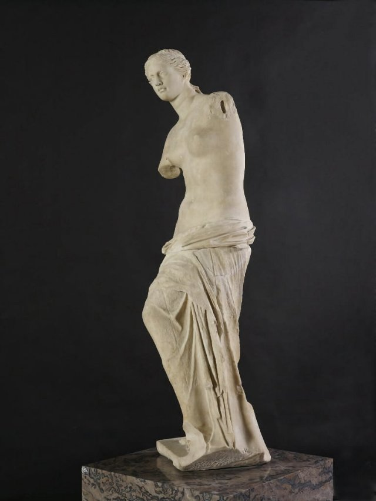

# Louvre Museum (fr_12_louvre_quest_data)
> [!note] Educators & Designers: help improving this quest!
> **Comments and feedback**: [discuss in the Forum](https://antura.discourse.group/t/fr-00-the-neighbors-of-france/22)  
> **Improve script translations**: [comment the Google Sheet](https://docs.google.com/spreadsheets/d/1FPFOy8CHor5ArSg57xMuPAG7WM27-ecDOiU-OmtHgjw/edit?gid=1044148815#gid=1044148815)  
> **Improve Cards translations**: [comment the Google Sheet](https://docs.google.com/spreadsheets/d/1M3uOeqkbE4uyDs5us5vO-nAFT8Aq0LGBxjjT_CSScWw/edit?gid=415931977#gid=415931977)  
> **Improve the script**: [propose an edit here](https://github.com/vgwb/Antura/blob/main/Assets/_discover/_quests/FR_12%20Louvre/FR_12%20Louvre%20-%20Yarn%20Script.yarn)  

- Version: 1.00
- Status: Development
- Location: France

- Difficulty: Normal
- Duration (min): 15
- Description: Discover the most famous museum in the world and Leonardo Da Vinci!

## Design Notes

**Musée du Louvre and Mona Lisa**
Mission: A stealth mission in the Louvre at night to go to Mona Lisa
Character: TEACHER

## Topics
### Louvre {#louvre}
[Open topic page](../../topics/index.md#louvre)  

- Importance: Critical  
- Country: France  
- Target age: Ages6to10  
- Subjects: Art

#### Core Card - Louvre
Ogromne muzeum pełne sztuki. To tu mieszka Mona Lisa.

{ width="200" }
- Type: Place
- Subjects: Art, Culture, History
- Year: 1793

#### Connection (LocatedIn) - Paryż
Stolica Francji. Paryż ma słynną wysoką wieżę zwaną Wieżą Eiffla!

{ width="200" }
- Type: Place
- Subjects: Geography, Culture

#### Connection (PartOf): part of the museum collection - Mona Lisa
Najsłynniejszy obraz świata! Kobieta o tajemniczym uśmiechu namalowana przez Leonarda da Vinci. Wydaje się, że śledzi cię wzrokiem.

{ width="200" }
- Rationale: Kids are fascinated by this mysterious painting and it introduces Renaissance art
- Type: Object
- Subjects: Art, History, Culture
- Year: 1503
- Words: woman

#### Connection (RelatedTo): associated artist - Leonardo da Vinci
Niesamowity artysta i naukowiec z Włoch. Namalował Monę Lisę i wynalazł maszyny latające setki lat przed samolotami!

{ width="200" }
- Type: Person
- Subjects: Art, Science, History
- Year: 1452

#### Connection (PartOf): part of the museum collection - Wolność wiodąca lud na barykady
Słynny obraz o wolności i odwadze. Przedstawia odważną kobietę trzymającą flagę Francji i prowadzącą ludzi do walki o swoje prawa.

{ width="200" }
- Rationale: This painting teaches kids about fighting for freedom and the French Revolution
- Type: Object
- Subjects: Art, History, Culture
- Year: 1830

#### Connection (PartOf): part of the museum collection - Wenus z Milo
Piękna, starożytna statua kobiety wykonana z białego marmuru. Brakuje jej ramion, ale i tak jest uważana za jedną z najpiękniejszych rzeźb, jakie kiedykolwiek powstały.

{ width="200" }
- Rationale: This statue teaches kids about ancient Greek art and how old things can still be beautiful
- Type: Concept
- Subjects: Art, History, Culture
- Year: 130

## Quest Script

(Script not public)

## Words
## Activities
- (none)

## Tasks
- (none)
## Credits
- Anne (France) (content)
- Lucie Paillat (France) (content)
- [Stefano Cecere](https://stefanocecere.com) (Italy) (content, design, development)
- Vieri Toti (Italy) (content, design)
