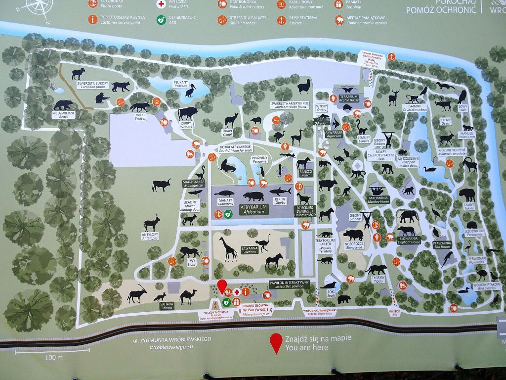

# Zoo (pl_04)
> [!note] Educators & Designers: help improving this quest!
> **Comments and feedback**: [discuss in the Forum](https://antura.discourse.group/t/pl-04-the-zoo/35/1)  
> **Improve script translations**: [comment the Google Sheet](https://docs.google.com/spreadsheets/d/1FPFOy8CHor5ArSg57xMuPAG7WM27-ecDOiU-OmtHgjw/edit?gid=819047762#gid=819047762)  
> **Improve Cards translations**: [comment the Google Sheet](https://docs.google.com/spreadsheets/d/1M3uOeqkbE4uyDs5us5vO-nAFT8Aq0LGBxjjT_CSScWw/edit?gid=415931977#gid=415931977)  
> **Improve the script**: [propose an edit here](https://github.com/vgwb/Antura/blob/main/Assets/_discover/_quests/PL_04%20Zoo/PL_04%20Zoo%20-%20Yarn%20Script.yarn)  

- Version: 1.00
- Status: Production
- Location: Poland - Wroclaw

- Difficulty: Normal
- Duration (min): 20
- Kind:
  - Journey
- Description: Odkryj słynne wrocławskie ZOO

## Design Notes

**Core Subject:** Animals, Logic, and Local Landmarks.

**Player Objectives:**

1. **Detective Work:** The Zoo Director tasks the player with finding the missing **Wrocław Flag**, which disappeared from the famous **Iglica** sculpture.
2. **Suspect Interviews:** The player must visit five animal suspects (Monkey, Lion, Giraffe, Elephant, Penguin) to investigate.
3. **Mini-Games:** To clear each animal's name, the player completes a specific mini-game (e.g., matching fruit for the Monkey, ordering the Lion's growth stages).
4. **Deduction:** After proving all animals are innocent (e.g., the Penguin can't fly, the Giraffe isn't tall enough), the mystery narrows down.
5. **Resolution:** The true culprit is revealed to be **Antura** , who was playing with the flag. The player returns the flag to the Iglica.

**Educational Content:**

- **Local Landmarks:** Features the **Centennial Hall** (UNESCO site) and the **Iglica** (Needle) sculpture.
- **Animal Facts:** Teaches key traits: Giraffes are tall, Elephants have memory, Lions live in prides, Penguins swim but don't fly.
- **Vocabulary:** Focuses on animal names and related terms (_Chimpanzee, Mane, Neck, Ice, Swim_).

**Mission**

The player must act as a detective to find the missing flag of Wrocław. The core gameplay involves visiting five different animal enclosures at the ZOO. To clear each animal as a suspect, the player must complete a unique, themed mini-game. After eliminating all animal suspects, the true culprit is revealed, and the player must retrieve the flag and return it to its rightful place.

**Character**

The ZOO Director: The character who gives the mission and provides information.
The Animals: An Elephant, a Giraffe, a Lion, a Monkey, and a Penguin, each with their own personality and mini-game.

### Knowledge content

**Famous Landmarks:**

- To recognize the Centennial Hall (a UNESCO World Heritage site),
- the Iglica sculpture
- the Wrocław ZOO

**Animal Vocabulary & Facts:**

To learn the names of five animals and a fun fact about each, such as:

- Elephants have excellent memories, Pachyderm = thick Skin, Largest land animal
- Giraffes are the world's tallest mammals.
- Lions are close relatives of cats that live in groups called prides.
- Monkeys are excellent climbers.
- Penguins are birds that do not fly, but they are expert swimmers.

## Topics
### Zoo Animals {#zoo}
[Open topic page](../../topics/index.md#zoo)  

- Importance: Medium  
- Country: International  
- Target age: Ages6to10  
- Subjects: Animal

#### Core Card - Zwierzęta z zoo
Automatycznie utworzona karta na temat „Zwierzęta w zoo”.

{ width="200" }
- Type: None

#### Connection (RelatedTo): Auto from remaining cards - Żyrafa
Bardzo wysokie zwierzę z długą szyją. Żyrafy są wyższe niż drzewa! Zjadają liście, do których inne zwierzęta nie mogą dosięgnąć.

{ width="200" }
- Rationale: Giraffes are fascinating animals that show kids how nature adapts to find food
- Type: Object
- Subjects: Animal, Environment

#### Connection (RelatedTo) - Lew
Duży kot zwany królem zwierząt. Żyje w grupach zwanych stadami.

{ width="200" }
- Type: Object
- Subjects: Animal, Environment

#### Connection (RelatedTo) - Małpa
Inteligentne zwierzę, które potrafi się wspinać i bawić. Niektóre małpy żyją w dużych rodzinach.

{ width="200" }
- Type: Object
- Subjects: Animal, Environment

#### Connection (RelatedTo) - Pingwin
Ptak, który nie lata, ale świetnie pływa. Żyje w zimnych miejscach.

{ width="200" }
- Type: Object
- Subjects: Animal, Environment

#### Connection (RelatedTo): Previous core card - Słoń
Ogromne zwierzę z trąbą. Słonie to największe zwierzęta chodzące po lądzie. Mają duże uszy i uwielbiają pryskać wodą!

{ width="200" }
- Rationale: Elephants are amazing animals that kids love learning about at the zoo!
- Type: Object
- Subjects: Animal, Environment
- Words: elephant, zoo

### wroclaw zoo {#wroclaw_zoo}
[Open topic page](../../topics/index.md#wroclaw_zoo)  

- Importance: Medium  
- Country: Poland  
- Target age: Ages6to10

#### Core Card - Ogród Zoologiczny we Wrocławiu
Duży ogród zoologiczny we Wrocławiu, w którym można poznać wiele zwierząt.

{ width="200" }
- Type: Place
- Subjects: Geography, Education, Animal

#### Connection (RelatedTo) - Opiekun zwierząt w zoo
Osoba opiekująca się zwierzętami w zoo.

{ width="200" }
- Type: Person
- Subjects: Community, Animal, Education

#### Connection (RelatedTo) - Wybieg dla zwierząt
Bezpieczna przestrzeń w zoo, w której mogą żyć zwierzęta.

{ width="200" }
- Type: Place
- Subjects: Animal, Safety

#### Connection (RelatedTo) - Dyrektor zoo
Osoba zarządzająca zoo i pomagająca zwiedzającym.

{ width="200" }
- Type: Person
- Subjects: Community, Education

## Additional Cards
#### Młode
Mały lew.

{ width="200" }
- Type: Concept
- Subjects: Animal, Science

#### Iglica
Wysoka metalowa konstrukcja obok Hali Stulecia.

{ width="200" }
- Type: Place
- Subjects: History, Culture

#### Papuga
Kolorowy ptak, który potrafi naśladować dźwięki.

{ width="200" }
- Type: Object
- Subjects: Animal, Science

#### Paw
Kolorowy ptak z dużym ogonem z piór.

{ width="200" }
- Type: Object
- Subjects: Animal, Science, Art

#### Znak
Tablica z prostymi faktami, które pomogą Ci się uczyć.

{ width="200" }
- Type: Object
- Subjects: Education, Community

#### Wrocław
Miasto w Polsce z rzekami, mostami i pięknymi zabytkami.

{ width="200" }
- Type: Place
- Subjects: Geography, History, Culture

#### Flaga Wrocławia
Flaga miasta, którą należy znaleźć i zwrócić.

{ width="200" }
- Type: Object
- Subjects: Culture, Community, History

#### Szympans
Sprytny i wesoły, uwielbia wspinać się na drzewa. Używa patyków i kamieni jak małych narzędzi!

{ width="200" }
- Type: None

#### Lwiątko
Mały lew o miękkim futrze i dużych łapach. Spędza czas, bawiąc się i cicho rycząc.

{ width="200" }
- Type: Object

#### Młody samiec lwa
Rośnie w siłę, ma krótką grzywę. Uczy się polować i chronić swoją dumę.

{ width="200" }
- Type: Object

#### Jabłko
Czerwone, okrągłe i chrupiące w smaku. To smaczny owoc, który doda ci sił!

{ width="200" }
- Type: Object

#### Banan
Miękki, żółty i łatwy do obrania. Pełen energii na cały dzień!

{ width="200" }
- Type: Object

#### Lód arktyczny
Zimny, biały i lśniący jak szkło. Dom fok i niedźwiedzi polarnych.

{ width="200" }
- Type: Place

#### Jabłoń
Drzewo o różowych kwiatach i czerwonych, smacznych owocach. Uwielbia słońce i daje nam chrupiące jabłka!

{ width="200" }
- Type: Object

#### Bananowiec
Wysoka roślina o olbrzymich liściach i żółtych bananach. Jej owoce rosną w zwisających gronach!

{ width="200" }
- Type: Object

#### Pomarańczowa roślina
Lśniące, zielone drzewo z okrągłymi, soczystymi pomarańczami. Pachnie świeżo i słodko jak słońce!

{ width="200" }
- Type: Object

#### Akacja
Roślina pokryta drobnymi złotymi kwiatami. Rozświetla wszystko swoim żółtym blaskiem!

{ width="200" }
- Type: Object

## Quest Script

[See the full script here](./pl_04-script.md)

## Words
## Activities
- [Memory](../../activities/index.md#Memory)
- [CleanCanvas](../../activities/index.md#CleanCanvas)
- [Order](../../activities/index.md#Order)
- [Match](../../activities/index.md#Match)
- [JigsawPuzzle](../../activities/index.md#JigsawPuzzle)
- [JigsawPuzzle](../../activities/index.md#JigsawPuzzle)
- [Memory](../../activities/index.md#Memory)
- [CleanCanvas](../../activities/index.md#CleanCanvas)
- [Order](../../activities/index.md#Order)
- [JigsawPuzzle](../../activities/index.md#JigsawPuzzle)
- [Match](../../activities/index.md#Match)

## Tasks
- [Collect] TASK_ANIMALS
- [Interact] back_to_director
## Credits
- [Jan Stasienko](mailto:jan.stasienko@dsw.edu.pl) (Poland) (content)
- Lorenzo Castrovilli (Italy) (design)
- [Stefano Cecere](https://stefanocecere.com) (Italy) (development)
- Valeria Passarella (Italy) (design)
- Vieri Toti (Italy) (design)
