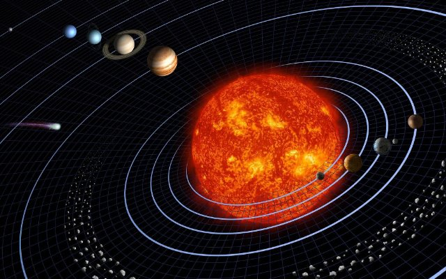

# Kopernik i układ słoneczny (pl_07)
> [!note] Educators & Designers: help improving this quest!
> **Comments and feedback**: [discuss in the Forum](https://antura.discourse.group/t/pl-07-copernicus-and-the-solar-system/38/1)  
> **Improve script translations**: [comment the Google Sheet](https://docs.google.com/spreadsheets/d/1FPFOy8CHor5ArSg57xMuPAG7WM27-ecDOiU-OmtHgjw/edit?gid=783699917#gid=783699917)  
> **Improve Cards translations**: [comment the Google Sheet](https://docs.google.com/spreadsheets/d/1M3uOeqkbE4uyDs5us5vO-nAFT8Aq0LGBxjjT_CSScWw/edit?gid=415931977#gid=415931977)  
> **Improve the script**: [propose an edit here](https://github.com/vgwb/Antura/blob/main/Assets/_discover/_quests/PL_07%20Solar%20System/PL_07%20Solar%20System%20-%20Yarn%20Script.yarn)  

- Version: 1.00
- Status: Development
- Location: Poland - Toruń

- Difficulty: Normal
- Duration (min): 10
- Description: Dowiedz się, kim był Mikołaj Kopernik i poznaj 8 planet Układu Słonecznego

## Design Notes
## Game Design Notes
**Mission**  
discover who Nicolaus Copernicus was and how he revolutionised science.
And did you know he was from poland?

### Knowledge
Nicolaus Copernicus and the life of a scientist in the renaissance  

- How does the telescope work?
- The 8 planets of the solar system and their names and order

### Flow
You arrive in Toruń, meeting the guide who welcomes you. He says that apparently Antura got stuck in Nicolaus Copernicus’ house and we need to help him. To do that, you first talk with Nicolaus Kopernik outside of his house – he introduces himself and says that he will help you if you help him first. He says that there is a map of a solar system that needs fixing.  
He asks you to put the planets in the correct order (ACTIVITY ORDER).  
When you do, he explains how people used to think that Earth was in the center of it and how he created the model of the Solar System that has the Sun in the center. You go with him inside of the house looking for Antura. You follow his trail and pass a telescope.  
Copernicus explains what that is and mentions what a planetarium is as well. Eventually you find Antura and take him out of there. Copernicus says he’s glad everything is okay and tells you about himself, who he is, what he’s known for.

## Topics
### Solar System {#solar_system}
[Open topic page](../../topics/index.md#solar_system)  

- Importance: High  
- Country: International  
- Target age: Ages6to10  
- Subjects: Science

#### Core Card - Układ Słoneczny
Słońce i osiem planet krążących wokół niego.

{ width="200" }
- Type: Concept
- Subjects: Space, Science

#### Connection (RelatedTo) - Merkury
Najbliższa Słońcu planeta, mała i bardzo szybka.

{ width="200" }
- Type: Object
- Subjects: Space, Science

#### Connection (RelatedTo) - Mars
Czerwona planeta z pyłem i dużymi wulkanami.

{ width="200" }
- Type: Object
- Subjects: Space, Science

#### Connection (RelatedTo) - Jowisz
Największa planeta, słynąca z Wielkiej Czerwonej Plamy.

{ width="200" }
- Type: Object
- Subjects: Space, Science

#### Connection (RelatedTo) - Neptun
Bóg morza ze starych opowieści.

{ width="200" }
- Type: Concept
- Subjects: Culture, History

#### Connection (RelatedTo) - Wenus
Bardzo gorąca planeta pokryta grubymi chmurami.

{ width="200" }
- Type: Object
- Subjects: Space, Science

#### Connection (RelatedTo) - Model heliocentryczny
Pogląd, że Słońce znajduje się w centrum, a planety krążą wokół niego.

{ width="200" }
- Type: Concept
- Subjects: Science, Space, History

#### Connection (RelatedTo) - Astronomia
Nauka zajmująca się badaniem Słońca, Księżyca, gwiazd i planet.

{ width="200" }
- Type: Concept
- Subjects: Science, Space

#### Connection (RelatedTo) - Saturn
Olbrzymia planeta z jasnymi pierścieniami i wieloma księżycami.

{ width="200" }
- Type: Object
- Subjects: Space, Science

#### Connection (RelatedTo) - Planetarium
Budynek, w którym można oglądać niebo i gwiazdy.

{ width="200" }
- Type: Place
- Subjects: Education, Science, Space

#### Connection (RelatedTo) - Ziemia
Nasza planeta, z domem powietrzem i wodą.

{ width="200" }
- Type: Object
- Subjects: Space, Science, Geography, Environment

#### Connection (RelatedTo) - Uran
Niebiesko-zielona planeta, toczy się na boku.

{ width="200" }
- Type: Object
- Subjects: Space, Science

### Telescope {#telescope}
[Open topic page](../../topics/index.md#telescope)  

- Importance: Medium  
- Country: International  
- Target age: Ages6to10  
- Subjects: Science

#### Core Card - Teleskop
Narzędzie pozwalające nam zobaczyć odległe obiekty na niebie.

{ width="200" }
- Type: Object
- Subjects: Science, Technology, Space

#### Connection (RelatedTo) - Mikołaj Kopernik
Genialny naukowiec z Polski, który odkrył, że to Ziemia krąży wokół Słońca, a nie odwrotnie! To zmieniło nasze rozumienie kosmosu.

{ width="200" }
- Rationale: Copernicus teaches kids about scientific discovery and Polish contributions to astronomy
- Type: Person
- Subjects: Science, History, Space
- Year: 1473

#### Connection (RelatedTo) - Okular
Mała soczewka, przez którą patrzysz w teleskopie.

{ width="200" }
- Type: Object
- Subjects: Science, Technology

#### Connection (RelatedTo) - Obiektyw
Przezroczysta szyba lub plastik, która załamuje światło.

{ width="200" }
- Type: Object
- Subjects: Science, Technology

#### Connection (RelatedTo) - Planetarium
Budynek, w którym można oglądać niebo i gwiazdy.

{ width="200" }
- Type: Place
- Subjects: Education, Science, Space

## Additional Cards
#### Dom Mikołaja Kopernika
Obecnie mieści się tam muzeum, w którym można poznać historię jego życia i osiągnięć naukowych.

{ width="200" }
- Type: Place
- Subjects: Culture, Science

#### Toruń
Miasto w Polsce, w którym urodził się Mikołaj Kopernik.

{ width="200" }
- Type: Place
- Subjects: Geography, History, Culture

## Quest Script

[See the full script here](./pl_07-script.md)

## Words
## Activities
- (none)

## Tasks
- (none)
## Credits
- [Jan Stasienko](mailto:jan.stasienko@dsw.edu.pl) (Poland) (content)
- [Stefano Cecere](https://stefanocecere.com) (Italy) (development)
