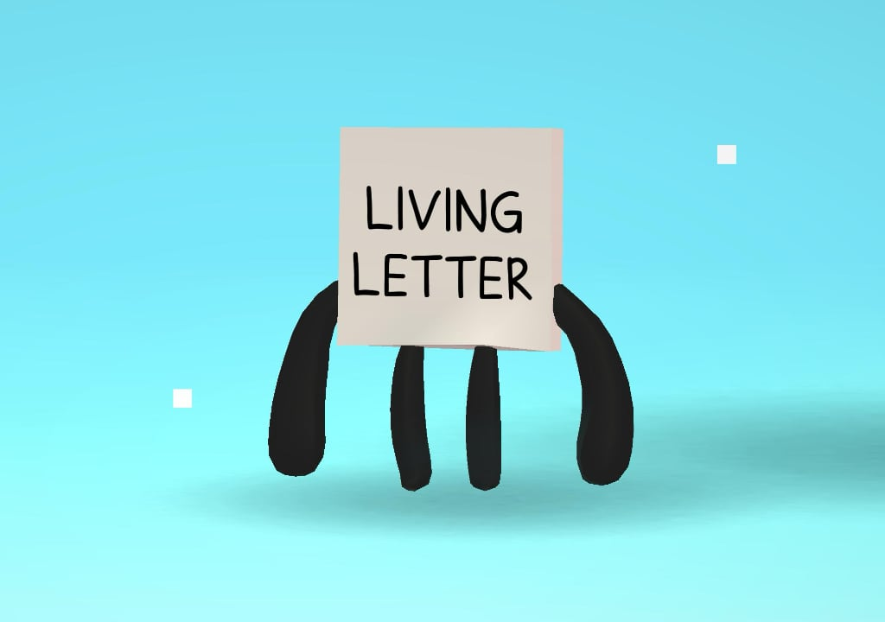

# Samouczek (tutorial)
> [!note] Educators & Designers: help improving this quest!
> **Comments and feedback**: [discuss in the Forum](https://antura.discourse.group/t/quest-tutorial/41)  
> **Improve script translations**: [comment the Google Sheet](https://docs.google.com/spreadsheets/d/1FPFOy8CHor5ArSg57xMuPAG7WM27-ecDOiU-OmtHgjw/edit?gid=631129787#gid=631129787)  
> **Improve Cards translations**: [comment the Google Sheet](https://docs.google.com/spreadsheets/d/1M3uOeqkbE4uyDs5us5vO-nAFT8Aq0LGBxjjT_CSScWw/edit?gid=415931977#gid=415931977)  
> **Improve the script**: [propose an edit here](https://github.com/vgwb/Antura/blob/main/Assets/_discover/_quests/_TUTORIAL/Tutorial%20-%20Yarn%20Script.yarn)  

- Version: 1.00
- Status: Production
- Location: International

- Difficulty: Tutorial
- Duration (min): 10
- Description: Nauczmy się grać w Antura Discover!

## Topics
### Antura's world {#antura-world}
[Open topic page](../../topics/index.md#antura-world)  

- Importance: Medium  
- Country: International  
- Target age: Ages6to10

#### Core Card - Antura
Główny bohater tej gry wideo

{ width="200" }
- Type: Concept

#### Connection (RelatedTo) - Ciastka
Słodkie nagrody, które możesz zbierać podczas gry! Wykorzystaj je, aby zdobyć nowe przedmioty i niespodzianki.

{ width="200" }
- Type: Object

#### Connection (RelatedTo) - Portal
Magiczne drzwi, które zaprowadzą Cię do nowych miejsc. Wejdź i zobacz, dokąd prowadzą!

{ width="200" }
- Type: Object

#### Connection (RelatedTo) - Karty
Każda karta skrywa coś wyjątkowego. Znajdź je wszystkie i przeczytaj!

{ width="200" }
- Type: Concept

#### Connection (RelatedTo) - Kot
Najlepszy przyjaciel i towarzysz podróży Antury. Ciekawy, sprytny i zawsze gotowy do pomocy!

{ width="200" }
- Type: Concept

#### Connection (RelatedTo) - Żywy List
Przyjazny list, który uwielbia rozmawiać i się bawić! Rozmawiaj z nim, aby nauczyć się nowych słów.

{ width="200" }
- Type: Concept

#### Connection (RelatedTo) - Blokowy
Ci zabawni ludzie żyją na tym świecie. Porozmawiaj z nimi wszystkimi... mają historie do opowiedzenia!

{ width="200" }
- Type: Concept

#### Connection (RelatedTo) - Portal
Magiczne drzwi, które zaprowadzą Cię do nowych miejsc. Wejdź i zobacz, dokąd prowadzą!

{ width="200" }
- Type: Object

#### Connection (RelatedTo) - Niebezpieczeństwo
Czegoś takiego nie powinieneś robić! Zachowaj ostrożność i bądź bezpieczny.

{ width="200" }
- Type: Concept

## Quest Script

[See the full script here](./tutorial-script.md)

## Words
## Activities
- [CleanCanvas](../../activities/index.md#CleanCanvas)
- [JigsawPuzzle](../../activities/index.md#JigsawPuzzle)
- [Match](../../activities/index.md#Match)
- [Memory](../../activities/index.md#Memory)
- [MoneyCount](../../activities/index.md#MoneyCount)
- [Order](../../activities/index.md#Order)

## Tasks
- [Collect] talk_everybody
- [Interact] open_chest
## Credits
- Fabio Cecere (Italy) (design, development)
- [Stefano Cecere](https://stefanocecere.com) (Italy) (design, development)
