# Topics

Total found: **35**

> [!note] NOTE: connections type can be:
> **Created By** (agent (person/org) who made/discovered/commissioned)  
> **Located In**       (where it is/was)  
> **Is A**             (type/category relation (Baguette is a Bread))  
> **Part Of**         (whole/part relation (Crust is part of Baguette))  
> **Made Of**          (physical composition)  
> **Time Context**     (period/event/date)  
> **Cultural Context** (origin/tradition/symbolism)  
> **Causal**           (clear cause→effect)  
> **Purpose**          (used for…)  
> **Compare**          (compare/Kind similar/contrast/analogy)  
> **Related To**     (whatever else, last choice...)  

## International

### Antura's world {#antura-world}
- Importance: Medium  
- Target Age: Ages6to10
- Core card:
    - **[Antura](../cards/index.md#antura)**
    Główny bohater tej gry wideo

    { width="200" }

- Connected cards:
    - **[Ciastka](../cards/index.md#antura_cookies)** (RelatedTo)
    Słodkie nagrody, które możesz zbierać podczas gry! Wykorzystaj je, aby zdobyć nowe przedmioty i niespodzianki.

    { width="200" }

    - **[Portal](../cards/index.md#antura_portal)** (RelatedTo)
    Magiczne drzwi, które zaprowadzą Cię do nowych miejsc. Wejdź i zobacz, dokąd prowadzą!

    { width="200" }

    - **[Karty](../cards/index.md#antura_cards)** (RelatedTo)
    Każda karta skrywa coś wyjątkowego. Znajdź je wszystkie i przeczytaj!

    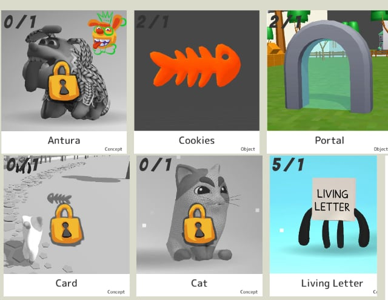{ width="200" }

    - **[Kot](../cards/index.md#antura_cat)** (RelatedTo)
    Najlepszy przyjaciel i towarzysz podróży Antury. Ciekawy, sprytny i zawsze gotowy do pomocy!

    { width="200" }

    - **[Żywy List](../cards/index.md#antura_livingletter)** (RelatedTo)
    Przyjazny list, który uwielbia rozmawiać i się bawić! Rozmawiaj z nim, aby nauczyć się nowych słów.

    { width="200" }

    - **[Blokowy](../cards/index.md#antura_blocky_character)** (RelatedTo)
    Ci zabawni ludzie żyją na tym świecie. Porozmawiaj z nimi wszystkimi... mają historie do opowiedzenia!

    { width="200" }

    - **[Portal](../cards/index.md#antura_portal)** (RelatedTo)
    Magiczne drzwi, które zaprowadzą Cię do nowych miejsc. Wejdź i zobacz, dokąd prowadzą!

    { width="200" }

    - **[Niebezpieczeństwo](../cards/index.md#antura_malus)** (RelatedTo)
    Czegoś takiego nie powinieneś robić! Zachowaj ostrożność i bądź bezpieczny.

    { width="200" }

- Quests: [Samouczek (tutorial)](../quests/quest/tutorial.md)

---

### Elementary Math {#elementary-maths}
- Description: Numbers and shapes for everyday life: counting, adding and subtracting, simple fractions, measuring, telling time, and using money.  
- Importance: Medium  
- Subjects: Math  
- Target Age: Ages6to10
- Core card:
    - **[Matematyka podstawowa](../cards/index.md#elementary_maths)**
    Liczby i kształty do codziennego użytku: liczenie, dodawanie i odejmowanie, proste ułamki, mierzenie, określanie czasu i korzystanie z pieniędzy.

- Connected cards:
    - **[Linia](../cards/index.md#fr_figure_line)** (PartOf)
    Linia prosta, która prowadzi z jednego punktu do drugiego. Linie mogą być długie lub krótkie.

    { width="200" }

    - **[Trójkąt](../cards/index.md#fr_figure_triangle)** (PartOf)
    Kształt z trzema prostymi bokami i trzema narożnikami. Trójkąty wyglądają jak kawałki pizzy!

    { width="200" }

    - **[Kompas](../cards/index.md#math_compass)** (Purpose)
    Narzędzie, które pomaga rysować idealne okręgi. Ma dwie nogi jak nożyczki.

    { width="200" }

    - **[Linijka](../cards/index.md#math_ruler)** (Purpose)
    Proste narzędzie do pomiaru długości przedmiotów. Linijki mają cyfry i linie.

    { width="200" }

    - **[Kwadrat](../cards/index.md#math_setsquare)** (Purpose)
    Narzędzie w kształcie trójkąta, służące do rysowania linii prostych i kątów prostych w matematyce.

    { width="200" }

    - **[Koło](../cards/index.md#fr_figure_circle)** (PartOf)
    Okrągły kształt bez rogów. Koła wyglądają jak koła, piłki i monety!

    { width="200" }

- Quests: [System edukacji (fr_02)](../quests/quest/fr_02.md)

Credits:
  - Valeria Passarella (Italy)
  - [Stefano Cecere](https://stefanocecere.com) (Italy)

---

### Fisherman {#fisherman}
- Importance: Medium  
- Target Age: Ages6to10
- Core card:
    - **[Rybak](../cards/index.md#fisherman)**
    Osoba łowiąca ryby w morzu.

    { width="200" }

- Connected cards:
    - **[Port](../cards/index.md#port)** (LocatedIn)
    Miejsce, w którym statki załadowują się i rozładowują.

    { width="200" }

    - **[Fale](../cards/index.md#waves)** (RelatedTo)
    Ruch wody na morzu.

    { width="200" }

    - **[Nawigacja](../cards/index.md#navigation)** (RelatedTo)
    Znalezienie drogi na morzu za pomocą świateł, map i narzędzi.

    { width="200" }

    - **[Sieć rybacka](../cards/index.md#fishing_net)** (Purpose)
    Sieć służąca do połowu ryb.

    { width="200" }

    - **[Statek](../cards/index.md#ship)** (RelatedTo)
    Duża łódź przewożąca ludzi lub towary.

    { width="200" }

---

### Flags of Europe {#flags_euroe}
- Importance: Medium  
- Target Age: Ages6to10
- Core card:
    - **[Mapa Europy](../cards/index.md#concept_europe_map)**
    Mapa przedstawiająca wszystkie kraje Europy. Możesz zobaczyć, gdzie znajdują się Francja, Polska, Niemcy i inne kraje.

    { width="200" }

- Connected cards:
    - **[Flaga Niemiec](../cards/index.md#flag_germany)** (CulturalContext)
    Flaga Niemiec ma trzy poziome pasy: czarny, czerwony i żółty. Niemcy słyną z samochodów, zamków i bajek!

    { width="200" }

    - **[Flaga Włoch](../cards/index.md#flag_italy)** (CulturalContext)
    Flaga Włoch ma trzy pionowe pasy: zielony, biały i czerwony. Kolory te przypominają bazylię, mozzarellę i pomidory na pizzy!

    { width="200" }

    - **[Flaga Luksemburga](../cards/index.md#flag_luxembourg)** (CulturalContext)
    Flaga Luksemburga ma poziome pasy w kolorze czerwonym, białym i jasnoniebieskim. Luksemburg to bardzo mały kraj, w którym mówi się trzema językami!

    { width="200" }

    - **[Flaga Monako](../cards/index.md#flag_monaco)** (CulturalContext)
    Flaga Monako ma poziome, czerwone i białe pasy. Monako jest malutkie, ale słynie z luksusowych samochodów i królewskich pałaców nad morzem!

    { width="200" }

    - **[Flaga Belgii](../cards/index.md#flag_belgium)** (CulturalContext)
    Flaga Belgii ma trzy pionowe pasy: czarny, żółty i czerwony. Belgia słynie z czekolady i gofrów!

    { width="200" }

    - **[Flaga Hiszpanii](../cards/index.md#flag_spain)** (CulturalContext)
    Flaga Hiszpanii ma poziome, czerwone i żółte pasy. Kolory te przypominają słońce i paprykę! To Hiszpania wynalazła taniec flamenco.

    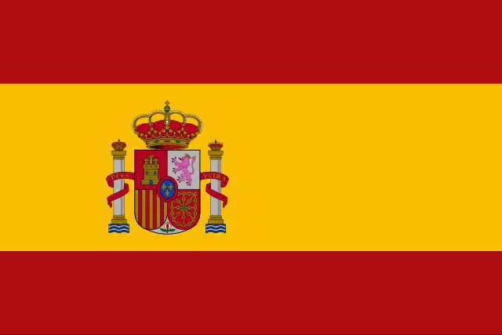{ width="200" }

    - **[Flaga Szwajcarii](../cards/index.md#flag_switzerland)** (CulturalContext)
    Flaga Szwajcarii jest czerwona z białym krzyżem pośrodku. Wygląda jak apteczka pierwszej pomocy! Szwajcaria słynie z gór i sera.

    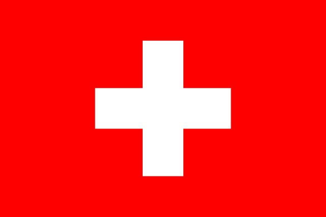{ width="200" }

    - **[Flaga Francji](../cards/index.md#flag_france)** (CulturalContext)
    Flaga Francji ma trzy pionowe pasy: niebieski, biały i czerwony. Te kolory symbolizują wolność, równość i braterstwo!

    { width="200" }

    - **[Flaga Republiki Czeskiej](../cards/index.md#flag_czech_republic)** (CulturalContext)
    Flaga ma biało-czerwone pasy z niebieskim trójkątem. Czechy słyną z pięknego Zamku Praskiego i kryształowego szkła.

    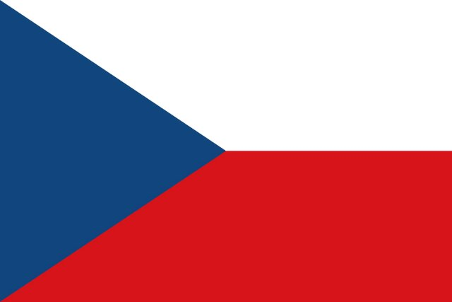{ width="200" }

    - **[Flaga Słowacji](../cards/index.md#flag_slovakia)** (CulturalContext)
    Flaga w kolorach białym, niebieskim i czerwonym. Reprezentuje Słowację.

    { width="200" }

    - **[Flaga Ukrainy](../cards/index.md#flag_ukraine)** (CulturalContext)
    Flaga w kolorach niebieskim i żółtym, przypominającym niebo i słońce. Reprezentuje Ukrainę.

    { width="200" }

- Quests: [Sąsiedzi Francji (fr_00)](../quests/quest/fr_00.md), [Sąsiedzi Polski (pl_00)](../quests/quest/pl_00.md)

---

### mountain activities {#mountain_activities}
- Importance: Medium  
- Target Age: Ages6to10
- Core card:
    - **[Góra](../cards/index.md#mountain)**
    Filary ziemi

    { width="200" }

- Connected cards:
    - **[Przewodnik górski](../cards/index.md#mountain_guide)** (RelatedTo)
    Osoba, która pomaga ludziom bezpiecznie się wspinać.

    { width="200" }

    - **[Turystyka piesza](../cards/index.md#hiking)** (RelatedTo)
    Wędrówki po szlakach na łonie natury.

    { width="200" }

    - **[Wspinaczka](../cards/index.md#climbing)** (RelatedTo)
    Wspinaczka po skałach lub lodzie przy użyciu specjalnego sprzętu.

    { width="200" }

    - **[Narciarstwo](../cards/index.md#skiing)** (RelatedTo)
    Zjeżdżanie na nartach po śniegu.

    { width="200" }

- Quests: [Mont Blanc i góry (fr_08)](../quests/quest/fr_08.md)

---

### mountain tools {#mountain_tools}
- Description: what we need to stay ssafe in the mountain  
- Importance: Medium  
- Target Age: Ages6to10
- Core card:
    - **[Góra](../cards/index.md#mountain)**
    Filary ziemi

    { width="200" }

- Connected cards:
    - **[Rękawice](../cards/index.md#gloves)** (RelatedTo)
    Ciepłe okrycia na dłonie.

    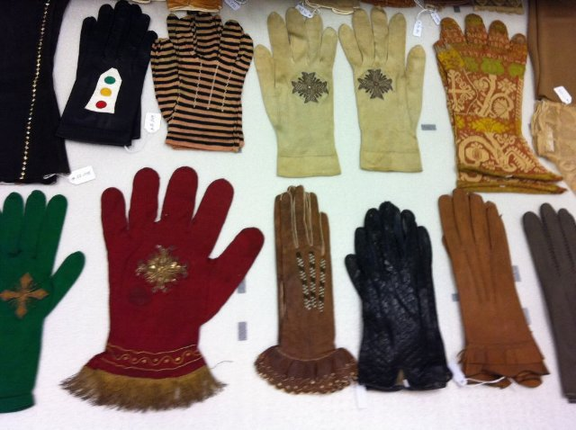{ width="200" }

    - **[Kapelusz](../cards/index.md#hat)** (RelatedTo)
    Ciepła czapka na głowę.

    { width="200" }

    - **[Plecak](../cards/index.md#backpack)** (RelatedTo)
    Torba, którą nosisz na plecach.

    { width="200" }

    - **[Lina](../cards/index.md#rope)** (RelatedTo)
    Mocna lina używana do zapewnienia bezpieczeństwa podczas wspinaczki.

    { width="200" }

    - **[Raki](../cards/index.md#crampons)** (RelatedTo)
    Kolczaste metalowe uchwyty przymocowane do butów, aby móc jeździć po lodzie.

    { width="200" }

    - **[Szalik](../cards/index.md#scarf)** (RelatedTo)
    Ciepły materiał noszony wokół szyi.

    { width="200" }

    - **[Okulary przeciwsłoneczne](../cards/index.md#sunglasses)** (RelatedTo)
    Okulary chroniące oczy przed jasnym światłem.

    { width="200" }

- Quests: [Mont Blanc i góry (fr_08)](../quests/quest/fr_08.md)

---

### Musical Notes {#musical_notes}
- Importance: Medium  
- Target Age: Ages6to10
- Core card:
    - **[Muzyka](../cards/index.md#musical_score)**
    Zapis nutowy i słowa piosenki.

    { width="200" }

- Connected cards:
    - **[Fortepian](../cards/index.md#piano)** (RelatedTo)
    Instrument klawiszowy służący do grania melodii i akordów.

    { width="200" }

    - **[La](../cards/index.md#note_la)** (RelatedTo)
    Nuta muzyczna.

    { width="200" }

    - **[Fa](../cards/index.md#note_fa)** (RelatedTo)
    Nuta muzyczna.

    { width="200" }

    - **[Si](../cards/index.md#note_si)** (RelatedTo)
    Nuta muzyczna.

    { width="200" }

    - **[Sol](../cards/index.md#note_sol)** (RelatedTo)
    Nuta muzyczna.

    { width="200" }

    - **[Do](../cards/index.md#note_do)** (RelatedTo)
    Nuta muzyczna.

    { width="200" }

    - **[Mi](../cards/index.md#note_mi)** (RelatedTo)
    Nuta muzyczna.

    { width="200" }

    - **[Odnośnie](../cards/index.md#note_re)** (RelatedTo)
    Nuta muzyczna.

    { width="200" }

- Quests: [Marsylianka (fr_11)](../quests/quest/fr_11.md)

---

### Solar System {#solar_system}
- Importance: High  
- Subjects: Science  
- Target Age: Ages6to10
- Core card:
    - **[Układ Słoneczny](../cards/index.md#solar_system)**
    Słońce i osiem planet krążących wokół niego.

    { width="200" }

- Connected cards:
    - **[Rtęć](../cards/index.md#mercury)** (RelatedTo)
    Najbliższa Słońcu planeta, mała i bardzo szybka.

    { width="200" }

    - **[Mars](../cards/index.md#mars)** (RelatedTo)
    Czerwona planeta z pyłem i dużymi wulkanami.

    { width="200" }

    - **[Jupiter](../cards/index.md#jupiter)** (RelatedTo)
    Największa planeta, słynąca z Wielkiej Czerwonej Plamy.

    { width="200" }

    - **[Neptun](../cards/index.md#neptune)** (RelatedTo)
    Bóg morza ze starych opowieści.

    { width="200" }

    - **[Wenus](../cards/index.md#venus)** (RelatedTo)
    Bardzo gorąca planeta pokryta grubymi chmurami.

    { width="200" }

    - **[Model heliocentryczny](../cards/index.md#heliocentric_model)** (RelatedTo)
    Pogląd, że Słońce znajduje się w centrum, a planety krążą wokół niego.

    { width="200" }

    - **[Astronomia](../cards/index.md#astronomy)** (RelatedTo)
    Nauka zajmująca się badaniem Słońca, Księżyca, gwiazd i planet.

    { width="200" }

    - **[Saturn](../cards/index.md#saturn)** (RelatedTo)
    Olbrzymia planeta z jasnymi pierścieniami i wieloma księżycami.

    { width="200" }

    - **[Planetarium](../cards/index.md#planetarium)** (RelatedTo)
    Miejsce, w którym można zobaczyć niebo i gwiazdy w pomieszczeniu.

    { width="200" }

    - **[Ziemia](../cards/index.md#earth)** (RelatedTo)
    Nasza planeta rodzinna z lądem, powietrzem i wodą.

    { width="200" }

    - **[Uran](../cards/index.md#uranus)** (RelatedTo)
    Niebiesko-zielona planeta obracająca się na boku.

    { width="200" }

- Quests: [Kopernik i układ słoneczny (pl_07)](../quests/quest/pl_07.md)

---

### Stree safety {#street-safety}
- Importance: Medium  
- Target Age: Ages6to10
- Core card:
    - **[Bezpieczeństwo na ulicy](../cards/index.md#street_safety)**
    Zasady zapewniające bezpieczeństwo wszystkim uczestnikom ruchu drogowego.

- Connected cards:
    - **[Kask (bezpieczeństwo uliczne)](../cards/index.md#helmet_street_safety)** (RelatedTo)
    Twardy kask chroniący głowę podczas jazdy.

    { width="200" }

    - **[Znak STOP](../cards/index.md#stop_sign)** (RelatedTo)
    Czerwony znak oznaczający, że musisz zatrzymać pojazd.

    { width="200" }

    - **[Zebra](../cards/index.md#zebra_crossing)** (RelatedTo)
    Białe pasy tam, gdzie ludzie przechodzą przez ulicę.

    { width="200" }

    - **[Sygnalizacja świetlna](../cards/index.md#traffic_lights)** (RelatedTo)
    Latarnie uliczne informujące, kiedy należy się ZATRZYMAĆ lub JECHAĆ.

    { width="200" }

    - **[Znak NIEBEZPIECZEŃSTWO](../cards/index.md#danger_sign)** (RelatedTo)
    Znak ostrzegający przed zbliżającym się niebezpieczeństwem. Zachowaj szczególną ostrożność.

    { width="200" }

---

### Telescope {#telescope}
- Importance: Medium  
- Subjects: Science  
- Target Age: Ages6to10
- Core card:
    - **[Teleskop](../cards/index.md#telescope)**
    Narzędzie pozwalające nam zobaczyć odległe obiekty na niebie.

    { width="200" }

- Connected cards:
    - **[Mikołaj Kopernik](../cards/index.md#nicolaus_copernicus)** (RelatedTo)
    Genialny naukowiec z Polski, który odkrył, że to Ziemia krąży wokół Słońca, a nie odwrotnie! To zmieniło nasze rozumienie kosmosu.

    { width="200" }

    - **[Okular](../cards/index.md#eyepiece)** (RelatedTo)
    Mała soczewka, przez którą patrzysz w teleskopie.

    { width="200" }

    - **[Obiektyw](../cards/index.md#lens)** (RelatedTo)
    Przezroczysta szyba lub plastik, która załamuje światło.

    { width="200" }

    - **[Planetarium](../cards/index.md#planetarium)** (RelatedTo)
    Miejsce, w którym można zobaczyć niebo i gwiazdy w pomieszczeniu.

    { width="200" }

- Quests: [Kopernik i układ słoneczny (pl_07)](../quests/quest/pl_07.md)

---

### Zoo Animals {#zoo}
- Importance: Medium  
- Subjects: Animal  
- Target Age: Ages6to10
- Core card:
    - **[Zwierzęta z zoo](../cards/index.md#zoo_animals)**
    Automatycznie utworzona karta na temat „Zwierzęta w zoo”.

    { width="200" }

- Connected cards:
    - **[Żyrafa](../cards/index.md#animal_giraffe)** (RelatedTo)
    Bardzo wysokie zwierzę z długą szyją. Żyrafy są wyższe niż drzewa! Zjadają liście, do których inne zwierzęta nie mogą dosięgnąć.

    { width="200" }

    - **[Lew](../cards/index.md#animal_lion)** (RelatedTo)
    Duży kot zwany królem zwierząt. Żyje w grupach zwanych stadami.

    { width="200" }

    - **[Małpa](../cards/index.md#animal_monkey)** (RelatedTo)
    Inteligentne zwierzę, które potrafi się wspinać i bawić. Niektóre małpy żyją w dużych rodzinach.

    { width="200" }

    - **[Pingwin](../cards/index.md#animal_penguin)** (RelatedTo)
    Ptak, który nie lata, ale świetnie pływa. Żyje w zimnych miejscach.

    { width="200" }

    - **[Słoń](../cards/index.md#animal_elephant)** (RelatedTo)
    Duże zwierzę z trąbą. Słonie to największe zwierzęta chodzące po lądzie. Mają duże uszy i uwielbiają pryskać wodą!

    { width="200" }

- Quests: [Zoo (pl_04)](../quests/quest/pl_04.md)

## France

### Baguette {#baguette}
- Description: the french bread famous all around the world!  
- Importance: Medium  
- Subjects: Food  
- Target Age: Ages3to5
- Core card:
    - **[Bagietka francuska](../cards/index.md#food_baguette)**
    Długi, chrupiący chleb, najsłynniejsze danie we Francji. Francuzi codziennie kupują świeże bagietki z piekarni!

    { width="200" }

- Connected cards:
    - **[Paryż](../cards/index.md#capital_paris)** (LocatedIn)
    Stolica Francji. Paryż ma słynną wysoką wieżę zwaną Wieżą Eiffla!

    { width="200" }

    - **[Piekarz](../cards/index.md#person_baker)** (CreatedBy)
    Osoba zajmująca się wypiekiem chleba, ciast i wypieków.

    { width="200" }

    - **[SÓL](../cards/index.md#food_salt)** (MadeOf)
    Białe kryształy, które poprawiają smak potraw.

    { width="200" }

    - **[Drożdże](../cards/index.md#food_yeast)** (MadeOf)
    Drożdże to magiczny proszek, który sprawia, że ​​chleb jest miękki i smaczny!

    { width="200" }

    - **[Mąka](../cards/index.md#food_flour)** (MadeOf)
    Biały proszek z pszenicy, używany do wypieku chleba.

    { width="200" }

    - **[Woda](../cards/index.md#food_water)** (MadeOf)
    Woda jest niezbędna do życia

    { width="200" }

- Quests: [DEV (dev)](../quests/quest/dev.md), [Paryż! (fr_01)](../quests/quest/fr_01.md)

---

### Bouillabaisse {#bouillabaisse}
- Importance: Low  
- Target Age: Ages6to10
- Core card:
    - **[Bouillabaisse](../cards/index.md#bouillabaisse)**
    Wyjątkowa zupa rybna z Marsylii w południowej Francji. Przyrządzana z wielu różnych gatunków ryb, ma pyszny zapach!

    { width="200" }

- Connected cards:
    - **[CHLEB](../cards/index.md#food_bread)** (MadeOf)
    Pyszne danie z mąki i wody. Można zrobić kanapki z chleba!

    { width="200" }

    - **[RYBA](../cards/index.md#food_fish)** (MadeOf)
    Zwierzę żyjące i pływające w wodzie. Ryby mają płetwy i skrzela, które umożliwiają im oddychanie pod wodą.

    { width="200" }

    - **[Krab](../cards/index.md#food_crab)** (MadeOf)
    Zwierzę morskie z dużymi szczypcami i twardą skorupą. Kraby chodzą bokiem po plaży!

    { width="200" }

    - **[Mleko](../cards/index.md#food_milk)** (MadeOf)
    Biały napój pochodzący od krów. Mleko wzmacnia kości i zęby!

    { width="200" }

    - **[Pomarańczowy](../cards/index.md#food_orange)** (MadeOf)
    Okrągły, pomarańczowy owoc o słodkim i soczystym smaku. Pomarańcze mają mnóstwo witaminy C!

    { width="200" }

    - **[Pomidor](../cards/index.md#food_tomato)** (MadeOf)
    Czerwony, okrągły owoc rosnący na roślinach. Pomidory służą do robienia sosu do pizzy!

    { width="200" }

    - **[Cytrynowy](../cards/index.md#food_lemon)** (MadeOf)
    Żółty owoc o bardzo kwaśnym smaku. Cytryny służą do robienia lemoniady!

    { width="200" }

    - **[Oliwa z oliwek](../cards/index.md#food_olive_oil)** (MadeOf)
    Specjalny olej z oliwek. Ludzie używają go do gotowania smacznych potraw.

    { width="200" }

    - **[Pieprz Sól](../cards/index.md#food_pepper_salt)** (MadeOf)
    Przyprawy, które poprawiają smak potraw. Sól jest biała, a pieprz czarny i ma drobne kawałki.

    { width="200" }

- Quests: [Jedzenie i targ (fr_09)](../quests/quest/fr_09.md)

Credits:
  - Valeria Passarella (Italy)

---

### Countries around France {#france_countries_around}
- Importance: Medium  
- Target Age: Ages6to10
- Core card:
    - **[Francja](../cards/index.md#country_france)**
    Kraj w Europie. Stolicą jest Paryż.

    { width="200" }

- Connected cards:
    - **[Szwajcaria](../cards/index.md#country_switzerland)** (RelatedTo)
    Kraj w Europie. Stolicą jest Berno. Szwajcaria słynie z gór i sera.

    { width="200" }

    - **[Luksemburg](../cards/index.md#country_luxembourg)** (RelatedTo)
    Państwo w Europie. Stolicą jest miasto Luksemburg.

    { width="200" }

    - **[Włochy](../cards/index.md#country_italy)** (RelatedTo)
    Państwo w Europie. Stolicą jest Rzym.

    { width="200" }

    - **[Flaga Hiszpanii](../cards/index.md#flag_spain)** (CulturalContext)
    Flaga Hiszpanii ma poziome, czerwone i żółte pasy. Kolory te przypominają słońce i paprykę! To Hiszpania wynalazła taniec flamenco.

    { width="200" }

    - **[Flaga Niemiec](../cards/index.md#flag_germany)** (CulturalContext)
    Flaga Niemiec ma trzy poziome pasy: czarny, czerwony i żółty. Niemcy słyną z samochodów, zamków i bajek!

    { width="200" }

    - **[Flaga Włoch](../cards/index.md#flag_italy)** (CulturalContext)
    Flaga Włoch ma trzy pionowe pasy: zielony, biały i czerwony. Kolory te przypominają bazylię, mozzarellę i pomidory na pizzy!

    { width="200" }

    - **[Flaga Luksemburga](../cards/index.md#flag_luxembourg)** (CulturalContext)
    Flaga Luksemburga ma poziome pasy w kolorze czerwonym, białym i jasnoniebieskim. Luksemburg to bardzo mały kraj, w którym mówi się trzema językami!

    { width="200" }

    - **[Flaga Belgii](../cards/index.md#flag_belgium)** (CulturalContext)
    Flaga Belgii ma trzy pionowe pasy: czarny, żółty i czerwony. Belgia słynie z czekolady i gofrów!

    { width="200" }

    - **[Flaga Szwajcarii](../cards/index.md#flag_switzerland)** (CulturalContext)
    Flaga Szwajcarii jest czerwona z białym krzyżem pośrodku. Wygląda jak apteczka pierwszej pomocy! Szwajcaria słynie z gór i sera.

    { width="200" }

    - **[Niemcy](../cards/index.md#country_germany)** (RelatedTo)
    Państwo w Europie. Stolicą jest Berlin.

    { width="200" }

    - **[Hiszpania](../cards/index.md#country_spain)** (RelatedTo)
    Kraj w Europie. Stolicą jest Madryt. Hiszpania wynalazła taniec flamenco.

    { width="200" }

---

### Eiffel Tower {#eiffel-tower}
- Description: What we need to know about the iconic Paris landmark  
- Importance: Critical  
- Subjects: History  
- Target Age: Ages3to5
- Core card:
    - **[Wieża Eiffla](../cards/index.md#eiffel_tower)**
    Wysoka wieża i symbol Paryża. Jest wykonana z żelaza i ma 300 metrów wysokości. Można na nią wejść i zobaczyć całe miasto.

    { width="200" }

- Connected cards:
    - **[Paryż](../cards/index.md#capital_paris)** (LocatedIn)
    Stolica Francji. Paryż ma słynną wysoką wieżę zwaną Wieżą Eiffla!

    { width="200" }

    - **[Gustave Eiffel](../cards/index.md#gustave_eiffel)** (CreatedBy)
    Człowiek, który zbudował Wieżę Eiffla! Był inżynierem, który uwielbiał budować z żelaza i stworzył najsłynniejszą wieżę na świecie.

    { width="200" }

    - **[Żelazo](../cards/index.md#iron_material)** (MadeOf)
    Gorące narzędzie służące do wygładzania i prostowania pogniecionych ubrań. Uwaga, żelazka są bardzo gorące!

    { width="200" }

    - **[Mapa Wieży Eiffla](../cards/index.md#eiffel_tower_map)** (RelatedTo)
    Mapa pokazująca lokalizację słynnej wysokiej wieży w Paryżu.

    { width="200" }

    - **[Bilet na Wieżę Eiffla](../cards/index.md#eiffel_tower_ticket)** (RelatedTo)
    Specjalny dokument umożliwiający odwiedzenie słynnej wysokiej wieży w Paryżu, we Francji.

    { width="200" }

- Quests: [Paryż! (fr_01)](../quests/quest/fr_01.md)

---

### France country {#france-country}
- Importance: Critical  
- Target Age: Ages6to10
- Core card:
    - **[Francja](../cards/index.md#country_france)**
    Kraj w Europie. Stolicą jest Paryż.

    { width="200" }

- Connected cards:
    - **[Flaga Francji](../cards/index.md#flag_france)** (CulturalContext)
    Flaga Francji ma trzy pionowe pasy: niebieski, biały i czerwony. Te kolory symbolizują wolność, równość i braterstwo!

    { width="200" }

    - **[Paryż](../cards/index.md#capital_paris)** (RelatedTo)
    Stolica Francji. Paryż ma słynną wysoką wieżę zwaną Wieżą Eiffla!

    { width="200" }

- Quests: [Sąsiedzi Francji (fr_00)](../quests/quest/fr_00.md)

---

### French School {#frenchschool}
- Importance: High  
- Subjects: Education  
- Target Age: Ages6to10
- Core card:
    - **[Szkoły francuskie](../cards/index.md#french_schools)**
    We Francji nauka w szkole przebiega w czterech głównych etapach: maternelle (zabawa i nauka dla małych dzieci), école élémentaire (czytanie, pisanie, matematyka), collège (szkoła średnia) i lycée (szkoła średnia). Na koniec lycée wielu uczniów zdaje ważny egzamin baccalauréat („le bac”).

- Connected cards:
    - **[Szkoła Maternelle](../cards/index.md#education_ecole_maternelle_fr)** (PartOf)
    Szkoła dla małych dzieci w wieku od 3 do 5 lat. Uczysz się poprzez zabawę i odkrywanie.

    { width="200" }

    - **[Szkoła podstawowa we Francji](../cards/index.md#education_ecole_primaire_fr)** (PartOf)
    Szkoła dla dzieci w wieku od 6 do 10 lat. Uczysz się czytania, pisania i liczenia.

    { width="200" }

    - **[Liceum we Francji](../cards/index.md#education_lycee_fr)** (PartOf)
    Szkoła średnia we Francji dla nastolatków w wieku od 16 do 18 lat. Uczniowie intensywnie przygotowują się do egzaminu maturalnego, aby móc iść na uniwersytet.

    { width="200" }

    - **[Collège we Francji](../cards/index.md#education_college_fr)** (PartOf)
    Szkoła średnia we Francji dla dzieci w wieku od 11 do 15 lat. Uczniowie uczą się wielu przedmiotów i przygotowują się do szkoły średniej.

    { width="200" }

    - **[Pismo odręczne](../cards/index.md#concept_cursive_writing)** (Purpose)
    Specjalny sposób pisania, w którym wszystkie litery w słowie są połączone. We Francji dzieci uczą się tego sposobu pisania w szkole.

    { width="200" }

    - **[Menu stołówki](../cards/index.md#object_canteen_menu)** (Purpose)
    Lista pokazująca, co możesz zjeść w szkolnym lunchu. Pomoże Ci wybrać, co zjeść!

    { width="200" }

    - **[Karta świeckości](../cards/index.md#concept_charter_of_secularism)** (CulturalContext)
    Zbiór zasad szanujących przekonania każdego. Pomaga ludziom żyć razem w pokoju.

    { width="200" }

- Quests: [System edukacji (fr_02)](../quests/quest/fr_02.md)

---

### Jules Verne {#jules_verne}
- Importance: Medium  
- Target Age: Ages6to10
- Core card:
    - **[Juliusz Verne](../cards/index.md#jules_verne)**
    Francuski pisarz, który wyobrażał sobie niesamowite przygody, zanim stały się możliwe! Pisał o okrętach podwodnych, rakietach i podróżach po świecie.

    { width="200" }

- Connected cards:
    - **[Dookoła świata w osiemdziesiąt dni](../cards/index.md#book_around_the_world_80_days)** (RelatedTo)
    Ekscytująca książka Juliusza Verne'a o bardzo szybkiej podróży dookoła całego świata pociągami, statkami i balonami na ogrzane powietrze!

    { width="200" }

    - **[Z Ziemi na Księżyc](../cards/index.md#book_from_earth_to_moon)** (RelatedTo)
    Książka Juliusza Verne'a o podróży na Księżyc w wielkiej armacie! Została napisana, zanim jeszcze istniały prawdziwe rakiety.

    { width="200" }

    - **[20 000 mil podmorskiej żeglugi](../cards/index.md#book_20000_leagues_under_the_sea)** (RelatedTo)
    Książka Juliusza Verne'a o podwodnych przygodach w łodzi podwodnej Nautilus. Spotykasz gigantyczne morskie stworzenia!

    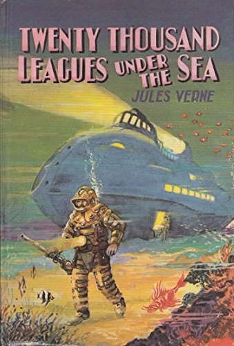{ width="200" }

    - **[Balon na ogrzane powietrze](../cards/index.md#hot_air_balloon)** (RelatedTo)
    Balon latający na gorące powietrze. Pierwszy taki balon poleciał we Francji.

    { width="200" }

    - **[Rakieta kosmiczna](../cards/index.md#space_rocket)** (RelatedTo)
    Rakieta, która leci w kosmos.

    { width="200" }

    - **[Łódź podwodna (Nautilus)](../cards/index.md#submarine_nautilus)** (RelatedTo)
    Łódź podwodna z powieści Juliusza Verne'a. Mogła eksplorować głębiny morskie.

    { width="200" }

- Quests: [Juliusz Verne i transport (fr_03)](../quests/quest/fr_03.md)

Credits:
  - Lucie Paillat (France)

---

### Louvre {#louvre}
- Importance: Critical  
- Subjects: Art  
- Target Age: Ages6to10
- Core card:
    - **[Żaluzja](../cards/index.md#louvre)**
    Ogromne muzeum pełne sztuki. To tu mieszka Mona Lisa.

    { width="200" }

- Connected cards:
    - **[Paryż](../cards/index.md#capital_paris)** (LocatedIn)
    Stolica Francji. Paryż ma słynną wysoką wieżę zwaną Wieżą Eiffla!

    { width="200" }

    - **[Mona Lisa](../cards/index.md#art_monalisa)** (PartOf)
    Najsłynniejszy obraz świata! Kobieta o tajemniczym uśmiechu namalowana przez Leonarda da Vinci. Wydaje się, że śledzi cię wzrokiem.

    { width="200" }

    - **[Leonardo da Vinci](../cards/index.md#person_leonardodavinci)** (RelatedTo)
    Niesamowity artysta i naukowiec z Włoch. Namalował Monę Lisę i wynalazł maszyny latające setki lat przed samolotami!

    { width="200" }

    - **[Wolność wiodąca lud](../cards/index.md#art_liberty_leading_the_people)** (PartOf)
    Słynny obraz o wolności i odwadze. Przedstawia odważną kobietę trzymającą flagę Francji i prowadzącą ludzi do walki o swoje prawa.

    { width="200" }

    - **[Wenus z Milo](../cards/index.md#art_venus_milo)** (PartOf)
    Piękna, starożytna statua kobiety wykonana z białego marmuru. Brakuje jej ramion, ale i tak jest uważana za jedną z najpiękniejszych rzeźb, jakie kiedykolwiek powstały.

    { width="200" }

- Quests: [Paryż! (fr_01)](../quests/quest/fr_01.md)

---

### market traders {#marketers}
- Description: People who sell food and goods at market stalls—like fishmongers, cheesemongers, and fruit sellers. They weigh, wrap, and call out today’s prices.  
- Importance: Medium  
- Target Age: Ages6to10
- Core card:
    - **[Traderzy rynkowi](../cards/index.md#market_traders)**
    Ludzie sprzedający żywność i towary na straganach targowych – jak sprzedawcy ryb, serów i owoców. Ważą, pakują i wykrzykują dzisiejsze ceny.

    { width="200" }

- Connected cards:
    - **[Kupiec handlujący serem](../cards/index.md#person_cheesemonger)** (RelatedTo)
    Osoba sprzedająca wiele rodzajów sera.

    { width="200" }

    - **[Piekarz](../cards/index.md#person_baker)** (RelatedTo)
    Osoba zajmująca się wypiekiem chleba, ciast i wypieków.

    { width="200" }

    - **[Badylarz](../cards/index.md#person_greengrocer)** (RelatedTo)
    Osoba sprzedająca świeże owoce i warzywa.

    { width="200" }

    - **[Właściciel sklepu spożywczego](../cards/index.md#person_grocer)** (RelatedTo)
    Osoba sprzedająca różnego rodzaju żywność i napoje.

    { width="200" }

    - **[Sprzedawca ryb](../cards/index.md#person_fishmonger)** (RelatedTo)
    Osoba sprzedająca świeże ryby i owoce morza.

    { width="200" }

- Quests: [Jedzenie i targ (fr_09)](../quests/quest/fr_09.md)

---

### marseillaise music {#marseillaise_music}
- Importance: High  
- Target Age: Ages6to10
- Core card:
    - **[Marsylianka](../cards/index.md#marseillaise_music)**
    Francuska pieśń narodowa. Śpiewa się ją podczas wielkich wydarzeń i meczów sportowych.

    { width="200" }

- Connected cards:
    - **[Rewolucja francuska](../cards/index.md#french_revolution)** (RelatedTo)
    Okres lat dziewięćdziesiątych XVIII wieku, kiedy we Francji nastąpiła zmiana rządu.

    { width="200" }

    - **[Dzień chwały](../cards/index.md#marseillaise_3)** (RelatedTo)
    Słowa z pierwszego wersu hymnu.

    { width="200" }

    - **[Allons enfants](../cards/index.md#marseillaise_1)** (RelatedTo)
    Pierwsze słowa pierwszego wersu hymnu.

    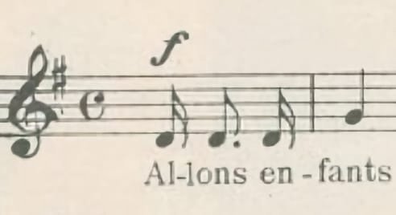{ width="200" }

    - **[De la patrie](../cards/index.md#marseillaise_2)** (RelatedTo)
    Słowa z pierwszego wersu hymnu.

    { width="200" }

    - **[Est Arrivé](../cards/index.md#marseillaise_4)** (RelatedTo)
    Słowa z pierwszego wersu hymnu.

    { width="200" }

- Quests: [Marsylianka (fr_11)](../quests/quest/fr_11.md)

---

### mont blanc {#mont_blanc}
- Importance: Medium  
- Target Age: Ages6to10
- Core card:
    - **[Mont Blanc](../cards/index.md#place_mont_blanc)**
    Najwyższa góra w Europie Zachodniej. Pokryta śniegiem przez cały rok.

    { width="200" }

- Connected cards:
    - **[Przewodnik górski](../cards/index.md#mountain_guide)** (RelatedTo)
    Osoba, która pomaga ludziom bezpiecznie się wspinać.

    { width="200" }

    - **[Wiatr](../cards/index.md#wind)** (RelatedTo)
    Ruch powietrza, który w górach może być odczuwalnie silniejszy.

    { width="200" }

    - **[Szczyt](../cards/index.md#summit)** (RelatedTo)
    Sam szczyt góry.

    { width="200" }

    - **[Alpy](../cards/index.md#alps)** (RelatedTo)
    Wysokie pasmo górskie w Europie.

    { width="200" }

    - **[Góra](../cards/index.md#mountain)** (RelatedTo)
    Filary ziemi

    { width="200" }

    - **[Śnieg](../cards/index.md#snow)** (RelatedTo)
    Zamarznięta woda spadająca w zimne dni.

    { width="200" }

    - **[Lód](../cards/index.md#ice)** (RelatedTo)
    Zamarznięta woda, która może być bardzo śliska.

    { width="200" }

- Quests: [Mont Blanc i góry (fr_08)](../quests/quest/fr_08.md)

---

### Notre Dame {#notredame}
- Importance: High  
- Subjects: Culture  
- Target Age: Ages6to10
- Core card:
    - **[Katedra Notre-Dame w Paryżu](../cards/index.md#notre_dame_de_paris)**
    Piękna katedra w Paryżu. Jej kolorowe witraże opowiadają historie.

    { width="200" }

- Connected cards:
    - **[Paryż](../cards/index.md#capital_paris)** (LocatedIn)
    Stolica Francji. Paryż ma słynną wysoką wieżę zwaną Wieżą Eiffla!

    { width="200" }

    - **[Pożar Notre-Dame](../cards/index.md#notre_dame_de_paris_fire)** (TimeContext)
    W 2019 roku wielki pożar zniszczył piękną katedrę Notre-Dame w Paryżu. Wiele osób współpracowało, aby uratować ten ważny budynek.

    { width="200" }

    - **[Ile-de-France](../cards/index.md#ile_de_france)** (LocatedIn)
    Region we Francji, w którym znajduje się stolica, Paryż. Mieszka tu wielu ludzi!

    { width="200" }

- Quests: [Paryż! (fr_01)](../quests/quest/fr_01.md)

---

### Seine Bridges {#seine_bridges}
- Importance: Medium  
- Target Age: Ages6to10
- Core card:
    - **[Most dla samochodów](../cards/index.md#place_bridge_cars)**
    Droga biegnąca nad wodą, dzięki której samochody mogą pokonywać rzeki i jeziora.

    { width="200" }

- Connected cards:
    - **[Kładki dla pieszych](../cards/index.md#place_bridge_people)** (RelatedTo)
    Małe mostki dla pieszych. Chronią przed ruchem ulicznym.

    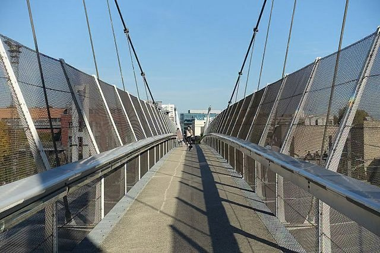{ width="200" }

    - **[Most dla pociągów](../cards/index.md#place_bridge_trains)** (RelatedTo)
    Specjalny most o konstrukcji wystarczająco wytrzymałej, aby umożliwić przejazd ciężkich pociągów nad wodą.

    { width="200" }

    - **[Łódź rzeczna](../cards/index.md#boat_river)** (RelatedTo)
    Łódź, która płynie po rzekach. Rzeki są jak drogi zbudowane z wody!

    { width="200" }

- Quests: [Paryż Sekwana (fr_10)](../quests/quest/fr_10.md)

## Poland

### gdansk {#gdansk}
- Importance: Medium  
- Target Age: Ages6to10
- Core card:
    - **[Gdańsk](../cards/index.md#gdansk)**
    Miasto portowe w Polsce nad Morzem Bałtyckim.

    { width="200" }

- Connected cards:
    - **[Latarnia Morska Gdańsk](../cards/index.md#gdansk_lighthouse)** (RelatedTo)
    Zabytkowa latarnia morska, która pomaga statkom znaleźć port.

    { width="200" }

    - **[Rzeka Motława](../cards/index.md#motawa_river)** (RelatedTo)
    Rzeka przepływająca przez Gdańsk do morza.

    { width="200" }

    - **[Wybrzeże Morza Bałtyckiego](../cards/index.md#baltic_sea_coast)** (RelatedTo)
    Piaskowy brzeg Morza Bałtyckiego.

    { width="200" }

    - **[Morze Bałtyckie](../cards/index.md#baltic_sea)** (RelatedTo)
    Wielkie morze w północnej Europie, gdzie spotykają się Polska, Niemcy i inne kraje. Ma piękne plaże i słynie z bursztynowych skarbów!

    { width="200" }

---

### Gingerbread {#gingerbread}
- Importance: Medium  
- Subjects: Food  
- Target Age: Ages6to10
- Core card:
    - **[Pierniki toruńskie](../cards/index.md#gingerbread)**
    tradycyjny polski przysmak przygotowywany z przypraw i miodu, często kształtowany w piękne wzory.

    { width="200" }

- Connected cards:
    - **[Forma do pierników](../cards/index.md#gingerbread_mold)** (RelatedTo)
    Narzędzie w kształcie ciasteczka, które pozwala na tworzenie ciekawych kształtów.

    { width="200" }

    - **[Cynamon](../cards/index.md#cinnamon)** (RelatedTo)
    Słodka przyprawa wytwarzana z kory drzewa.

    { width="200" }

    - **[Masło](../cards/index.md#butter)** (RelatedTo)
    Żółty tłuszcz wytwarzany z mleka, używany do gotowania i pieczenia.

    { width="200" }

    - **[Jajka](../cards/index.md#eggs)** (RelatedTo)
    Pokarm z kurczaków, używany do pieczenia i gotowania.

    { width="200" }

    - **[Ożywić](../cards/index.md#ginger)** (RelatedTo)
    Pikantny korzeń używany w kuchni i ciasteczkach.

    { width="200" }

    - **[Miód](../cards/index.md#honey)** (RelatedTo)
    Słodki przysmak wytwarzany przez pszczoły.

    { width="200" }

---

### Neptune's fountain {#neptune_fountain}
- Importance: Medium  
- Target Age: Ages6to10
- Core card:
    - **[Fontanna Neptuna](../cards/index.md#neptune_s_fountain)**
    Słynna fontanna w Gdańsku z figurą boga morza.

    { width="200" }

- Connected cards:
    - **[Bursztyn](../cards/index.md#amber)** (RelatedTo)
    Błyszcząca skamieniała żywica drzewna zwana „Bałtyckim Złotem”.

    { width="200" }

    - **[Bursztynowy Pokój](../cards/index.md#amber_room)** (RelatedTo)
    Słynny pokój z bursztynu o tajemniczej historii.

    { width="200" }

    - **[Muszla](../cards/index.md#seashell)** (RelatedTo)
    Twardy muszla zwierzęcia morskiego, przydatna do rękodzieła.

    { width="200" }

    - **[Naszyjnik](../cards/index.md#necklace)** (RelatedTo)
    Sznur koralików lub muszelek noszony na szyi.

    { width="200" }

    - **[Gdańsk](../cards/index.md#gdansk)** (RelatedTo)
    Miasto portowe w Polsce nad Morzem Bałtyckim.

    { width="200" }

---

### Odra river {#odra_river}
- Importance: Medium  
- Target Age: Ages6to10
- Core card:
    - **[Rzeka Odra](../cards/index.md#place_odra_river)**
    Duża rzeka w zachodniej Polsce. Umożliwia statkom podróżowanie i handel.

    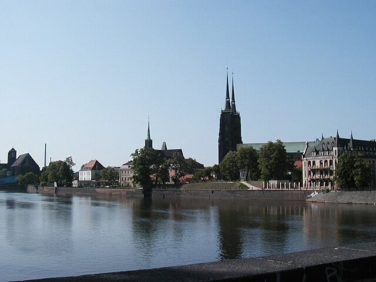{ width="200" }

- Connected cards:
    - **[Kładka](../cards/index.md#footbridge)** (RelatedTo)
    Most, po którym ludzie mogą chodzić. Bez samochodów.

    { width="200" }

    - **[Most Tumski](../cards/index.md#tumski_bridge)** (RelatedTo)
    Słynny most z kłódkami symbolizującymi miłość i latarniami gazowymi.

    { width="200" }

    - **[Most Rędziński](../cards/index.md#redzinski_bridge)** (RelatedTo)
    Najdłuższy most wantowy w Polsce.

    { width="200" }

    - **[Most drogowy](../cards/index.md#road_bridge)** (RelatedTo)
    Most dla samochodów i autobusów.

    { width="200" }

    - **[Dom na wodzie](../cards/index.md#houseboat)** (RelatedTo)
    Łódź stworzona do życia na niej.

    { width="200" }

    - **[Most kolejowy](../cards/index.md#train_bridge)** (RelatedTo)
    Most z torami kolejowymi.

    { width="200" }

    - **[Mosty Wrocławskie](../cards/index.md#wroclaw_bridges)** (RelatedTo)
    We Wrocławiu nad Odrą przebiega wiele mostów.

    { width="200" }

    - **[Wisła (Wisła)](../cards/index.md#place_vistula_river)** (RelatedTo)
    Najdłuższa rzeka w Polsce nazywa się Wisła. Przepływa przez Kraków i Warszawę.

    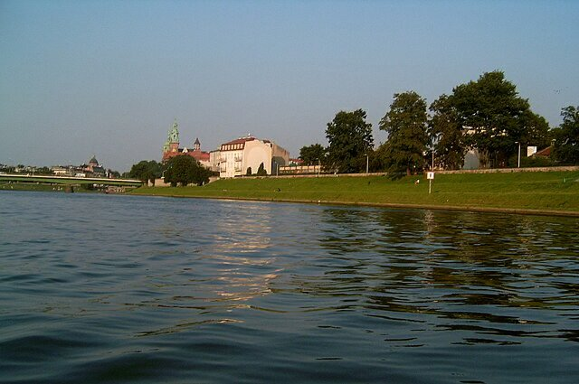{ width="200" }

---

### Pierogi Recipe {#pierogi}
- Importance: Medium  
- Target Age: Ages6to10
- Core card:
    - **[Przepis na pierogi](../cards/index.md#pierogi_recipe)**
    Wyrób miękkie ciasto, nałóż na nie puree ziemniaczane i serek wiejski, zamknij i gotuj, aż ciasto wypłynie na powierzchnię – następnie smaż na patelni z cebulą na maśle.

    { width="200" }

- Connected cards:
    - **[Polskie pierogi](../cards/index.md#pierogi)** (RelatedTo)
    Pierogi z nadzieniem ziemniaczanym, serowym lub owocowym. To słynne polskie danie.

    { width="200" }

    - **[Waluta Złoty](../cards/index.md#currency_zloty)** (RelatedTo)
    Walutą polską jest złoty. Monety i banknoty mają symbole polskie.

    { width="200" }

    - **[Pierniki toruńskie](../cards/index.md#gingerbread)** (RelatedTo)
    tradycyjny polski przysmak przygotowywany z przypraw i miodu, często kształtowany w piękne wzory.

    { width="200" }

- Quests: [Pierniki i targ spożywczy (pl_06)](../quests/quest/pl_06.md)

---

### Poland Countries {#poland_countries_around}
- Importance: Medium  
- Target Age: Ages6to10
- Core card:
    - **[Polska](../cards/index.md#country_poland)**
    Kraj w Europie. Stolicą jest Warszawa. Polska słynie z naukowców takich jak Kopernik i pysznych pierogów!

    { width="200" }

- Connected cards:
    - **[Słowacja](../cards/index.md#country_slovakia)** (RelatedTo)
    Kraj w Europie. Stolicą jest Bratysława.

    { width="200" }

    - **[Czechy](../cards/index.md#country_czech_republic)** (RelatedTo)
    Kraj w Europie. Stolicą jest Praga.

    { width="200" }

    - **[Litwa](../cards/index.md#country_lithuania)** (RelatedTo)
    Państwo w Europie. Stolicą jest Wilno.

    { width="200" }

    - **[Białoruś](../cards/index.md#country_belarus)** (RelatedTo)
    Państwo w Europie. Stolicą jest Mińsk.

    { width="200" }

    - **[Flaga Białorusi](../cards/index.md#flag_belarus)** (CulturalContext)
    Flaga Białorusi ma poziome, czerwone i zielone pasy z pięknymi, tradycyjnymi wzorami po bokach. Białoruś jest sąsiadem Polski.

    { width="200" }

    - **[Flaga Rosji](../cards/index.md#flag_russia)** (CulturalContext)
    Flaga z białymi, niebieskimi i czerwonymi paskami. Reprezentuje Rosję.

    { width="200" }

    - **[Flaga Słowacji](../cards/index.md#flag_slovakia)** (CulturalContext)
    Flaga w kolorach białym, niebieskim i czerwonym. Reprezentuje Słowację.

    { width="200" }

    - **[Flaga Republiki Czeskiej](../cards/index.md#flag_czech_republic)** (CulturalContext)
    Flaga ma biało-czerwone pasy z niebieskim trójkątem. Czechy słyną z pięknego Zamku Praskiego i kryształowego szkła.

    { width="200" }

    - **[Flaga Litwy](../cards/index.md#flag_lithuania)** (CulturalContext)
    Flaga ma poziome pasy w kolorze żółtym, zielonym i czerwonym. Litwa to kraj bałtycki z pięknymi lasami i plażami.

    { width="200" }

    - **[Flaga Ukrainy](../cards/index.md#flag_ukraine)** (CulturalContext)
    Flaga w kolorach niebieskim i żółtym, przypominającym niebo i słońce. Reprezentuje Ukrainę.

    { width="200" }

    - **[Flaga Niemiec](../cards/index.md#flag_germany)** (CulturalContext)
    Flaga Niemiec ma trzy poziome pasy: czarny, czerwony i żółty. Niemcy słyną z samochodów, zamków i bajek!

    { width="200" }

    - **[Niemcy](../cards/index.md#country_germany)** (RelatedTo)
    Państwo w Europie. Stolicą jest Berlin.

    { width="200" }

    - **[Rosja](../cards/index.md#country_russia)** (RelatedTo)
    Państwo w Europie. Stolicą jest Moskwa.

    { width="200" }

---

### Poland country {#poland-country}
- Importance: Critical  
- Target Age: Ages6to10
- Core card:
    - **[Polska](../cards/index.md#country_poland)**
    Kraj w Europie. Stolicą jest Warszawa. Polska słynie z naukowców takich jak Kopernik i pysznych pierogów!

    { width="200" }

- Connected cards:
    - **[Flaga Polski](../cards/index.md#flag_poland)** (CulturalContext)
    Flaga Polski ma poziome, biało-czerwone pasy. Polska słynie z naukowców takich jak Kopernik i pysznych pierogów!

    { width="200" }

    - **[Warszawa](../cards/index.md#capital_warsaw)** (RelatedTo)
    Stolica Polski.

    { width="200" }

- Quests: [Sąsiedzi Polski (pl_00)](../quests/quest/pl_00.md)

---

### Warsaw {#warsaw}
- Importance: Medium  
- Target Age: Ages6to10
- Core card:
    - **[Pomnik Chopina](../cards/index.md#chopin_monument)**
    Duży pomnik w warszawskich Łazienkach Królewskich poświęcony Fryderykowi Chopinowi. Latem odbywają się tam również popularne plenerowe koncerty fortepianowe. (Specjalne drzewo, pod którym siedzi, to typowa polska… wierzba)

    { width="200" }

- Connected cards:
    - **[Syrena Warszawska](../cards/index.md#mermaid_of_warsaw)** (RelatedTo)
    Symbolem miasta jest odważna syrena z mieczem i tarczą. Jej posąg można zobaczyć nad rzeką.

    { width="200" }

    - **[Wars i Sawa](../cards/index.md#wars_and_sawa)** (RelatedTo)
    Dwie legendarne postacie, które nadały Warszawie nazwę. Wars był dzielnym wojownikiem, a Sawa piękną syreną, która mieszkała w Wiśle.

    { width="200" }

    - **[Fryderyk Chopin](../cards/index.md#fryderyk_chopin)** (RelatedTo)
    Znany polski kompozytor fortepianowy. Tworzył piękną muzykę, która brzmi jak taniec lub opowiadanie historii. Jego muzyka sprawia, że ​​ludzie czują się szczęśliwi lub smutni.

    { width="200" }

- Quests: [Odkryj Warszawę (pl_01)](../quests/quest/pl_01.md)

---

### Wroclaw {#wroclaw}
- Importance: Medium  
- Target Age: Ages6to10
- Core card:
    - **[Wrocław](../cards/index.md#wroclaw)**
    Miasto w Polsce z rzekami, mostami i historią.

    { width="200" }

- Connected cards:
    - **[Mosty Wrocławskie](../cards/index.md#wroclaw_bridges)** (RelatedTo)
    We Wrocławiu nad Odrą przebiega wiele mostów.

    { width="200" }

    - **[Rzeka Odra](../cards/index.md#place_odra_river)** (RelatedTo)
    Duża rzeka w zachodniej Polsce. Umożliwia statkom podróżowanie i handel.

    { width="200" }

    - **[Wisła (Wisła)](../cards/index.md#place_vistula_river)** (RelatedTo)
    Najdłuższa rzeka w Polsce nazywa się Wisła. Przepływa przez Kraków i Warszawę.

    { width="200" }

---

### Wroclaw Dwarves {#wroclaw_dwarves}
- Importance: Medium  
- Target Age: Ages6to10
- Core card:
    - **[Krasnale wrocławskie](../cards/index.md#wroclaw_dwarfs)**
    Malutkie figurki w całym mieście, które uwielbiają płatać figle.

    { width="200" }

- Connected cards:
    - **[Miłośnik zwierząt Krasnolud](../cards/index.md#animal_lover_dwarf)** (RelatedTo)
    Figurka krasnala, który uwielbia zoo i zwierzęta.

    { width="200" }

    - **[Biskup Krasnolud](../cards/index.md#bishop_dwarf)** (RelatedTo)
    Posąg karła zadającego pytanie kościelne.

    { width="200" }

    - **[Ekspert Krasnoludów](../cards/index.md#dwarf_expert)** (RelatedTo)
    Przyjazny przewodnik, który wie wszystko o krasnoludkach.

    { width="200" }

    - **[Krasnolud Klucznik](../cards/index.md#keymaster_dwarf)** (RelatedTo)
    Posąg krasnala pilnującego windy z dużym kluczem.

    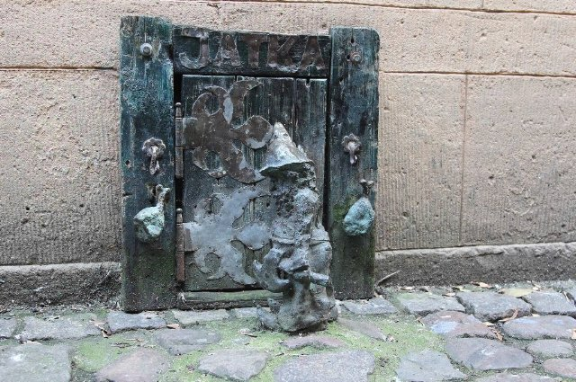{ width="200" }

    - **[Polskie krasnale (wrocławskie krasnale)](../cards/index.md#polish_dwarf)** (RelatedTo)
    Małe figurki krasnali kryją się we Wrocławiu. Ich znalezienie to fajna gra miejska.

    { width="200" }

    - **[Rzeźba Krasnala wrocławskiego](../cards/index.md#wroclaw_dwarf_statue)** (RelatedTo)
    Niewielka figurka miejska; krasnale są symbolem Wrocławia.

    { width="200" }

    - **[Wrocław](../cards/index.md#wroclaw)** (LocatedIn)
    Miasto w Polsce z rzekami, mostami i historią.

    { width="200" }

- Quests: [Wielka akcja ratunkowa krasnala wrocławskiego (pl_02)](../quests/quest/pl_02.md)

---

### wroclaw zoo {#wroclaw_zoo}
- Importance: Medium  
- Target Age: Ages6to10
- Core card:
    - **[Ogród Zoologiczny we Wrocławiu](../cards/index.md#wroclaw_zoo)**
    Duży ogród zoologiczny we Wrocławiu, w którym można poznać wiele zwierząt.

    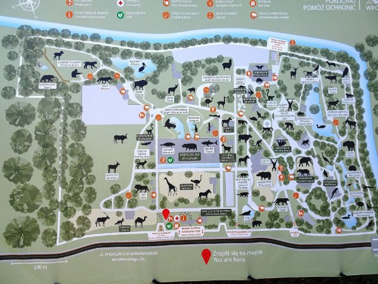{ width="200" }

- Connected cards:
    - **[Opiekun zoo](../cards/index.md#zoo_keeper)** (RelatedTo)
    Osoba opiekująca się zwierzętami w zoo.

    { width="200" }

    - **[Wybieg dla zwierząt](../cards/index.md#animal_enclosure)** (RelatedTo)
    Bezpieczna przestrzeń w zoo, w której mogą żyć zwierzęta.

    { width="200" }

    - **[Dyrektor zoo](../cards/index.md#zoo_director)** (RelatedTo)
    Osoba zarządzająca zoo i pomagająca zwiedzającym.

    { width="200" }

- Quests: [Zoo (pl_04)](../quests/quest/pl_04.md)

