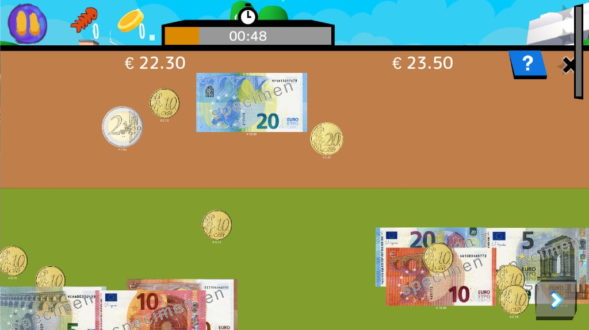

# Jak grać Odkrywaj zadania <Badge type="tip" text=„new” />

## Wybierz zadanie
- Zacznij od menu Ziemia i wybierz kraj lub lokalizację (zazwyczaj miasto).
- Wybierz zadanie, aby zobaczyć jego tytuł, krótki opis i treść.
  
- W trybie Classroom: nauczyciel może zablokować kraj i pozwolić ci wybrać dowolną misję w jego obrębie.  
- W trybie Home: misje są zazwyczaj odblokowywane jedna po drugiej. Powtórne granie poprawia twój wynik i odkrywa dodatkowe karty.  

> [!tip]
> Jeśli jesteś nowy, zacznij od misji samouczka w każdym kraju.  

## Sterowanie graczem
**PC / Komputer stacjonarny**
  
- Klawisze ASDW = poruszanie się (przytrzymaj 2 sekundy, aby biec)
- SPACE = skok / interakcja / przejście do kolejnych dialogów
- SHIFT = bieg (tajne, ponieważ nie jest to obowiązkowe)
- Mysz + prawy przycisk = poruszanie kamerą
- Lewy przycisk myszy = interakcja

**Dotyk**
- Lewy palec = poruszanie się (przytrzymaj 2 sekundy, aby biec)
  
- Przycisk = skok / interakcja
- Dotknij obiektów = interakcja
- Dotknij i przeciągnij na ekranie = przesuń kamerę
> [!tip] Wskazówka dla nauczycieli
> Zaplanuj sterowanie na tablicy podczas pierwszej sesji. Połącz uczniów w pary, tak aby jeden czytał wskazówki, a drugi sterował, a następnie zamieńcie role.

## Mapa i zadania
- Przycisk mapy: otwiera prostą mapę z Twoją aktualną pozycją i głównym celem.
  
- Punkt docelowy: znacznik punktu orientacyjnego i promień prowadzący wskazują, dokąd należy się udać.
- Panel zadań: krótkie podpowiedzi tekstowe pojawiają się na ekranie, gdy zmienia się cel (np. „Porozmawiaj z piekarzem”).

> [!tip] Wskazówka dla nauczycieli
> Poproś uczniów, aby przed przejściem do kolejnego zadania sformułowali aktualny cel własnymi słowami.

## Rodzaje interakcji
- **Rozmowa**: podejdź do postaci i naciśnij przycisk interakcji, aby rozpocząć krótką rozmowę.
- **Spojrzenie**: spójrz na znaki, plakaty lub przedmioty, aby odblokować karty wiedzy w Księdze.
- **Zbieranie**: podnoś przedmioty, które trafiają do ekwipunku (automatycznie używane w razie potrzeby).
- **Użycie**: naciśnij przyciski, dźwignie lub przełączniki podłogowe, aby otworzyć drzwi lub uruchomić zdarzenia.
- **Poruszanie się**: skacz po platformach, unikaj zagrożeń, podążaj bezpiecznymi ścieżkami (np. przechodź na zielonym świetle).
- **Działania**: niektóre interakcje uruchamiają działanie (patrz poniżej) pozwalające przećwiczyć kartę lub umiejętność.
> [!uwaga]
> Przycisk „Interakcja” jest taki sam jak przycisk „Skok”, gdy znajdujesz się blisko postaci niezależnej/przedmiotu.

## Ekwipunek i przedmioty
- Do 5 szybkich slotów; przedmioty znikają po wykorzystaniu do wykonania zadania.

## Postępy i nagrody
- **Gwiazdy**: ogólny wynik zadania (3 = idealny).
- **Karty wiedzy**: odblokowywane poprzez eksplorację, rozmowy, czytanie znaków i wykonywanie zadań.
- **Klejnoty**: waluta mistrzostwa zdobywana poprzez wykonywanie zadań i specjalnych kart.
  
- **Ciasteczka**: waluta służąca do kupowania kosmetycznych rekwizytów.
- **Osiągnięcia**: kamienie milowe, takie jak „Ukończ 3 zadania” lub „Zbierz 20 kart”.
- **Bonus/Malus**: dobre działania (rozmowa z NPC, sprzątanie) vs. ryzykowne działania (przechodzenie na czerwonym świetle, deptanie kwiatów).
  
## Działania w ramach zadań
Podczas zadań pojawiają się szybkie gry treningowe. Szczegóły dotyczące poszczególnych działań znajdują się tutaj: [Przegląd działań](../content/activities/index.md).

### [Płótno](../content/activities/index.md#CleanCanvas)  
odkrywaj obraz, omijając przeszkody.

### [Puzzle](../content/activities/index.md#JigsawPuzzle)
złożyć pełny obraz z kawałków. 

### [Match](../content/activities/index.md#Match)
Połącz elementy, które do siebie pasują.

  
### [Memory](../content/activities/index.md#Memory)
znajdź pasujące pary z pamięci.

  
### [Count the Money](../content/activities/index.md#MoneyCount)
wybierz monety/banknoty, aby osiągnąć docelową sumę.

  
### [Kolejność](../content/activities/index.md#Order)
Ułóż kroki w prawidłowej kolejności.

### [Fortepian](../content/activities/index.md#Piano)
Powtórz sekwencje kolorów / dźwięków / nut. 

## Dostępność i tryby
- Tryb klasowy zmniejsza hałas i pozwala skupić się na jednym kraju.
- Napisy i podpowiedzi ikonowe pomagają początkującym czytelnikom i w kontekstach wielojęzycznych.
  
- Krótkie sesje (5–15 minut) pomagają utrzymać uwagę i umożliwiają szybkie podsumowanie.

## Personalizacja (do ustalenia)
- Użyj plików cookie, aby kupić czapki, plecaki i małe rekwizyty dla swojej awatarki kota.
- Niektóre przedmioty odblokowują się po osiągnięciu określonego poziomu klejnotów lub osiągnięć.
- Więcej szczegółów i podgląd wkrótce (przestrzeń gracza nie jest jeszcze gotowa)
  
