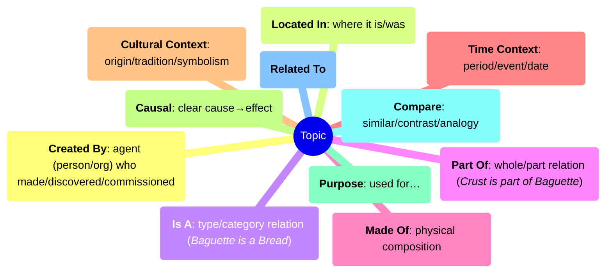

# Odkrywaj kultury szczegóły

## Treść

### Słowa
Zaczynamy od wszystkich słów z [modułu nauki języka](./learnlanguage_module.md).

Słowa są przedstawiane przez Living Letters (LL), które wypowiadają słowa podczas interakcji i są widoczne w dialogach. W ten sposób nauka języka jest wzmacniana w zabawny, kontekstowy sposób.
  
> [!note] Baza danych słów
> Aktualna lista [wszystkich słów w grze](../content/words/index.md)

### Karty
Sercem każdej misji są karty, które reprezentują „atom wiedzy”, taki jak fakty, osoby, miejsca, przedmioty, tradycje, potrawy, fauna i flora.

Każda karta:
- ma **tytuł** i prosty **opis**
- ma co najmniej jeden **obraz** i może mieć **dźwięki**
- znajduje się w przestrzeni (na przykład w mieście) i czasie (umożliwiając tworzenie osi czasu krajów)
- pozostaje **ukryta do momentu odkrycia** i odblokowania w zadaniach
- jest zawsze dostępna z Księgi gracza.

Każda karta ma jeden **typ**, na przykład:
- **Miejsce** (GDZIE) - Miasta, rzeki, góry, zabytki
- **Wydarzenie** (KIEDY) - Wydarzenia historyczne, święta, festiwale
- **Osoba** (KTO) - Postacie historyczne, nauczyciele, przyjaciele
- **Obiekt** (CO) - Przedmioty, z którymi można wchodzić w interakcję lub które można zbierać
- **Pojęcie** (MYŚL) - Abstrakcyjne idee (przyjaźń, bezpieczeństwo, pokój)
- **Aktywność** (CO ROBIĆ) - gry, gotowanie, sport

i jest powiązana z jednym lub kilkoma **przedmiotami**.

Przedmioty podstawowe:
- **Sztuka** - tworzenie i kreowanie
- **Kultura** - jak żyją ludzie
- **Geografia** - gdzie się coś znajduje
- **Historia**
- **Literatura** – opowiadania i książki
- **Matematyka** – liczby i logika
- **Nauki ścisłe** – jak działają różne rzeczy
- **Technologia** – nauki stosowane

Przedmioty dodatkowe:
- **Zwierzęta**
- **Żywność**
- **Muzyka**
- **Rośliny**
- **Rekreacja** – czas wolny i hobby: taniec, rękodzieło, wędrówki, gry
- **Kosmos**
- **Sport**
- **Transport** - samochody, samoloty, łodzie
- **Pogoda**

Życie społeczne i praktyczne:
- **Wiedza o społeczeństwie** - podstawowe informacje o rządzie i obywatelstwie
- **Społeczność** - kiedy ludzie organizują się i pomagają sobie nawzajem na poziomie lokalnym
- **Edukacja** - szkoły
- **Środowisko**  - troska o przyrodę
- **Rodzina**
- **Przyjaźń**  - ważna koncepcja społeczna
- **Zdrowie** - medycyna, szpitale
- **Pieniądze** - podstawowa wiedza finansowa
- **Bezpieczeństwo**
- **Czas** - zrozumienie zegarów/kalendarzy

> [!note] Baza danych kart
> Aktualna lista [wszystkich kart w grze](../content/cards/index.md)

### Tematy
Tematy są definiowane przez nauczycieli poprzez połączenie zestawu kart, zdefiniowanie relacji i utworzenie **widocznego grafu wiedzy**.

Grafy te stanowią podstawę działań dydaktycznych. Są łatwe do zbadania i zrozumienia: dzieci mogą przeanalizować powiązania między elementami kultury, a także wykonywać zadania i działania oparte na tych grafach.
Oto rodzaje powiązań dostępnych obecnie w grze:

> [!note] Baza danych tematów
> Aktualna lista [wszystkich tematów w grze](../content/topics/index.md)

## Zadania
Zadania to krótkie (5–15 minut) przygody skupiające się na tematach kulturowych lub edukacyjnych, zazwyczaj 1–2 **tematy**.

Każde zadanie łączy:
- odkrywanie autentycznych miejsc
- spotkania z postaciami
- rozwiązywanie zagadek i minigier
- zbieranie elementów kulturowych (**kart**)

- Dwa poziomy gry:
    - Pierwsza rozgrywka ujawnia tylko podstawową zawartość.
    - Powtórka umożliwia odblokowanie dodatkowych zadań, ukrytych przedmiotów i specjalnych fragmentów kart, aby odblokować ostateczny klejnot.

### Fabuła i rozgrywka
Każda misja ma inną fabułę i może zawierać różne wyzwania, takie jak:
- **Ukryte przedmioty**: znajdź przedmioty dzięki wskazówkom od postaci niezależnych/znaków
- **Kolekcja**: zbierz wszystkie przedmioty (wzmocnienie matematyki)
- **Zagadki fizyczne**: labirynty, zadania przestrzenne
- **Fabularne**: liniowe zadania narracyjne z narratorem
- **Quizy kulturowe**: postacie niezależne pytają o odkryte przedmioty
- **Mini-gry**: rzemiosło, sport lub praktyki kulturowe

### Postacie
**Żywe litery (LL)**
Są głównymi towarzyszami znanymi z modułów nauki języka. Łączą słowa z postaciami niezależnymi.
Mogą reprezentować:
- literę (mała LL)
- słowo z rysunkiem (normalna LL)
- kartę (obraz lub dźwięki)
**Postacie blokowe**
Postacie humanoidalne / podobne do postaci z gry Minecraft.
**NPC otoczenia**
Gołębie, koty, psy, samochody, pociągi, ptaki (sterowane przez AI).

### Zadania
„Co mam zrobić?” jest uproszczone dzięki zadaniom.
Podczas rozmowy z postaciami gracz otrzymuje cele do osiągnięcia, takie jak
- zebranie przedmiotów (zebranie wszystkich składników do przepisu)
- dotarcie do określonej pozycji (wspiąć się na Mont Blanc lub Wieżę Eiffla)
- wywołać akcję (opuszczenie mostu zamkowego)

### System postępów
- Zadania kończą się 1–3 gwiazdkami w zależności od błędów.
- Wydarzenia bonusowe/malusowe wpływają na postępy.

### Karty specjalne
Powtórne granie zadań może ujawnić fragmenty kart specjalnych, prowadząc do ostatecznego klejnotu zadania.
Po opanowaniu, powtarzanie daje ciasteczka, ale nie klejnoty.

### Aktywności
Aktywności mogą być osadzone w zadaniach lub rozgrywane oddzielnie od Księgi i dotyczyć różnych tematów.
> [!uwaga]
> Jedną z nowych funkcji naszego frameworka jest to, że aktywności te mogą być wykorzystywane do utrwalenia danego tematu i automatycznego pobierania kart do rozegrania.
- **Kolejność**: ułożenie elementów w sekwencji
- **Fortepian**: powtarzanie melodii/kolorów
- **Płótno**: czyszczenie w celu odsłonięcia obrazów
- **Pieniądze**: liczenie monet i banknotów
- **Puzzle**: obrazy kulturowe
- **Pamięć**: dopasowywanie kart
- **Quiz**: odpowiedzi tekstowe, obrazkowe lub mieszane
- **Oceny końcowe**: formalne sprawdziany po zadaniach
Poznaj wszystkie działania: [Przegląd działań](../content/activities/index.md).

### Języki
Wszystkie dialogi są dwujęzyczne: język ojczysty dziecka + język kraju goszczącego (np. polski, francuski).
Ułatwia to dzieciom śledzenie historii podczas nauki nowych słów i zwrotów.
Domyślnie gra najpierw mówi w języku nauki, a następnie w języku ojczystym, ale nauczyciel może wybrać odwrotną kolejność, jeśli jest to lepsze dla dziecka.

### Poziomy trudności
Wszystkie elementy gry i treści są podzielone na trzy poziomy trudności:
- Łatwy
- Normalny
- Ekspert
Nauczyciele mogą dostosować poziom trudności w panelu nauczyciela, aby dostosować czas, podpowiedzi i gęstość wyzwań do poziomu ucznia. Niektóre zadania odblokowują również dodatkowe opcjonalne zadania podczas ponownego odtwarzania dla zaawansowanych uczniów.

### Lokalizacje
Każde zadanie znajduje się w określonej lokalizacji (zwykle mieście lub części miasta), którą można wybrać na mapie świata.
Są one tworzone przy użyciu dwóch metodologii:
1. **Sztuka abstrakcyjna**
Projektanci tworzą ogólne środowisko przy użyciu popularnych modeli 3D. Dobrze sprawdza się w przypadku popularnych tematów, które nie są ściśle powiązane z położeniem geograficznym.
2. **Realistyczne mapy**
Miasto jest tworzone na podstawie realistycznej mapy (z [OpenStreetMap](https://www.openstreetmap.org)), z określonymi współrzędnymi GPS i orientacją.
Scenariusze te najlepiej sprawdzają się w prawdziwych „miejskich” zadaniach, w których orientacja ma znaczenie.

## Rozgrywka

### Menu Ziemia
Punkt wejścia do eksploracji świata, krajów i zadań.
Dostęp do Księgi (przegląd wiedzy) i Sklepu (personalizacja).
**Zależności**
Zadania mogą wymagać wcześniejszych zadań jako wiedzy wstępnej.

### Mapa i punkty docelowe
- Przycisk mapy pokazuje Twoją pozycję i główny cel.
- Znacznik **celu** wskazuje następny cel; podpowiedzi pojawiają się, gdy zmieniają się cele.
- Opcjonalne zadania i ukryte przedmioty mogą pojawiać się jako dodatkowe ikony.

### Interakcje i ekwipunek
- Interakcje: rozmowa, sprawdzanie, zbieranie, używanie.
- Ekwipunek: do 5 miejsc; przedmioty są używane automatycznie w razie potrzeby i znikają po użyciu.
  
### Tryby (klasa vs dom)
- W trybie klasy skupiamy się na jednym kraju/temacie i zadaniach, które można dowolnie wybierać w jego ramach.
- Tryb domowy: wszystkie kraje są dostępne do wyboru, a zadania są zazwyczaj odblokowywane sekwencyjnie w celu eksploracji.

### Dostępność
- Napisy i podpowiedzi ikonowe wspierają początkujących czytelników i wielojęzyczną rozgrywkę.
- Tryb klasy zmniejsza hałas
- Wszystkie zdania są wypowiadane we wszystkich językach
- Używamy znaków kolorystycznych, kształtowych i dźwiękowych

### Urządzenia i sterowanie
Działa z klawiaturą/myszą i ekranem dotykowym. Zobacz [Jak grać](./discover_how_to_play.md), aby zapoznać się ze sterowaniem, mapą, interakcjami i galerią działań.

## Motywacja i nagrody
- Karty wiedzy = zebrane dowody nauki.
  
- Klejnoty = odblokowują zaawansowane zadania i niektóre rekwizyty.
- Ciasteczka = dostosowują postać i przestrzeń.
- Gwiazdki = motywują do ukończenia i ponownego grania.
- Osiągnięcia = długoterminowe cele i zabawne wyzwania.

### Waluty
- Ciasteczka (rybki) = można je znaleźć w zadaniach; z czasem się odnawiają.
  
- Klejnoty wiedzy (neurony) = nagrody za opanowanie zadań i odblokowanie kart; reprezentują **rzeczywisty postęp w nauce**.
- Punkty XP = doświadczenie zgromadzone podczas gry; wykorzystywane do postępów.

### Sklep / Personalizacja kota
- Użyj ciasteczek, aby kupić skórki i rekwizyty dla kota.
- Niektóre rekwizyty odblokowują się dopiero po zdobyciu określonych klejnotów lub kart.

### Osiągnięcia
Globalne i lokalne osiągnięcia zachęcają do ponownego grania i angażowania się.
Przykłady:
- Zbierz wszystkie karty
- Kup kosmetyki dla kota
- Ukończ wszystkie zadania
- Cele mistrzostwa (ukończ wszystkie zadania z 3 gwiazdkami)
- Zabawne cele (skocz 1000 razy, biegnij sprintem przez 60 sekund, porozmawiaj ze wszystkimi)

### System bonusów/malusów
Wzmacnia **dobre obywatelstwo i świadomość kulturową** poprzez nagradzanie niektórych działań.
- Przykłady bonusów: rozmowa z postaciami niezależnymi, przestrzeganie sygnalizacji świetlnej, zbieranie śmieci.
- Przykłady malusów: przechodzenie na czerwonym świetle, niszczenie mienia, deptanie kwiatów.
Działania te są rejestrowane w Księdze jako część refleksji nad zachowaniem.

## Narzędzia dla nauczycieli i rodziców

### Panel nauczyciela
- tworzenie klasy i dodawanie graczy
- dla każdego gracza dostosowywanie poziomu trudności, wybór języka oraz monitorowanie zadań i osiągnięć

### Księga
Przegląd wszystkich zgromadzonych informacji.
Wyświetlanie wszystkich odkrytych i nieodkrytych kart, klejnotów i osiągnięć.
Narzędzie do powtórki materiału w klasie lub w domu.

### Strona internetowa
Wyświetlanie tematów, kart i ćwiczeń omówionych podczas sesji.
  
### Integracja z zajęciami
Po zakończeniu zadania nauczyciele mogą:
- Odbudować wykres wiedzy wraz z uczniami.
- Rozszerzyć go o nowe pomysły lub wkład uczniów.
- Opowiedzieć o zadaniu w klasie.
- Porównać z rzeczywistymi zasobami (mapy, książki, wizyty).

Przykładowe podsumowanie (10 minut):
- Zapytaj: „Którą kartę odblokowaliście? Z czym się wiąże?”.  
- Narysuj na tablicy „Baguette → Chleb → Francuska żywność” i poproś uczniów, aby dodali powiązane pomysły.
- Szybka wymiana w parach: każdy uczeń wyjaśnia jedno nowe słowo i miejsce, w którym się pojawiło.  

### Analityka
> [!uwaga]
> Dbamy o prywatność i anonimowość. Gromadzimy dane dotyczące rozgrywki bez łączenia ich z danymi osobowymi.
> Łączenie uczniów z profilami (w razie potrzeby) jest zarządzane przez nauczyciela zgodnie z polityką szkoły.

- Rejestruje wydarzenia związane z rozgrywką (czas gry, próby wykonania zadań, bonusy/malusy, kolekcja kart).
- Dane można eksportować w prostym formacie do ręcznej oceny (JSON) lub automatycznej (xAPI).  
- Podczas zajęć nauczyciele widzą uproszczone podsumowania (postępy, karty, osiągnięcia).  

## Projektowanie zadań
- Definiowane za pomocą otwartej platformy AdventurED.
- Projektowane za pomocą narzędzia internetowego DiscoverED:
- wizualny edytor przebiegu zadań (fabuła + zadania + quizy)
- wbudowane tłumaczenie na wiele języków
- wspólne tworzenie treści z nauczycielami
Dokumentacja: Projektowanie zadań - https://docs.antura.org/manual/quests/

### Licencjonowanie i podziękowania
- Zasoby są tworzone na zamówienie lub na licencji Creative Commons (CC0/CC‑BY).
- Podziękowania są śledzone w przypadku zasobów zewnętrznych (obrazy, dźwięki, modele).
  

