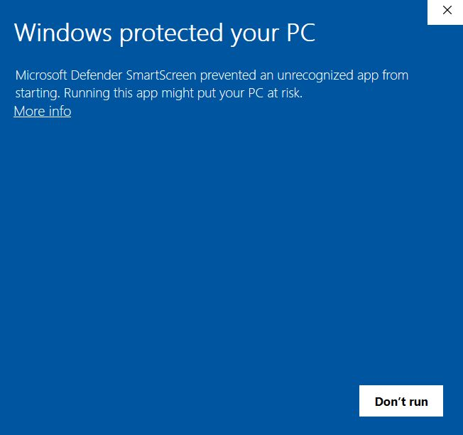
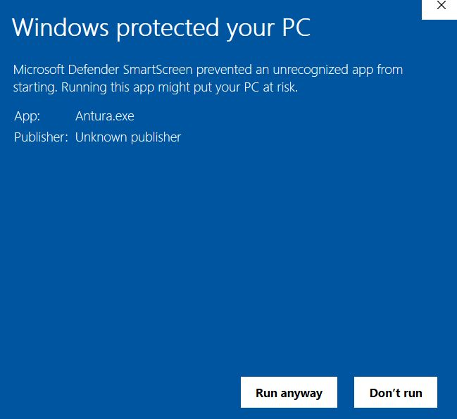

# Zainstaluj wersję beta
> [!note]
> Z tej strony można pobrać nową wersję Learn with Antura v3.0. Jeśli szukasz aktualnej wersji v2.0 (w tym modułów Learn to Read i Learn a Language), przejdź do [strony pobierania](../download.md)

Gra jest kompatybilna z systemami iOS, Android i Windows, więc można w nią grać na smartfonach, tabletach i komputerach. **Po zainstalowaniu gra nie wymaga połączenia z Internetem.**

> [!TIP]
> **Zalecamy tablety** jako najłatwiejsze w użyciu urządzenia w klasie.

## iOS
**Wymagania**: iOS 13
  
👉 Otwórz ten link **na swoim urządzeniu z systemem iOS**: [https://testflight.apple.com/join/Qm77iXFA](https://testflight.apple.com/join/Qm77iXFA)

(Testflight to usługa służąca do testowania aplikacji na iOS, które są jeszcze w fazie rozwoju: otwórz powyższy link na urządzeniu, na którym chcesz zainstalować aplikację. Po zainstalowaniu z Testflight możesz korzystać z Antury jak z każdej innej aplikacji)

> [!note]
> jeśli napotkasz jakiekolwiek problemy podczas pobierania lub instalowania aplikacji, wyślij wiadomość na forum [https://antura.discourse.group/](https://antura.discourse.group/c/antura/5)

## Android
Wersja beta v3.0 zostanie wkrótce wydana dla systemu Android.

## Windows
**Wymagania**: Windows 10/11

Najnowszą wersję dla systemu Windows można pobrać tutaj:
<WindowsDownloadLink />

Pobierz plik ZIP, rozpakuj całą zawartość do folderu, a następnie uruchom plik **Antura.exe**.

Program Windows Defender może wykryć nową aplikację i wyświetlić następujące ostrzeżenie:

W takim przypadku naciśnij „Więcej informacji”, a następnie „Uruchom mimo to”.

## Linux i MacOS
Ponieważ gra jest open source, a silnik użyty do jej stworzenia jest wieloplatformowy, w razie potrzeby można stworzyć wersje dla systemów Linux i macOS.
Prosimy o zgłaszanie zapotrzebowania na forum [https://antura.discourse.group/](https://antura.discourse.group/c/antura/5).
