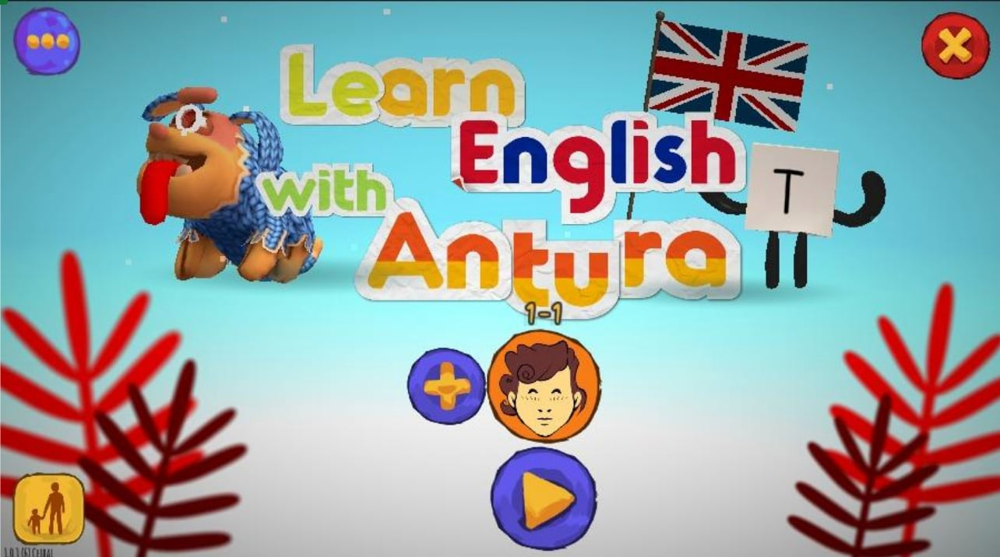

# Naucz się języków

Learn with Antura to gra służąca do nauki różnych języków (angielskiego, francuskiego, polskiego, hiszpańskiego, niemieckiego...) jako drugiego języka, przeznaczona dla dzieci w wieku od 5 do 9 lat; odpowiada poziomowi **PreA1** zgodnie z **Europejskim systemem opisu kształcenia językowego**.  

W trakcie gry dzieci w zabawny sposób uczą się całego  alfabetu, ponad 250 słów oraz szeregu zwrotów i wyrażeń.

Gra składa się z 6 różnych światów, z których każdy zawiera od 15 do 20 jednostek dydaktycznych, z których każda ma określony cel pedagogiczny, który jest realizowany dzięki serii minigier i kończy się testem końcowym, który ma na celu utrwalenie procesu uczenia się.

Aby przejść różne minigry, słowa, obrazy i dźwięki, tak aby proces uczenia się przebiegał płynnie, a postępy w grze szły w parze z procesem uczenia się.

## Aktualne moduły edukacyjne

### Nauka nowego języka

- Nauka języka angielskiego
- Naucz się francuskiego
- Nauka niemieckiego
- Naucz się węgierskiego
- Naucz się włoskiego
- Naucz się polskiego
- Naucz się rumuńskiego
- Naucz się hiszpańskiego

### Nauka czytania w swoim własnym języku

- Naucz się czytać po arabsku
- Naucz się czytać w języku perskim dari
- Naucz się czytać w języku paszto (w trakcie realizacji)
- Naucz się czytać po ukraińsku (w trakcie realizacji)

### Obsługiwane języki ojczyste
(język używany do komunikacji z graczem)

- arabski
- angielski
- francuski
- niemiecki
- Węgierski
- włoski
- paszto (w przygotowaniu)
- Perski dari
- Polski
- rumuński
- Rosyjski
- Hiszpański
- Ukraiński

## Cele

Learn with Antura ma na celu wprowadzenie do języka bez konieczności wcześniejszego kontaktu z nim; może to odbywać się zarówno w kontekście akademickim, jak i nieformalnym, służąc jako narzędzie wspomagające nauczanie i zabawowe podejście do nauki języka angielskiego jako drugiego języka.

Naszym głównym celem będzie zapoznanie dzieci z podstawowym słownictwem angielskim i brzmieniem języka angielskiego na poziomie odpowiadającym PreA1; wszystko to z dużym naciskiem na część mówioną, która staje się stałym elementem całej gry.

Wybrane słownictwo składa się z ponad 250 słów uporządkowanych w grupy tematyczne, a także różnych wyrażeń i zwrotów, które posłużą do wprowadzenia zagadnień syntaktycznych i gramatycznych, które choć wykraczają poza wyraźną treść, pojawiają się w sposób przekrojowy w celu wykształcenia słuchu.

Przy wyborze tego słownictwa wzięliśmy pod uwagę użycie przedmiotów bliskich i codziennych wraz z komponentem fonetycznym, tak aby wszystkie fonemy były w nim reprezentowane.

## Metodologia

Learn with Antura opiera swój **model pedagogiczny na znaczącej nauce** poprzez zabawowe środowisko edukacyjne wzmocnione systemem nagród. Uzupełnia modele nauczania oparte na podejściu komunikacyjnym i komunikacji ustnej systemami gier sprzyjającymi **uczeniu się w ukryciu**, metodą, która pozwala dzieciom skupić się na grze i związanych z nią wyzwaniach, bez konieczności podejmowania wysiłku, aby nauczyć się lub zapamiętać pojęcia.

Gra wprowadza nowe pojęcia bez żadnych teoretycznych wyjaśnień, po prostu proponuje wyzwanie i prowadzi gracza przez pierwsze kroki, aby mógł on następnie samodzielnie posuwać się naprzód, tworząc własny mentalny model wiedzy. Za każdym razem, gdy gracz wchodzi w interakcję z literą lub słowem, gra wymawia je w prawidłowy sposób, wzmacniając proces uczenia się.

Treść została zorganizowana wokół nauki słów poprzez piktogramy, wyrażenia i ich formy pisemne, tak aby były one powiązane w trójkątny sposób, dając początek wnioskom i dedukcjom, które służą zrozumieniu proponowanego słownictwa poprzez jego wykorzystanie w różnych mechanizmach gry.

Priorytetem jest proces słuchania, kojarzenie dźwięku i piktogramu oraz brzmienie wszystkich elementów, które można kliknąć, aby w każdym momencie wzmacniać kwestie fonetyczne i oswajanie się z brzmieniem języka angielskiego.

Ponadto gra oferuje nagrody w postaci ciasteczek, które można wykorzystać do zakupu dodatków estetycznych dla postaci Antury, która będzie nam towarzyszyć w naszych przygodach w trakcie gry. W ten sposób dodajemy dodatkową motywację do prawidłowego ukończenia różnych poziomów i częstego korzystania z aplikacji.

## Ścieżka pedagogiczna

Gra składa się z 6 różnych światów, przez które będziemy przechodzić, grając w różne jednostki dydaktyczne i testy. Każdy ze światów zawiera kilka grup słów, w każdej z nich będziemy pracować z około 50 słowami zorganizowanymi w grupy od 8 do 12.

Każda grupa słów będzie wprowadzana stopniowo poprzez bloki minigier, najpierw prezentując gry, których celem jest odkrycie słów, a następnie rzucając nam wyzwanie rozpoznania wcześniej przedstawionych słów. Na końcu każdej z 2 lub 3 grup słów znajduje się seria minigier poświęconych zapoznaniu się z ich użyciem w zdaniach. Na końcu każdej grupy minigier znajdują się fazy podsumowujące z konkretnymi testami, które pozwalają powtórzyć treść przed przejściem dalej.

Zaczynamy od świata wprowadzającego, w którym zapoznasz się z fonetyką języka angielskiego poprzez alfabet i gdzie zobaczymy pierwsze słowa, które zostaną dodane poprzecznie do pozostałych światów. Różne światy są następujące:

1. Alfabet
2. Przyroda i zwierzęta
3. Dom, przedmioty i ubrania
4. Miasto i rodzina
5. Części ciała i jedzenie
6. Kalendarz, kolory i liczby

## Rozwój

Poniżej przedstawiono schemat blokowy całej aplikacji wraz z przejściami między różnymi sekcjami aplikacji:

### Start
Pierwszy ekran gry oferuje możliwość utworzenia nowego profilu lub kontynuowania gry przy użyciu wcześniej utworzonego profilu. Również z tej sekcji można uzyskać dostęp do opcji (np. włączenia lub wyłączenia muzyki w tle) oraz sekcji zarezerwowanej dla nauczyciela.

### Tworzenie profilu

Gra umożliwia tworzenie niestandardowych profili z różnymi twarzami, kolorami skóry, włosów i tła awatara. Aby utworzyć profile nauczycieli, należy przejść do sekcji dla nauczycieli.

### Prezenty dla Antury
Po utworzeniu profilu otrzymasz pierwszy prezent, który pozwoli Ci spersonalizować Anturę. Kolejne prezenty będziesz otrzymywać po ukończeniu każdej jednostki dydaktycznej, po zakończeniu każdej fazy osadnictwa. W grze dostępnych jest łącznie ponad 90 prezentów, z których każdy można spersonalizować za pomocą 16 kombinacji kolorów.

### Przestrzeń Antury

W tej sekcji gracz może dostosować Anturę za pomocą otrzymanych prezentów, a także wykorzystać ciasteczka w kształcie kości, które zdobędzie w miarę postępów w grze.

Ciasteczka można rzucać do Antury lub wykorzystać do zakupu dekoracji do jej pokoju. Ponadto za pomocą ciasteczek gracz może robić zdjęcia Antury w jej pokoju. Zdjęcia są automatycznie zapisywane w galerii zdjęć urządzenia.

### Mapa
Nauka języka angielskiego jest przedstawiona jako podróż przez 6 światów, z których każdy ma inne środowisko: góry, wyspy, preria, pustynia, las i miasto.

Podróż podzielona jest na wiele etapów i za każdym razem, gdy gracz pomyślnie ukończy sesję gry (sekwencję minigier lub quiz), przechodzi do następnego etapu. Nie przeszkadza mu to jednak wrócić i ponownie zagrać w poprzednią sesję, aby powtórzyć treści dydaktyczne lub uzyskać najwyższy wynik (3 gwiazdki). Mapa nie tylko pozwala bardzo wyraźnie wizualizować postępy w podróży, ale także umożliwia dostęp do innych kluczowych sekcji, takich jak pokój Antury i słownik.

## Statystyki i słownik
Ta sekcja pozwala graczowi sprawdzić swoje główne statystyki i skorzystać ze słownika. Słownik zawiera wszystkie wybrane słowa oraz alfabet pokazujący różne fonemy związane z każdą pisownią. Ponadto wszystkie mini-gry można uruchomić bezpośrednio z tej sekcji, aby poćwiczyć z nimi.

## Nastrój
Kiedy gracz uruchamia grę i zaczyna grać przy użyciu istniejącego profilu, pierwszą sekcją, którą widzi, jest ta sekcja; pojawia się ona przy pierwszym uruchomieniu gry każdego dnia. Dzięki prostemu pytaniu „Jak się dzisiaj czujesz?” gracz ma chwilę na zastanowienie się nad swoim nastrojem. Odpowiedź udziela się po prostu, dotykając jednej z 5 emotikonów wyświetlanych na ekranie.

## Codzienne nagrody
Każdego dnia gracz **otrzymuje ciasteczka za samo uruchomienie gry** i odpowiedź na pytanie dotyczące jego nastroju. Liczba ciasteczek rośnie z każdym kolejnym dniem, w którym gracz ponownie uruchamia grę, motywując go do codziennego korzystania z niej.

## Panel nauczyciela
Ta sekcja jest chroniona hasłem (aby dzieci nie miały do niej samodzielnego dostępu) i oferuje wszystkie funkcje przeznaczone wyłącznie dla nauczycieli:
Możliwość utworzenia profilu nauczyciela, aby uzyskać swobodny dostęp do wszystkich treści gry. Możliwość sprawdzenia postępów profilu jako zewnętrzny obserwator.

KOD DOSTĘPU DO PROFILU NAUCZYCIELA: naciśnij 5 razy zielony przycisk, a następnie 1 raz czerwony przycisk. Po zalogowaniu się na profil nauczyciela rozpoczniemy grę od końca, czyli od ostatniej jednostki dydaktycznej ostatniego świata; w ten sposób będziemy mogli poruszać się po mapie bez ograniczeń i uzyskać dostęp do wszystkich jednostek dydaktycznych.

## Jednostki edukacyjne
Każdy świat zawiera od 15 do 20 jednostek dydaktycznych, z których każda ma określony cel pedagogiczny. Każda jednostka składa się z serii minigier i kończy się testem końcowym, który ma na celu utrwalenie wiedzy. Jednostki dydaktyczne będą oznaczone na mapie znacznikami z nitką, fazy osadnictwa ołówkami, a jednostki poświęcone eksperymentowaniu z frazami skrzynkami pocztowymi.

## Zawartość słownictwa

### Świat 1: Alfabet

Istnieje 5 grup liter:

1. A, E, C, R, S, T
2. O, D, L, M, N
3. I, F, G, H, W
4. U, B, K, P, V
5. Y, J, Q, X, Z

Dla każdej grupy liter gracz powtórzy te same kroki pedagogiczne i ćwiczenia, zorganizowane w następującej kolejności trzech jednostek dydaktycznych:

**1. Odkrywanie liter i ich nazw**

- ColorTickle_LetterName
- Rzucaj piłkami_Nazwa litery
- FastCrowd_Nazwa_litery
- Ocena_Nazwa_Litery (test)

**2. Rozpoznawanie liter po nazwie**

- Song_Alphabet
- Egg_LetterName
- HideSeek_LetterName
- Ocena_Nazwa_Litery (test)

**3. Odkrywaj słowa przy użyciu znanych liter**

- FastCrowd_BuildWord
- Rzucaj piłkami_Buduj słowa
- Egg_BuildWord
- Ocena_Kolejność liter w słowie (test)

### Odkrywanie słownictwa
Każdy świat od 2 do 6 będzie obejmował około 50 słów podzielonych na kilka podgrup po 10 słów każda. Dla każdej grupy powtórzone zostaną te same etapy pedagogiczne i te same ćwiczenia, zorganizowane w następujących sekwencjach 4 jednostek dydaktycznych:

1. Odkrywanie i rozpoznawanie słów na podstawie ich obrazu i brzmienia
    - ColorTickle_Image
    - ThrowBalls_Image
    - FastCrowd_Image
    - Balony_Obraz
    - Egg_Image
    - HideSeek_Image
    - Ocena_Dopasuj_słowo_do_obrazka (test)
2. Odkrywaj słowa na podstawie ich pisowni, brzmienia i rysunków
    - Rzucaj piłkami_Twórz słowa
    - FastCrowd_Budowanie_słowa
    - Egg_Budowanie_słowa
    - Mieszane litery_Budowanie słów
    - Ocena_Dopasuj_słowo_do_obrazka (test)
3. Rozpoznawanie słów na podstawie liter, dźwięków i rysunków
    - Rzucanie piłkami_Słowo
    - Szybka_grupa_słowa
    - Balony_Słowo
    - Ocena_Wybierz_wymawiane_słowo (test)
4. Przyzwyczaj się do krótkich zdań zawierających nauczone słowa
    - Song_Word
    - ReadingGame_Phrase
    - Brakująca_litera_fraza
    - Ocena_PytanieIOdpowiedź (test)

### Świat 2: Zwierzęta i przyroda

**Przyroda**  
PLAŻA, BRYZA, CHMURA, PUSTYNIA, OGNIE, KWIAT, LAS, WZGÓRZE, WYSPY, KSIĘŻYC, GÓRY, ROŚLINY, DESZCZ, RZEKA, MORZE, NIEBO, ŚNIEG, GWIAZDA, KAMIEŃ, SŁOŃCE, DRZEWO, WULKAN

**Zwierzęta**  
NIEDŹWIEDŹ, PSZCZOŁA, PTAK, WIELBŁĄD, KOT, KURCZAK, KROWA, KROKODYL, PIES, KACZKA, SŁOŃ, LIS, ŻABA, KOZA, KONIE, LW, JASZCZURKA, MAŁPA, OŚMIORNICA, PAPUGA, PINGWIN, ŚWINIA, SZCZUR, WĄŻ, WIEWIÓRKA, TYGRYS, ŻÓŁW, WIELORYB

### Świat 3: Dom, przedmioty, ubrania

**Dom**  
ŁÓŻKO, SYPIALNIA, KRZESŁO, SZAFA, KOMPUTER, KANAPA, FILIŻANKA, TALERZ, DRZWI, PODŁOGA, WIDELEC, LODÓWKA, KUCHNIA, NÓŻ, LAMPKA, LUSTRO, PIEC, DACH, PRYSZNIC, ZLEW, MYDŁO, ŁYŻKA, SCHODY, KUCHENKA, STÓŁ, TELEWIZOR, TOALETA, RĘCZNIK, OKNO

**Przedmioty i ubrania**  
PIŁKA, KSIĄŻKA, PUDEŁKO, PŁASZCZ, LALKA, RĘKAWICZKI, KLEJ, CZAPKA, KURTKA, IGŁA, PAPIER, OŁÓWEK, SZALIK, NOŻYCZKI, KOSZULA, BUTY, SPÓDNICA, SKARPETKI, TEST, ZABAWKA, SPODNIE

### Świat 4: Miasto, rodzina

**Miasto**  
LOTNISKO, BANK, ROWER, AUTOBUS, SAMOCHÓD, ZAMEK, KOŚCIÓŁ, MIASTO, SALA LEKCYJNA, POLE, OGRÓD, SZPITAL, DOM, BIBLIOTEKA, TARG, MOTOCYKL, MUZEUM, PARK, APTEKA, SAMOLOT, PLAC ZABAW, RESTAURACJA, PORT, DROGA, SZKOŁA, SKLEP, STACJA, ULICA, TEATR, MIASTO, POCIĄG, CIĘŻARÓWKA, Z, ## Rodzina, CIOTKA, CHŁOPIEC, BRAT, CÓRKA, OJCIEC, DZIEWCZYNKA, WNUCZKA, DZIADEK, BABCIA, WNUK, MĘŻCZYZNA, MATKA, ZWIERZĘ DOMOWE, SIOSTRA, SYN, WUJEK, KOBIETA

### Świat 5: Jedzenie, ciało

**Jedzenie**  
JABŁKO, MARSZCZYNKA, BANAN, CHLEB, CIASTO, MARCHEWKA, SER, WIŚNIA, CIECIERZYCA, KAWA, OGÓREK, ŻYWNOŚĆ, CZOSNEK, WINOGRONA, SOK, MIĘSO, OLEJ, CEBULA, GRUSZKA, PIEPRZ, ZIEMNIAK, RYŻ, SÓL, CUKIER, HERBATA, POMIDOR, WODA, ARBUZ, JOGURT

**Ciało**  
RĘKA, PLECY, BRZUCH, MÓZG, KLATKA PIERSIOWA, UCHO, OKO, TWARZ, PALEC, STOPA, WŁOSY, DŁOŃ, GŁOWA, NOGA, USTA, USTA, PAZNOKCIE, NOS, ŁZA, JĘZYK, ZĄB

### Świat 6: Kalendarz, kolory, liczby

**Kolory**  
CZARNY, NIEBIESKI, BRĄZOWY, ZIELONY, SZARY, POMARAŃCZOWY, RÓŻOWY, FIOLETOWY, CZERWONY, BIAŁY, ŻÓŁTY

**Dni i pory roku**  
PONiedziałek, WTOREK, ŚRODA, CZWARTEK, PIĄTEK, SOBOTA, NIEDZIELA, WIOSNA, LATO, JESIEŃ, ZIMA

**Liczby**  
ZERO, JEDEN, DWIE, TRZY, CZTERY, PIĘĆ, SZEŚĆ, SIEDEM, OSIEM, DZIEWIĘĆ, DZIESIĘĆ, JEDENAST, DWANAŚCIE, TRZYNAŚCIE, CZTERNAŚCIE, PIĘTNAŚCIE, SZESNAŚCIE, SIEDEMNAŚCIE, OSIEMNAŚCIE, DZIEWIĘTNAŚCIE, DWADZIEŚCIA

**Miesiące**  
STYCZEŃ, LUTY, MARZEC, KWIECIEŃ, MAJ, CZERWIEC, LIPIEC, SIERPIEŃ, WRZESIEŃ, PAŹDZIERNIK, LISTOPAD, GRUDZIEŃ

