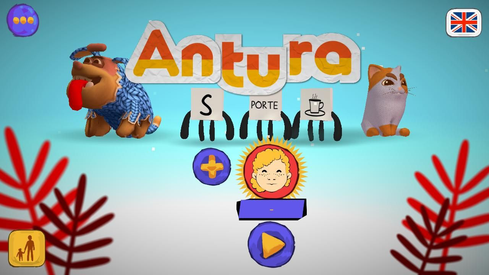
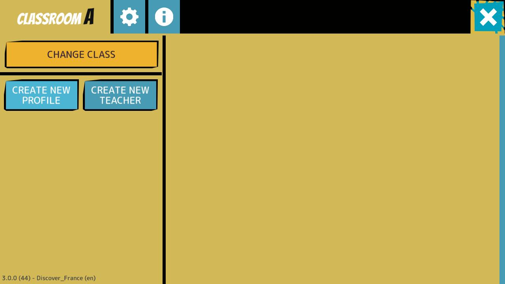
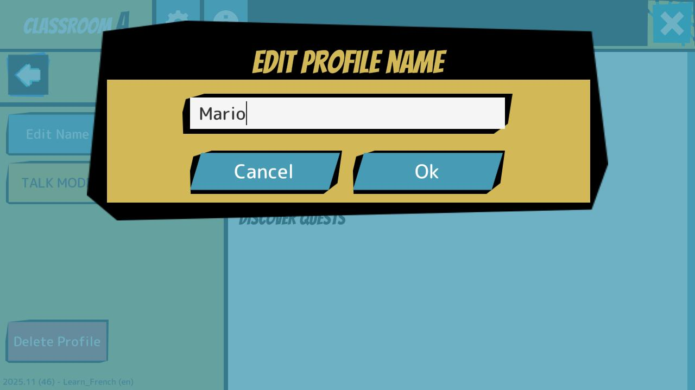
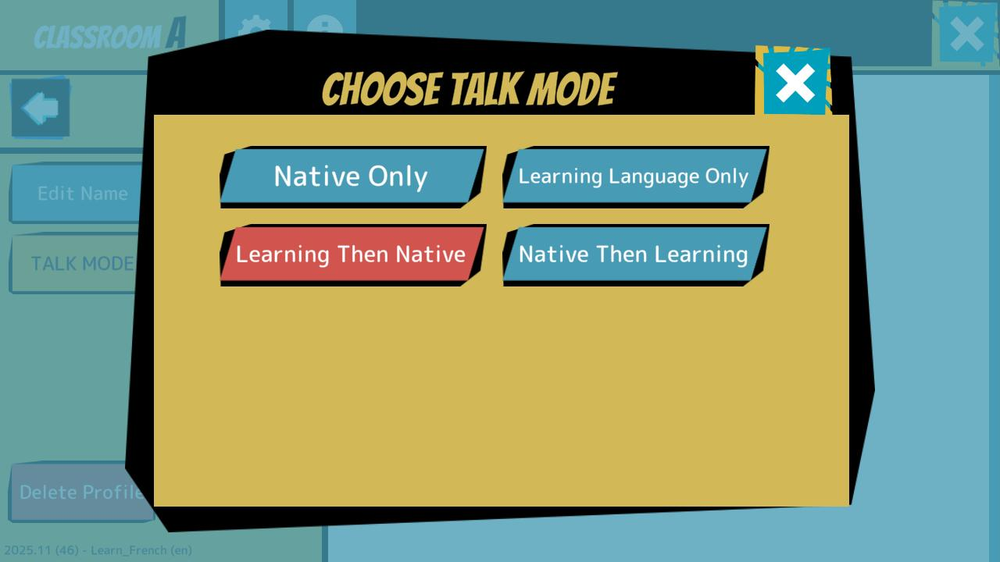
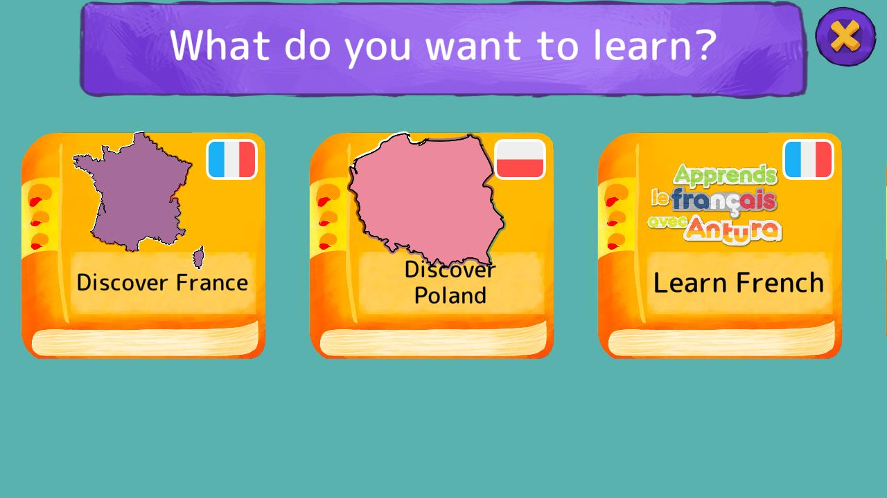

# Konfiguracja

> [!uwaga]
> Gra jest identyczna na wszystkich platformach, więc poniższe instrukcje dotyczą każdego urządzenia, na którym grasz.

## Pierwsze kroki
Po uruchomieniu gry najpierw zostaniesz zapytany o swój język ojczysty.
Obecnie obsługiwanych jest kilkanaście języków ojczystych.

Następnie postępuj zgodnie z instrukcjami, aby utworzyć swój pierwszy profil.

> [!note]
> Jeśli poniższy ekran nie pojawi się, oznacza to błąd. Zamknij aplikację i uruchom ją ponownie. Po ponownym uruchomieniu aplikacji błąd nie powinien już występować.

O język ojczysty pytamy tylko przy pierwszym uruchomieniu gry, ale zawsze można go zmienić, naciskając przycisk języka w prawym górnym rogu.

> [!note]
> Antura może być używana przez nauczycieli w klasie lub przez rodziny do samodzielnej nauki w domu (lub gdziekolwiek się znajdują). Ponieważ jednak obecnie testujemy kilka nowych funkcji we Francji i Polsce w ramach projektu ANTURA Erasmus+, poniższa sekcja skupia się na nauczycielach korzystających z gry w swoich klasach.

## Obszar nauczycieli
Jeśli uczniowie są podzieleni na grupy/klasy, pierwszą rzeczą, którą należy zrobić, jest wybranie klasy.
Naciśnij przycisk w lewym dolnym rogu, a następnie postępuj zgodnie z instrukcjami, aby uzyskać dostęp do obszaru nauczycieli.

## Wybór klasy
W obszarze dla nauczycieli można „Zmienić klasę”: różne klasy są oznaczone literą (A, B, C...) lub cyfrą (1, 2, 3...).

> [!note]
> Domyślnie gra rozpoczyna się w klasie „-”, co oznacza „brak klasy”, ale dla prawidłowego użytkowania w klasie lepiej jest zawsze wybrać klasę.

Proszę przypisać unikalną literę lub cyfrę do każdej z grup/klas i zapisać ją, ponieważ będzie trzeba ją wybierać za każdym razem, gdy używasz Antury z konkretną grupą/klasą.

## Tworzenie profili uczniów
Po wybraniu pierwszej klasy zauważysz, że klasa jest pusta, 

Naciśnij „Utwórz nowy profil”, aby dodać ucznia do tej klasy.

> [!uwaga]
> Proszę zignorować przycisk „Utwórz nowego nauczyciela”. Zostanie on usunięty.

## Edytowanie nazw profili uczniów
Po utworzeniu profilu pojawi się on w klasie, ale pod standardową nazwą „UCZEŃ”.

Teraz możesz wybrać profil (naciskając jego ikonę lub nazwę)...

... a następnie zdefiniować jego nazwę, naciskając „Edytuj nazwę”.

## Edytowanie ustawień profili uczniów
Możesz również włączyć „TRYB ŁATWY” (aby zmniejszyć poziom trudności gry dla tego konkretnego ucznia) i wybrać „TRYB ROZMOWY” (oznaczający, jakich języków gra powinna używać dla tego konkretnego ucznia).

Dostępne opcje to:
- **Tylko język ojczysty**: gra używa tylko języka ojczystego
- **Tylko język nauki**: gra używa tylko języka nauki (np. francuskiego lub polskiego)
- **Najpierw język nauki, potem język ojczysty**: gra używa najpierw języka nauki, a następnie powtarza w języku ojczystym
- **Najpierw język ojczysty, potem język nauki**: gra używa najpierw języka ojczystego, a następnie powtarza w języku nauki

> [!WAŻNA UWAGA]
> Wszystkie profile są zapisywane tylko lokalnie na urządzeniu, na którym zostały utworzone, więc każdy uczeń musi zawsze używać tego samego urządzenia, aby korzystać z własnego profilu. Najprawdopodobniej na każdym urządzeniu trzeba będzie utworzyć jeden profil __na klasę__, ponieważ urządzenie będzie zawsze używane przez tego samego ucznia podczas zajęć w tej klasie!

## Przygotowanie do gry
Po zakończeniu tworzenia i edycji profilu dla swojej klasy można wrócić do menu głównego, naciskając strzałkę wstecz po lewej stronie i przycisk X w prawym górnym rogu ekranu.

> [!Przypomnienie]
> Przed rozpoczęciem gry przez ucznia należy ustawić jego język ojczysty, naciskając przycisk w prawym górnym rogu.

## Wybór treści do nauki
Naciśnij przycisk „Graj” pod aktywnym profilem, aby wybrać treści do nauki.
Gra oferuje listę książek, które można przeglądać, przesuwając ekran w prawo lub w lewo.
Każda książka reprezentuje inny program nauczania, zbiór treści do nauki na określony temat. Gra obsługuje obecnie 2 główne rodzaje programów nauczania:
- **Nauka języków**: wprowadzenie do języka obcego
- **Odkrywanie kraju i jego kultury**: pomoc w integracji dzieci migrantów w kraju przyjmującym

> [!uwaga]
> W języku arabskim i perskim można również **nauczyć się czytać** w swoim języku ojczystym, ale ten program nauczania czytania i pisania ma wiele wspólnego z **nauką języka**, więc w niniejszym podręczniku skupimy się na tym drugim.

W ramach testowania projektu ANTURA Erasmus+ we Francji i Polsce skupimy się na 4 książkach:
- Odkrywaj Francję i ucz się francuskiego
- Odkrywaj Polskę i ucz się polskiego

W poniższych sekcjach szczegółowo wyjaśniono zarówno moduły [Nauka języków](./learnlanguage_module.md), jak i [Odkrywanie kultury](./discover_introduction.md), a także przedstawiono przewodnik [Jak korzystać z nich w klasie](./classroom_guide.md).

